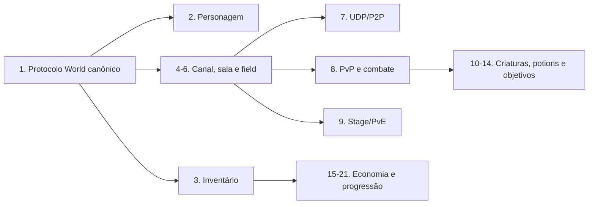

# Auditoria mestre de cobertura RE — Rakion v258

## Objetivo e escopo

Este documento responde duas perguntas:

1. Quais sistemas do jogo aparecem no cliente, servidor original, banco ou servidor .NET?
2. Quais deles ainda não possuem uma documentação de engenharia reversa suficiente?

Fontes cruzadas:

- cliente: `<cliente-v258-golden>`;
- exports e decompile do cliente: `rakion-work\ghidra-proj\stage_spawn_re3.out.txt`;
- dispatcher original: `rakion-work\ghidra-proj\handlers.out.txt`;
- banco legado: `rakion-tutorial\server\DB\rakion_data.sql`;
- implementação atual: `server/RakionServer`;
- documentos ativos indexados em [`../README.md`](../README.md).

Esta é uma auditoria estática completa da **superfície encontrada**, não uma afirmação de que todos
os sistemas estão implementados. Os 29 itens possuem passe dedicado. Cada linha separa o que já foi
fechado por binário/probe do que ainda depende de implementação, integração externa ou validação
visual; uma pendência visual não transforma automaticamente um contrato estático fechado em RE
ausente.

Para uma visão curta dos objetivos concluídos e da ordem restante, consulte
[`re-status-summary.md`](re-status-summary.md); o veredito por classe de entidade está em
[`entity-class-census.md`](entity-class-census.md).

## Resultado executivo

- Os **29 blocos de trabalho** têm documento dedicado e classificação verificável.
- Launcher/update, Broker/IPC, integridade, Valentine, PC Bang/region e replay/demo já têm o passe
  de RE encerrado para esta build; seus limites de runtime ou ausência de feature estão explícitos.
- Economia possui vários contratos completos headless, mas ainda não deve ser anunciada como
  validada graficamente no cliente.
- Canal/lobby possui agregado, presença, chat, saída e as duas famílias de ping completos
  estaticamente e em testes headless; falta a prova visual com dois clientes.
- Clã possui login `0x0C` fechado por captura diferencial, persistência e gestão Admin transacionais,
  Buddy e presença de canal; sala/campo e resultado gráfico continuam como validação explícita.
- O risco estrutural remanescente no World está nas colisões dependentes de estado entre o
  interceptador e a tabela, não na falta de catálogo de opcodes.
- As rotas de sala `0x36/0x38/0x39/0x3B` já têm entrada canônica única na tabela; o trabalho de
  consolidação continua nos opcodes que realmente mudam de semântica entre lobby e stage.

A fonte canônica do protocolo World orienta os demais documentos. A busca estática dos exports
rejeitados foi fechada: apenas `0x1D` tem um call site UI, e seu produtor, argumentos, resposta e
estado de primeiro/último registro estão mapeados; os demais não aparecem no grafo WorldNet da UI.
O World v258 rejeita todos esses requests. Permanecem nomes semânticos de alguns campos,
transições internas e validações visual/multicliente.

## Níveis de cobertura

| Estado | Significado |
|---|---|
| Coberto | Existe doc dedicada com cliente, servidor original, banco, auditoria .NET e lacunas explícitas |
| Mapeado com lacunas | Existe passe dedicado, mas faltam capturas, regra, implementação ou validação runtime |
| Parcial | Há informação útil, mas faltam fluxos, layouts, persistência ou auditoria atual |
| Ausente | Só há código, asset, tabela ou referência superficial; não existe RE dedicado |
| Conflitante | Documentação/código contradiz evidência mais forte e precisa ser refeito |

## Cobertura atual das docs

| Documento | Sistema | Cobertura real |
|---|---|---|
| [`protocol/buddy.md`](../protocol/buddy.md) | amigos, presença, grupos, P2P/tunnel buddy | RE e implementação headless completos; Buddy é autoridade e a DLL apenas dispara o `SetNickname` nativo exigido pelo cliente; visual/LAN/NAT pendentes |
| [`systems/social/clan.md`](../systems/social/clan.md) | clã, árvore, ranking e guerra | RE e implementação headless do ciclo básico completos: login `0x0C`, árvore, Admin transacional, Buddy e presença de canal. A UI de canal usa `clanId` apenas para escolher a cor do nome; a tela é destruída ao entrar na sala e o roster não carrega clã. Restam validação gráfica, `0x78` dormente e guerra sem transporte ativo |
| [`systems/events/christmas-and-gifts.md`](../systems/events/christmas-and-gifts.md) | Natal e caixa persistente de presentes | Gift Box implementada/probada; dez eventos de entidade tipados; stage fechado como conteúdo dormente/ausente |
| [`guides/gameguard.md`](../guides/gameguard.md) | dependência nProtect | Coberto para o veredito de incompatibilidade/offline |
| [`archive/protocol-world-legacy.md`](../archive/protocol-world-legacy.md) | frame, AES, login e notas antigas | Histórico; não canônico |
| [`guides/config-xfs.md`](../guides/config-xfs.md) | formato/edição de XFS | Guia operacional |
| [`server/RakionServer/TUTORIAL.md`](../../server/RakionServer/TUTORIAL.md) | instalação e execução | Guia operacional atual |
| [`audits/code-quality.md`](code-quality.md) | qualidade estrutural | Auditoria de código, não protocolo ou regra de jogo |

## Superfície canônica enviada pelo cliente

Os nomes abaixo vêm dos métodos exportados de `IScavengerWorldNet`. O opcode foi confirmado no corpo de cada método. Eles são uma evidência mais forte da intenção da UI do que nomes inventados durante a transcrição de um handler do servidor.

Um mesmo opcode ainda pode ter comportamento condicionado ao estado da sessão. Por isso, o nome do cliente não substitui o RE do handler original, mas deve ser a âncora inicial.

### Administração, sessão e personagem

| Opcode | Método do cliente | Sistema |
|---:|---|---|
| `0x04` | `SendAdminBan` | eco administrativo; não persiste ban no World analisado |
| `0x05` | `SendAdminNotice` | notice por escopo `0/2/3`, field e alvo opcional |
| `0x0C` | `SendLogin` | login World |
| `0x0E` | `SendSuccessUDP` | confirmação UDP/endpoints |
| `0x0F` | `SendAlive` | keepalive |
| `0x10` | `SendGameGuard` | GameGuard |
| `0x12` | `SendCharacterCreate` | criação de personagem |
| `0x13` | `SendCharacterDelete` | exclusão de personagem |
| `0x14` | `SendCharacterSelect` | seleção de personagem |
| `0x15` | `SendCharacterChangeBuddyName` | identidade buddy |
| `0x16` | `SendCharacterWhisper` | whisper/localização |
| `0x17` | `SendCharacterWhereAmI` | localização própria |
| `0x18` | `SendCharacterWhereAreYou` | localizar jogador |
| `0x19` | `SendCharacterGetUserName` | eco de C-string curta pelo canal de mensagem `0x0D` |
| `0x1A` | `SendCharacterTutorialClear` | tutorial concluído |
| `0x1B` | `SendCharacterStateClear` | reset de stats |
| `0x1C` | `SendCharacterChangeCharName` | troca de nome |

### Canal e lobby

| Opcode | Método do cliente |
|---:|---|
| `0x1D` | `SendChannelList` (evento UI `0x174`; corpo `[primeiroId][1]` fechado e World rejeita) |
| `0x1E` | `SendChannelCharacters` |
| `0x1F` | `SendChannelEnter` |
| `0x20` | `SendChannelExit` |
| `0x21` | `SendChannelCreate` |
| `0x22` | `SendChannelChat` |
| `0x23` | `SendChannelClose` |
| `0x24` | `SendChannelKick` |
| `0x25` | `SendChannelChangeName` |
| `0x26` | `SendChannelChangePassword` |
| `0x27` | `SendChannelChangeMaxCharacter` |
| `0x28` | `SendChannelChangeBoss` (export colide com enchant C→S; notificação owner S→C válida) |
| `0x29` | `SendChannelFieldPingRequest` |
| `0x2A` | `SendChannelFieldPingResponse` |

### Inventário, loja e progressão paga

| Opcode | Método do cliente |
|---:|---|
| `0x2C` | `SendInventoryEnter` |
| `0x2D` | `SendInventoryLeave` |
| `0x2E` | `SendInventoryBuy` |
| `0x2F` | `SendInventorySell` |
| `0x31` | `SendInventoryMove` |
| `0x32` | `SendInventoryBuyBag` |
| `0x33` | `SendInventoryAllocationPoint` |
| `0x34` | `SendInventoryBuyPowerUser` |
| `0x35` | `SendInventoryBuyCharacterSlot` |
| `0x6F` | `SendInventoryBuyPotionSlot` |
| `0x70` | `SendInventoryBuyStageRankClear` |
| `0x71` | `SendInventoryBuyStageLevelFree` |
| `0x73` | `SendInventoryStackPotion` |
| `0x74` | `SendEncahntReinforce` (alias do catálogo; ausente nos exports do `engine.dll`) |

### Sala, partida e gameplay

| Opcode | Método do cliente |
|---:|---|
| `0x36` | `SendFieldList` |
| `0x38` | `SendFieldEnter` |
| `0x39` | `SendFieldQuickEnter` |
| `0x3A` | `SendFieldExit` |
| `0x3B` | `SendFieldCreate` |
| `0x3C` | `SendFieldChangeBoss` |
| `0x3D` | `SendFieldReady` |
| `0x3E` | `SendFieldChangeTeam` |
| `0x3F` | `SendFieldClose` |
| `0x40` | `SendFieldKick` |
| `0x41` | `SendFieldChangeRule` |
| `0x42` | `SendFieldChangeSlotStatus` |
| `0x43` | `SendFieldGameStart` |
| `0x44` | `SendFieldGameEnd` |
| `0x45` | `SendFieldGameEnter` |
| `0x46` | `SendFieldGameExit` |
| `0x47` | `SendFieldChat` |
| `0x48` | `SendFieldGameRoundStart` |
| `0x4A` | `SendFieldGameRoundEnd` |
| `0x4B` | `SendFieldGameAddPlayer` |
| `0x4C` | `SendFieldGameAddPlayerReply` |
| `0x4D` | `SendFieldGameMasterGolem` |
| `0x4F` | `SendFieldGameDiePlayer` |
| `0x50` | `SendFieldGamePoint` |
| `0x53` | `SendFieldGameStagePoint` |
| `0x56` | `SendFieldGameTunnelingAll` |
| `0x57` | `SendFieldGameTunnelingOne` |
| `0x59` | `SendFieldPingRequest` |
| `0x5A` | `SendFieldPingResponse` |
| `0x5B` | `SendFieldForceChangeTeam` |
| `0x5D` | `SendFieldGameVoteOpen` |
| `0x5E` | `SendFieldGameVote` |
| `0x60` | `SendFieldGameMasterBossHP` |
| `0x62` | `SendFieldSlotUDP` |
| `0x6E` | `SendFieldGamePotion` |
| `0x72` | `SendFieldInvitation` |

### Eventos, presentes e integridade

| Opcode | Método do cliente | Observação |
|---:|---|---|
| `0x64` | `SendGMOperation` | sem payload; gate por substatus `0x34` e allowlist IPv4, fechado |
| `0x65` | `SendChCode` | revalidação MD5 em field; modos, hashes globais e `BB/BC` fechados |
| `0x66` | `SendEvent1` | payload vazio; export dormente, rejeitado com `DISC C9` pelo World original |
| `0x69` | `SendEvent4` | payload vazio; export dormente, rejeitado com `DISC C9` pelo World original |
| `0x6B` | `SendPresentPeek` | documentado em Natal/presentes |
| `0x6C` | `SendPresentAccept` | documentado em Natal/presentes |
| `0x6D` | `SendPresentDispose` | documentado em Natal/presentes |
| `0x75` | compra da loteria | confirmado pelo handler original; não aparece como export `Send*` separado |

`SendPacketSpeedTest` possui corpo vazio nessa build. `SendEvent1` e `SendEvent4` montam somente o
opcode, sem payload. A busca de referências encontrou apenas vtable, IAT e thunks, sem consumidor
ativo em `rakion.bin`; o dispatcher original não possui os cases e rejeita ambos com `DISC C9`.
Portanto, são ABI legado/dormente desta build e não autorizam criar regra de evento.

## Conflitos críticos e contratos corrigidos no servidor atual

| Opcode | Intenção confirmada pelo cliente | Registro/uso atual | Risco |
|---:|---|---|---|
| `0x04` | AdminBan | `Op_AdminBanEcho` | fechado: o original apenas ecoa flag/texto e não persiste ban |
| `0x05` | AdminNotice | `Op_AdminNotice` | fechado: escopo, field, nome case-sensitive, broadcast/ack fiéis |
| `0x09` | GmQueryEntry | `Op_GmQueryEntry` | fechado: gate `Status=5/DISC 11`, `fieldId:u16`, status `0/1/2`, ID ecoado e `roomName/creatorCharacter` no sucesso |
| `0x0E` | SuccessUDP | `Op_SuccessUdp` canônico | fechado: rota única, request lógico `u8`, resíduos do bloco AES ignorados como no original e resposta de 15 bytes com dois endpoints; cliente pristine validado graficamente em 18/07/2026 |
| `0x0F` | KeepAlive | `Op_KeepAlive` canônico | fechado: request vazio e sem seq, gate apenas de conta (`DISC 1A`), intervalo e alerta estrito acima de 90 s; sem resposta |
| `0x12`–`0x1A` | ciclo de personagem, busca e tutorial | handlers `Op_Character*` canônicos; busca/whisper dedicados | fechado: aliases de field removidos, create 3/7 bytes, delete com snapshot de clã, buddy variável, tutorial sem ack, seleção/buscas/layouts/gates com golden source; validação visual continua pendente |
| `0x19` | CharacterGetUserName | `Op_CharacterGetUserName` canônico | rota única; o lookup DB sintético foi removido: original só valida `<13`, envia C-string em msgType `0x0D` e usa `DISC 28/29` |
| `0x31` | InventoryMove | `Op_InventoryMove` canônico | rota única; swap puro entre box e zona ativa, limites `120/19`, estados `1..4` e resposta de 21 bytes; merge removido para `0x73` |
| `0x14` | CharacterSelect | `Op_CharacterSelect` | fechado: rota única, DTO `u32`, status `0/1/2` e entrada no canal após sucesso |
| `0x1B` | CharacterStateClear | `Op_CharacterStateClear` canônico | rota única, builder/parser 1/3 bytes, gate de conta, cash/coupon, callbacks e random presents fechados; UI pendente |
| `0x1C` | CharacterChangeCharName | `Op_CharacterChangeCharName` canônico | rota única, builder/parser variável, gate de conta, unicidade, cash/coupon e callback fechados; UI pendente |
| `0x2D` | InventoryLeave | `Op_InventoryLeave` | fechado: rota única, máquina `0/1/2`, comando DB interno `0x13`, callback e frame lógico de 3 bytes |
| `0x2E`/`0x2F` | InventoryBuy/InventorySell | `Op_InventoryBuy`/`Op_InventorySell` canônicos | rotas únicas; payloads, gates `36/37` e `39/3A`, limites, estados `1..4/1..3`, callbacks e transações fechados; visual pendente |
| `0x32`/`0x35` | BuyBag/BuyCharacterSlot | `Op_InventoryBuyBag`/`Op_InventoryBuyCharacterSlot` canônicos | rotas únicas; flags não binárias, UI `1/2`, cupom, limites, callback e transações fechados; visual pendente |
| `0x34` | BuyPowerUser | `Op_InventoryBuyPowerUser` canônico | rota única; modo, flags não binárias, busy imediato, callback, transação e EXP `×1,5` fechados; visual pendente |
| `0x36` | FieldList | `Op_FieldList` canônico | rota única; parser de 10 bytes, cursor, direção, cinco filtros, elegibilidade e resposta variável validados headless |
| `0x38` | FieldEnter | `Op_FieldEnter` canônico | rota única; ID, senha, estados de join, roster incremental/completo e resposta especial de fase fechados |
| `0x39` | FieldQuickEnter | `Op_FieldQuickEnter` canônico | rota única; request vazio, seleção pública elegível e conclusão `0x39` fechados |
| `0x3A` | FieldExit | `Op_FieldExit` canônico | rota única; saída, limpeza de field/seat, retorno ao canal e refresh `0x1F/0x1E/0x36` fechados |
| `0x3B` | FieldCreate | `Op_FieldCreate` canônico | rota única; strings, nove bytes de opções, modo solo/competitivo, alocação e ack fechados |
| `0x3D` | FieldReady | `Status=2` roteia ready; `Status=3` roteia `FieldWeaponChange` original | fechado por estado e validado headless |
| `0x3E` | ChangeTeam | `Status=2` troca time; `Status=3` move o record entre blocos de seat | fechado por estado e validado headless |
| `0x46` | FieldGameExit | `Op_0x46_Recon` atua sobre o próprio sender | fechado por modo: estado 1, transferência de host, penalidade de EXP e eventual `0x4A`; Team Death validado em duas sessões |
| `0x47` | FieldChat | `Op_FieldChat`, canal FIELD e seat real | fechado por RE estático, golden e probe com duas sessões |
| `0x48` | FieldGameRoundStart | `Op_FieldGameRoundStart` canônico | rota única; request vazio, duração da sala/stage e resposta lógica de nove bytes fechados |
| `0x5B` | FieldForceChangeTeam | `Op_FieldForceChangeTeam` | fechado estática e headless; teste atravessa a tabela na janela pré-spawn, move o target e fixa os dois corpos `0x3E`; visual pendente |
| `0x56`/`0x57` | tunneling all/one | handlers fiéis | all/one saem como `0x57`, escopados ao field/seat e validados headless |
| `0x59`/`0x5A` | ping request/response | handlers fiéis | request ao host usa slot global; response ao alvo usa seat local; validado headless |
| `0x64` | GMOperation | `Op_GmOperationIpGate` | corrigido; `B9/BA` e sucesso sem resposta validados ao vivo |
| `0x6B`–`0x6D` | presentes | `Op_PresentPeek/Accept/Dispose` canônicos | rotas únicas; gates, prefixos lógicos, FIFO, callbacks e persistência validados; visual pendente |
| `0x6F` | BuyPotionSlot | `Op_InventoryBuyPotionSlot` canônico | request vazio, gates `D3/D4/D5`, produtos/moedas, ledger, callback e células fechados |
| `0x70` | reset de ranks de stage | `Op_InventoryBuyStageRankClear` canônico | request vazio, gates `D9/DA`, faixas, transação e callback fechados |
| `0x71` | liberação de level de stage | `Op_InventoryBuyStageLevelFree` canônico | request vazio, gates `DB/DC`, preço, cooldown, ledger, marcador e callback fechados |
| `0x72` | FieldInvitation | `Op_FieldInvitation` | fechado: request por slot global e notificação com serializer original da sala; validado em duas sessões |
| `0x73` | StackPotion | `Op_InventoryStackPotion` | fechado canonicamente: request de dois slots, gates/status originais, erro `0x73` e confirmação `0x27`; teste visual pendente |
| `0x74` | EnchantReinforce | preview `FUN_00421E10`; commit em `0x28`/`FUN_0041DE40` | contrato consolidado; alias não existe como export do engine |

Nem todo conflito significa que o fluxo visível está quebrado: alguns opcodes mudam de semântica
conforme o estado e ainda passam por `TryHandleLobbyEntry`. `0x36/0x38/0x39/0x3B` deixaram essa
lista: seus handlers históricos incompatíveis foram removidos e a tabela chama diretamente a
implementação validada de `ClientSession.Rooms`.

Os nomes expostos por `WorldHandlers.OpName` foram normalizados para os exports canônicos do
`engine.dll` e protegidos por `CanonicalOpcodeNamesTests`. A coluna “Registro/uso atual” acima
descreve o corpo delegado efetivamente conectado; a consolidação segue sistema por sistema nas
rotas dependentes de estado que ainda aparecem no interceptador.

## Backlog de RE — fazer um por vez

### P0 — corrigir a fundação

| # | Sistema/documento sugerido | Cobertura | O que precisa ser fechado |
|---:|---|---|---|
| 1 | [`protocol/world.md`](../protocol/world.md) | RE estático e implementação headless completos; visual/multijogador pendentes | Builders fecharam requests vazios/padding, consulta `0x36`, regra `0x41`, enumerações de `0x3B`, os cinco valores de `0x53` e identidades `usergameinfo.id/characterinfo.id` versus field/seat. A fila IScavengerWorldNet S→C está fechada em 88/88 cases, o CNet/P2P em 24 cases explícitos e `FUN_0041B940` foi fechada como fila de requests DB. `0x51/0x52` têm layouts completos e builders golden; `0x53` agora possui handler canônico único, parser de comprimento exato e settlement transacional; `0x5C/0x63/0x67..0x6A` distinguem cstr, corpo ignorado e ponteiro bruto, e `0x5C/0x67..0x69` foram fechados como APIs dormentes sem produtor nesta build. A matriz C→S separa intercept e jump table; o catch-all foi removido, nenhum delegate final usa `Stub` ou `Op_InterceptedRoute`, gates estão aplicados com ações específicas, preview/seleção separados e `0x43→0x48→0x4B`, inclusive o primeiro relay sem repaint especulativo, `0x61/62` e `0x75..79` foram validados. Restam a comparação gráfica do roster variável `0x36`, P2P direto/reliable real e UIs de opcodes inativos apenas se a build os emitir |
| 2 | [`systems/core/character-lifecycle.md`](../systems/core/character-lifecycle.md) | RE e implementação headless completos; visual/SMTP pendentes | `0x0C` usa conta variável e IDs reais; create/select têm gates de domínio e select exclui `auth=10`. Delete fecha hard-delete `<15`, chave de uma hora, compensação do pickup, soft-delete e logs. Falta validação gráfica e entrega SMTP externa |
| 3 | [`systems/core/inventory-equipment-storage.md`](../systems/core/inventory-equipment-storage.md) | RE e implementação headless completos; observação gráfica pendente | storage, compra/venda, snapshot, stack, equipamento, sets, serial, expiração, presentes e entitlements fechados. Preview `0x0C` agora possui matriz das cinco classes e filtro negativo; expiração cobre storage/gear/quickslot, wire e box cheio. Falta somente observar os mesmos efeitos no cliente gráfico |
| 4 | [`systems/core/channel-lobby.md`](../systems/core/channel-lobby.md) | RE e implementação headless completos; visual pendente | agregado `0x358`, slots locais, presença `0x1E/0x1F/0x20`, owner sentinel `100` + nome real `channel01`, transferência S→C `0x28`, classe/nome/clã, chat `0x22`, `/roominfo` com 26 linhas exatas, refresh de até 8 e ping `0x29/0x2A` versus `0x59/0x5A` fechados. O consumidor cliente de clã foi fechado: estrutura `0x24`, ID em `+0x14`, cor por zero/não zero e draw apenas do nome; a tela é destruída na entrada da sala. Sonda de nove sessões aprovou snapshots 1..9, refresh, chat/exit e ausência correta de `0x28` no canal ownerless. Management C→S segue desativado; falta validação visual da cor |
| 5 | [`systems/core/room-management.md`](../systems/core/room-management.md) | RE estático e headless completos; visual pendente | `0x36` fechado byte a byte com cursor, filtros, senha, rounds, níveis e contagem/capacidade `1/12`; create competitivo, IDs limitados/reutilizados, status de join, roster `0x37/0x38`, quick, ready/start/leave, host, team, rule, slot, kick e close foram implementados. O roster não possui clã e não herda o cache visual do canal. Stress de join/close/list passou sem seat ou identidade órfã; falta a jornada gráfica |
| 6 | [`systems/core/field-match-lifecycle.md`](../systems/core/field-match-lifecycle.md) | RE estático e implementação headless completos; visual pendente | `FUN_00409940` foi portada para transições determinísticas: engage de 40 s, timeout específico dos quatro modos com motivo `0`, intermissão, população e motivos `1/2/5/6`; próximo round envia apenas `0x49` e objetivos reiniciam em `1`. Mutações críticas são serializadas por field e o settlement usa snapshot imutável por `MatchId`. Goldens, regras e probes de duas sessões passam; faltam PvP gráfico e respawn visual |
| 7 | [`systems/core/udp-p2p-tunneling.md`](../systems/core/udp-p2p-tunneling.md) | RE estático avançado e os dois modos headless validados; P2P gráfico pendente | dispatcher original corrigido: o World aceita apenas `0x0201/0202/0401/0402`; `0x03xx/0x83xx` pertence ao canal direto `2300..2399`. Handshake, endpoint observado/anunciado, migração, reliable, decisão `IsTunneling_Client`, flag individual no roster, matriz TunnelAll/One sem duplicação, ping, agregado `0x54/0x55` e `0x62 target→senderSeat` estão fechados. A varredura integral de `user+0x1478` comprovou leitores/serializer e somente writers de zero; não há setter direto de `1`, então a ativação por ausência de endpoint no .NET é extensão configurável. Faltam captura gráfica direta, LAN/NAT e UDP bloqueado |

### P1 — gameplay necessário para lançamento

| # | Sistema/documento sugerido | Cobertura | Evidência existente |
|---:|---|---|---|
| 8 | [`systems/gameplay/pvp-modes-combat.md`](../systems/gameplay/pvp-modes-combat.md) | RE do World e implementação headless completos; visual pendente | IDs 1–4, ready/start, blocos de team `0..9/10..19`, `0x4F` e `0x46` por modo fechados. O produtor `CPlayer::Death` fecha a derivação de `cause 1..8`, incluindo morte própria (`1`), `NpcGoldGolem` (`4`) e o ramo especial de dois pontos (`8`); somente os nomes históricos de algumas categorias não existem no binário. Líder Boss é o maior `CharLevel` por time com sentinela `0x14`; `+0x1531/+0x1534` são nível/EXP. Team Death confirmou give-up `0x46→0x4A`; Deathmatch confirmou score individual/draw; Golem e Boss confirmaram objetivo e morte decisiva em duas sessões. `0x54/0x55` e relay direto/túnel foram validados em sessão mista. `PlayerActionState`, as 32 ações, `pa_aViewRotation` e os payloads reliable de arma/disparo/hold estão tipados; falta confirmação gráfica no cliente |
| 9 | [`systems/gameplay/stage-pve-progression.md`](../systems/gameplay/stage-pve-progression.md) | Implementação headless avançada; combate/visual pendentes | catálogo v258 ligado diretamente ao `DataSetup.xfs`, duração, rewards literais e Cells estão integrados. O smoke Release atualizado atravessou seleção/create/start/spawn/clear e settlement Stage 3/A: reportou `40 EXP/83 gold`, aplicou `60/83` com Power User, aceitou replay idêntico e rejeitou pré-clear, stage e replay divergentes. Fórmulas de rank e layout do loader fechados. Grafo dos 48 scripts versionado: 5.826 nós, links explícitos, waves, actions e win; 29 refs ausentes/31 duplicatas preservadas. A política do `CLevelScriptor` está fechada. Party reproduz clear exclusivo do master e derrota somente após todos morrerem, com testes headless. Faltam métricas por simulação PvE autoritativa e matriz visual dos 48 stages |
| 10 | [`systems/gameplay/cells-creatures-npc.md`](../systems/gameplay/cells-creatures-npc.md), [`npc-stat-curves.md`](../systems/gameplay/npc-stat-curves.md), [`npc-family-nak.md`](../systems/gameplay/npc-family-nak.md), [`npc-family-panzer.md`](../systems/gameplay/npc-family-panzer.md), [`npc-family-crossbow.md`](../systems/gameplay/npc-family-crossbow.md), [`npc-family-blazer.md`](../systems/gameplay/npc-family-blazer.md), [`npc-family-golem.md`](../systems/gameplay/npc-family-golem.md), [`npc-family-soulcannon.md`](../systems/gameplay/npc-family-soulcannon.md), [`npc-family-longbow.md`](../systems/gameplay/npc-family-longbow.md), [`npc-family-taurus.md`](../systems/gameplay/npc-family-taurus.md), [`npc-family-dragon.md`](../systems/gameplay/npc-family-dragon.md), [`npc-family-icewind.md`](../systems/gameplay/npc-family-icewind.md), [`npc-special-classes.md`](../systems/gameplay/npc-special-classes.md) e [`entity-class-census.md`](entity-class-census.md) | RE estático e compatibilidade headless completos; dinâmica visual pendente | golden source: 47 tipos/99 níveis, 43 classes carregáveis; `NpcBlackDragon*` ausente por três fontes. Curvas, CP, targeting, friendly fire e dano comum estão provados. Nak fecha poison; Panzer, stab/lash; CrossBow, flecha; Blazer, FireBall; Golem, pedra/debris; SoulCannon, previsão; LongBow, arco/flecha e target aéreo; Taurus, investida/reação; Dragon, voo e chama no solo/céu; IceWind, banda de altitude, carga de gelo e o projétil dedicado `CIceWind`; MasterGolem/GoldGolem, morte-como-objetivo com respawn/rebirth e Golden Sword; ChocolateCake, distribuição do evento na morte. Init, 269 eventos, late join e parsers estão fechados. O censo de 116 descritores prova que nenhuma classe concreta ficou sem veredito — o passe estático por classe está completo. Faltam apenas goldens runtime, efeitos/hitboxes exatos e validação gráfica; autoridade server-side é opcional |
| 11 | [`systems/gameplay/combat-actions-status.md`](../systems/gameplay/combat-actions-status.md) | RE client/P2P e codecs implementados; autoridade opcional pendente | ações e controles relayados; `0x030A` está fechado até o produtor de `pa_aViewRotation`; `0x830C`, `EPlayerDamage`, HP/AP, morte/respawn e os cinco eventos de arma/hold estão fechados por tamanho, offset e consumidor. `DamageType`, `DamageMotionType`, escalares e vetores agora possuem codec byte a byte. Timers 7/25/30/40 s e `gamemp` desembrulhado comprovam defaults `respawnInPlace=1`/`spawnInvulnerability=3.0`, cópia para `CSessionProperties+0x6C/+0x98` e ausência de consumidor direto em gameplay; faltam captura visual e eventual autoridade server-side |
| 12 | [`systems/gameplay/potions-chaos-effects.md`](../systems/gameplay/potions-chaos-effects.md) | RE estático e implementação headless completos; visual pendente | `0x6E` fechado no World original: `[cell][itemId]`, guards `D0/D1/D2`, validação, decremento e ausência de resposta/broadcast; consumo unitário transacional e reservas concorrentes implementados sem ressurreição da contagem. `EUsePotion 0x01910025` possui parser tipado de oito bytes; kinds `0..7` chegam ao handler ativo `0x35163420`, ao switch `0x35164791` e geram efeitos `0x53..0x5A`. Steam multiplica por `1,3` até `StartRound`; Scouter dura até morte/round; os `30 s/60 s` comerciais não têm consumidor. Chaos fecha carga, eventos de entrada/saída, morte, velocidade `×1,1`, dano recebido `×0,5`, soma dos três hit powers e ramos próprios de animação/arma |
| 13 | [`systems/gameplay/votes-invites-kicks.md`](../systems/gameplay/votes-invites-kicks.md) | RE e implementação headless completos; visual pendente | `0x40`, `0x72`, `0x5B` e `0x5D/0x5E/0x5F` fechados byte a byte. Três sessões comprovam abertura, votação, apuração, cancelamento por saída, `0x3A/0x4A`, vítima conectada no lobby e penalidade de join de 30 min. O decompile também confirma que o legado não normaliza choices fora de `1..3` nem instala estado de accept/decline para convite; acrescentar essas políticas alteraria o v258. Falta somente validação gráfica dos popups e transições |
| 14 | [`systems/gameplay/golem-boss-objectives.md`](../systems/gameplay/golem-boss-objectives.md) | RE estático e World implementados; visual pendente | `0x4D/0x60`, lado perdedor, wins, seleção do líder por nível e mortes decisivas de Golem/Boss validados em duas sessões; `0x0308/0x030B/0x0310`, corpo reliable, ownership local/remoto e snapshot de late join fechados. `EGoldSword`, pickup/restore, eventos Gold/Master Golem e áudio inicial mapeados; spawn, pickup/drop, barras, Boss e late join ainda exigem validação gráfica/P2P |

### P2 — economia e progressão

| # | Sistema/documento sugerido | Cobertura | Evidência existente |
|---:|---|---|---|
| 15 | [`systems/economy/shop-economy-items.md`](../systems/economy/shop-economy-items.md) | RE e implementação headless completos; visual pendente | `iteminfo` confirmado como catálogo ativo (`buyinfo` sem refs); moeda/quote, cupom Cash/Gold, bundle type-10, compra/venda, random present, células, ledger `kind=0/1` e expiração online fechados. Compra agora vincula `item_sn` ao ID do ledger com `sn_type=1/2`, usando unicidade por namespace; o wire não possui chave de idempotência distribuída |
| 16 | [`systems/economy/enchant-reinforce.md`](../systems/economy/enchant-reinforce.md) | RE e implementação headless completos; visual pendente | `0x74→0x28→0x74`, seriais, rows, coeficientes, seis buckets, locking, transação, ledger e replay validados. Disassembly fechou bits IEEE-754, armazenamento float32 e sorteio `sample/32767` inclusivo; restart invalida a própria conexão pendente, portanto não exige correlação fora do wire |
| 17 | [`systems/economy/power-user-slots.md`](../systems/economy/power-user-slots.md) | RE e implementação headless completos; visual pendente | `0x32/0x35/0x6F`, compra/renovação `0x34`, callback, cupom, wallets, validade, points, snapshot e expiração fechados. Cliente e World confirmam EXP `×1,5`, Gold bruto e asset `Img_PCBang` reutilizado; Gold customizado é extensão neutra por padrão |
| 18 | [`systems/economy/coupons-discounts.md`](../systems/economy/coupons-discounts.md) | RE e implementação headless completos; visual pendente | Reset/rename/loja/bag/character slot/Power User têm validação, arredondamento, consumo, logs e transação confirmados. Power User usa produtos `10000/10001` no `logcoupon`; potion slot `0x6F` não possui seleção de cupom no wire. Colunas de nível/validade são carregadas, mas não lidas pelo helper desta build |
| 19 | [`systems/economy/ranking-rewards.md`](../systems/economy/ranking-rewards.md) | RE e implementação headless completos; visual pendente | `RankUpdate.exe` identificado e decompilado: elegibilidade, ranking total por país, classe global, grades, membros/clãs, ranks anteriores e sete snapshots fechados. Job one-shot .NET com lock, staging e rename conjunto agora atravessa MariaDB→canônicos→sete snapshots→login `0x0C` em E2E restaurável; o original não possui grants de reward. Falta somente observar o render no cliente real |
| 20 | [`systems/economy/lottery.md`](../systems/economy/lottery.md) | Backend World completo headless; feature dormente no cliente v258 | `0x75/0x76`, callbacks DB, DDL, preços, wallets, rodada e paginação fechados. O dispatcher S→C do `engine.dll` termina em `0x74`, e não há builders C→S de loteria no cliente disponível. O World original só lê `loglottery`; nenhum binário gera sorteio ou liquida prêmio. Ativação visual exige outra build cliente ou extensão autoral |
| 21 | [`systems/economy/cash-payments-local-sales.md`](../systems/economy/cash-payments-local-sales.md) | RE e runtime headless completos; checkout externo pendente | Xrefs confirmam wallet direta e logs por produto; `localsales`, `logaddgoldcash`, `logincash` e `logspendgoldcash` não têm consumidor no World. Gastos estão transacionais. Admin exige motivo, bloqueia wallet e grava auditoria atômica. A landing `/cash/` e o redirecionamento por saldo insuficiente existem; provedor, webhook, refund e liquidação continuam uma integração nova |

### P3 — operação, conteúdo e serviços auxiliares

| # | Sistema/documento sugerido | Cobertura | Evidência existente |
|---:|---|---|---|
| 22 | [`systems/social/chat-moderation-abuse.md`](../systems/social/chat-moderation-abuse.md) | World textual e SMS central completos headless; P2P direto fora da autoridade | Pipeline único em `0x16/0x22/0x47` e Buddy `0x2030`; AES/login legado, fila `buddy_sms`, entrega `0x2010` com inner `0xC015`, ACK `0x2011`, mute/block e auditoria implementados. Build 0 warnings, 668 testes e smoke de duas sessões aprovados. Falta validação visual; `0x56/0x57` e P2P direto permanecem binários/não autoritativos |
| 23 | [`systems/operations/gm-admin-commands.md`](../systems/operations/gm-admin-commands.md) | Completo headless; enum histórico não provado | `0x03..0x0B/0x64` fechados; `0x09` agora preserva status, ID e as duas C-strings do serializer original; elevação por canal removida; policy local `Authority 0/1/2/3`; GM default-off; Admin Viewer/Operator/Owner no backend; bind externo exige HTTPS; ledger transacional encadeado com motivo e hashes. A semântica histórica da coluna `Authority` não aparece no World original e permanece explicitamente não atribuída |
| 24 | [`protocol/launcher-auth-update.md`](../protocol/launcher-auth-update.md) | Completo headless; runtime visual pendente | Nyx `AutoFetch2/3`, XFS2, request, parser, URL, check e `M/D/R/E` decompilados; ausências de `file.php`/consumo web provadas. Caminho moderno implementa ticket de 20 chars enviado diretamente ao World, login fail-closed, vínculo app/build, ECDSA/SHA-256, staging/rollback e publicação segura. Smokes MySQL/HTTP/update aprovados; faltam captura dinâmica do Nyx e validação visual v258 |
| 25 | [`protocol/broker-ipc.md`](../protocol/broker-ipc.md) | Completo headless; limites históricos explícitos | layout online original preservado; política online-only fecha lista mista; goldens 0/1/misto/LAN/WAN; parser valida origem/id/tamanho/contrato/BCRC; cifra `code` passou smoke real. Exports/decompile do engine provam que Broker envia apenas `0x0101/0x0102` e que login IPC é código dormente; removido do runtime. Permanecem desconhecidos layout offline original, filtro de versão e proteção anti-replay compatível |
| 26 | [`protocol/client-integrity.md`](../protocol/client-integrity.md) | RE completo desta build; proteção moderna headless | GameGuard separado; login/ChCode, MD5 global, modos, `BB/BC`, feature flag e probes fechados. Imports, vtable e consumidores de `_pRakionWorldNet` provam ChCode sem call site e packet-speed como no-op dormente. Update assinado e ticket vinculado a app/build implementam o gate de rollout; a suíte World atual possui 830 testes verdes e o launcher mantém 14. A DLL centraliza patches e IP com gate da build golden; validação visual segue pendente |
| 27 | [`systems/events/valentine-and-generic-events.md`](../systems/events/valentine-and-generic-events.md) | RE fechado por ausência nesta build | Os três markers têm só `// 종료`, não entram no `levellist` e nenhum módulo/config/SQL/texto contém regra Valentine. Xrefs limitam os assets a componentes visuais genéricos e EventItem natalino; `0x66/0x69` são exports vazios dormentes rejeitados com C9. Não há feature Valentine fiel para implementar no v258 |
| 28 | [`systems/operations/pcbang-region-service.md`](../systems/operations/pcbang-region-service.md) | RE fechado por ausência/resíduo nesta build | `Img_PCBang` é badge de Power User, não flag independente; fórmula fechada em EXP `×1,5` e Gold bruto. Tabelas PC Bang/region/service não têm consumidor no World v258; país é metadado. Resolver IP/recompensa seria feature nova |
| 29 | [`systems/operations/replay-demo-diagnostics.md`](../systems/operations/replay-demo-diagnostics.md) | RE fechado como infraestrutura dormente | Engine serializa world/state e ticks comprimidos em `.dem`, mas scanners/helper Rakion não alcançam playback, não há caller ativo de gravação/reprodução nem integração World. Diagnóstico permanece opt-in; replay autoritativo seria feature nova |

## Resultado final da rodada

- **29/29** domínios do backlog têm documento dedicado e classificação honesta.
- Os itens `24..29` encerram o passe de RE desta build por contrato headless, ausência comprovada ou
  infraestrutura dormente; isso não afirma que todos tenham experiência visual ativa.
- Os itens restantes registram separadamente lacuna de protocolo, implementação e validação, sem
  reabrir fatos já comprovados.
- Clã saiu do backlog de implementação básica; permanece no lote de validação gráfica com dois
  clientes e captura de qualquer metadado ainda não identificado em sala/campo.
- Ciclo de personagem (`#2`), inventário (`#3`) e canal/lobby (`#4`) atingiram o limite estático/headless; os maiores bloqueios de lançamento
  continuam em sala/field, PvP/PvE e validação visual com cliente real.

Prioridade recomendada para implementação/validação:

1. fechar ciclo de personagem e inventário nas telas reais;
2. tornar sala/field, clã, combate e resultado verificáveis com dois clientes;
3. fechar comportamento visual dos modos PvP/PvE, criaturas, objetivos e efeitos;
4. validar graficamente os contratos econômicos já completos headless;
5. validar launcher/update e integridade no fluxo real de distribuição;
6. adicionar componentes externos somente quando o jogo original não os contém, como recarga,
   sorteio/liquidação e eventual política moderna de PC Bang.

## Sistemas já documentados, mas ainda não encerrados

Estes não precisam de uma nova doc; precisam continuar na doc existente:

| Sistema | Pendência principal |
|---|---|
| Buddy | validar visualmente duas contas e a matriz mesma máquina/LAN/NAT; contratos, persistência, presença e tunnel estão fechados headless |
| Clã | fechar bytes de login/presença, persistência transacional e guerra/ranking em runtime |
| Presentes | validar somente a UI gráfica `0x6B`–`0x6D`; ownership, FIFO, célula ocupada, aceite/descarte, timestamps, persistência física e célula após reconnect estão fechados no fio headless; `0x6A` termina em callback vazio nesta build |
| Natal | validar visualmente Gift Box; o stage v258 está encerrado e Santa não possui modelo nos XFS |
| GameGuard | nenhuma emulação recomendada; manter cliente no-GG e documentar integridade alternativa |

## Extensão fora do jogo original

O sistema de bots/puppets é uma extensão do projeto, não uma feature original do Rakion v258. O bot
peer sintético server-side está implementado e documentado em
[`../systems/gameplay/bot-subsystem.md`](../systems/gameplay/bot-subsystem.md), com movimento,
combate dentro do teto do cliente e E2E no fio. Puppets com um segundo cliente real continuam sendo
uma extensão opcional e não entram na contagem do RE original.

## Ordem recomendada

Sequência prática:

1. protocolo World canônico;
2. ciclo de personagem;
3. inventário/equipamento/storage;
4. canal/lobby;
5. salas;
6. field e ciclo da partida;
7. UDP/P2P/tunneling;
8. modos PvP e combate;
9. stage/PvE;
10. cells/criaturas/NPC;
11. economia, enchant e progressão;
12. serviços/eventos restantes.

## Modelo obrigatório para cada próximo RE

Cada documento deve incluir:

1. escopo e terminologia;
2. assets, UI e textos do cliente;
3. métodos `Send*` e recepção do cliente;
4. requests e responses byte a byte;
5. handlers/endereço do servidor original;
6. estados e regras de negócio;
7. tabelas/SQL e transações;
8. auditoria do .NET atual;
9. arquitetura de implementação;
10. configuração, ativação e rollback;
11. testes unitários, golden, integração e teste visual;
12. fatos confirmados, inferências e pontos não resolvidos.

Um sistema só passa para **Coberto** depois de captura dourada ou evidência binária suficiente para os dois sentidos do protocolo. Implementação existente, teste unitário verde ou handler que não desconecta o cliente não bastam para classificá-lo como completamente mapeado.

## Limites desta auditoria

- Houve probes controlados contra o servidor original para broker, login sem UDP e mutações
  `0x12/0x13/0x15/0x1A/0x1B/0x1C`, incluindo cupom e produção de random presents em `0x1B/0x1C`;
  a Gift Box `0x6A`–`0x6D` também foi fechada por decompile, probes e integração; isso ainda não
  substitui capturas das demais rotas nem validação visual.
- Não houve teste visual de todas as telas e modos.
- O build validado com o SDK .NET 9 passa com zero erros e zero warnings.
- A suíte de World cobre os contratos já promovidos a golden; a contagem vigente deve ser obtida
  executando `dotnet test`, e não tratada como prova de captura original ou validação visual.
- Itens/classes genéricos herdados da Serious Engine não foram automaticamente classificados como features Rakion; só entraram no backlog quando também havia protocolo, UI, tabela ou uso Rakion correspondente.
