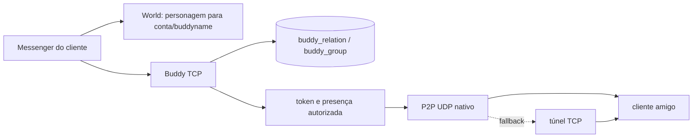

# Sistema de amigos (Buddy) — Rakion v258

## Estado atual

O contrato estático do `Buddy2.dll`, a persistência de amigos e grupos, o registro UDP, a presença
autorizada e o fallback por túnel TCP estão implementados. Um E2E headless com dois clientes e
sockets reais agora fecha também handshake original, lista inicial, presença UDP, SMS cifrado,
entrega, ACK e persistência no MySQL.

A validação gráfica de 18/07/2026 aprovou o login simultâneo de `test` e `test2`, o registro UDP e
a abertura do painel Messenger pelo F9 nos dois clientes pristine. O painel, porém, permaneceu
visualmente vazio mesmo com uma relação bilateral no banco. O trace no consumer original confirmou
`RET_LOGIN friendCount=1` e `NTF_USER_STATE` online nos dois sentidos; portanto, a renderização da
lista continua aberta e o Messenger ainda não deve ser classificado como funcional completo.

Em 19–20/07/2026 foi reproduzida outra falha: após entrar no servidor ou trocar de personagem, o
modelo social podia ser reinicializado sem que o cliente repetisse `SVC_SET_NICK`; a lista só surgia
depois de selecionar manualmente **Nick Change**. A correção fica integralmente no backend. Antes do
snapshot `0x0C`, o World normaliza `buddyname` para o primeiro personagem válido por slot. No login
Buddy e em todo refresh válido, o servidor reproduz a sequência que destrava o cliente:
`RET_SET_NICK(result=0)` seguido de `RET_LOGIN`. A mesma sequência é reenviada mesmo se o nome já
estava correto. O monitor acompanha `charname` e `buddyname` das contas online em uma consulta em
lote e exige estabilidade por dois ciclos de 500 ms antes do refresh. Login, create, rename,
select, delete e refresh estão cobertos no backend; a confirmação visual pelo F9 permanece pendente.

A matriz LAN/NAT também permanece pendente. O P2P UDP direto continua sendo executado pelo
`Buddy2.dll`; o servidor fornece descoberta de endpoint e fallback TCP, mas não interpreta nem
modera o tráfego direto.

| Camada | Estado |
|---|---|
| Framing, handshake e login AES | Implementado e validado no fio |
| Lista inicial de amigos | Sequência `RET_SET_NICK` → `RET_LOGIN` validada headless; novo smoke F9 pendente |
| Amigos e grupos | Persistência InnoDB e mutações principais implementadas |
| Registro UDP e presença | E2E de dois clientes em localhost; validação LAN/NAT pendente |
| Túnel TCP `0x2020/0x2021` | Implementado, autorizado e limitado |
| SMS central/offline | Envio, entrega cifrada, ACK e banco validados no fio |
| P2P UDP direto | Nativo no cliente; validação visual/rede pendente |
| `GROUP_DEL/CHG` | ABI dormente: há consumers de resposta, mas nenhum builder de request localizado |

## Evidência e reprodução

Cliente analisado:

```text
C:\Users\joaop\Desenvolvimento\Rakion\rakion-final\Bin\Buddy2.dll
SHA-256 6501BBC46EDAB7E25F132322BAFA941226C6B8B35AEB63D0398E7CD35AABFEE7
```

O script [`DecompileBuddyServiceContracts.py`](../../tools/ghidra/DecompileBuddyServiceContracts.py)
reproduz os builders e consumers usados nesta documentação:

```powershell
& 'C:\Users\joaop\Desenvolvimento\Rakion\ghidra_11.0.3_PUBLIC\support\analyzeHeadless.bat' `
  'C:\Users\joaop\Desenvolvimento\Rakion\rakion-work\_dbg\buddyproj' buddy `
  -process Buddy2.dll -noanalysis -scriptPath tools\ghidra `
  -postScript DecompileBuddyServiceContracts.py C:\temp\buddy_service_contracts.txt
```

O passe atual encontra 18 funções para 18 constantes, incluindo os builders de `0x2020`,
`0x3000`, `0x3002`, `0x3004`, `0x3006`, `0x3100`, `0x3102`, `0x3104`, `0x3110` e `0x3152`, além
do consumer comum de respostas/notificações. Não foram localizados builders de `0x3154` ou
`0x3156`; por isso o servidor não inventa esses payloads.

Os traces Frida [`buddy_login_trace.js`](../../tools/frida/buddy_login_trace.js),
[`buddy_friend_trace.js`](../../tools/frida/buddy_friend_trace.js) e
[`buddy_ui_model_trace.js`](../../tools/frida/buddy_ui_model_trace.js) reproduzem a derivação do
login, inspecionam `RET_LOGIN`/`NTF_USER_STATE` e auditam a passagem para o modelo do `rakion.exe`.
O último confirmou um registro interno de `0x116` bytes e `modelCount=1` depois do callback, sem
alterar pacotes ou estado. Assim, a pendência observada no F9 está depois da inserção no modelo.

## Arquitetura



O backend usa vertical slices por responsabilidade, mantendo codecs byte-exatos separados do
banco e do transporte:

- `BuddyServer.Protocol.cs`: dispatch, handshake, login e SMS;
- `BuddyServer.CharacterSelection.cs`: refresh da lista após troca do personagem ativo;
- `BuddyServer.Friends.cs`: amigos, grupos e extensões;
- `BuddyServer.Presence.cs`: token, registro UDP e online/offline;
- `BuddyServer.Tunnel.cs`: autorização e relay;
- `BuddyFriendCodec.cs` e `BuddyTunnelCodec.cs`: contratos de borda;
- `BuddyDatabase.Friends.cs`: schema, migração e transações.

## Transporte TCP

Todos os valores, exceto IP/porta de endpoint, usam little-endian:

```text
+0x00  u16 size       tamanho total, incluindo o header
+0x02  u16 command
+0x04  byte payload[size - 4]
```

O parser aceita fragmentação e frames coalescidos. A escrita é serializada por conexão e continua
até enviar o frame completo.

## Handshake e login

### `SVC_PRECREDENTIAL 0x1000` / `RET_PRECREDENTIAL 0x1001`

`SVC_PRECREDENTIAL` não possui payload. A resposta tem exatamente oito bytes:

```text
+0x00  u32 seed
+0x04  u32 cookie opaco
```

O servidor gera ambos com CSPRNG por conexão.

### `SVC_LOGIN 0x1010`

O cliente deriva `sessionKey = SHA0(accountId || seedLE32)` e usa os primeiros quatro words do
estado final em little-endian (16 bytes). O segundo secure-string lido pelo `Buddy2.dll` está vazio
no cliente v258 e, portanto, senha não participa dessa derivação. A credencial de
32 bytes usa AES-128-ECB com a chave fixa original `2C45926CF3396642B670D006A1FA8182`;
os 176 bytes seguintes são blocos de 16 bytes no formato
`[u32 0x2DBABE65][12 bytes cifrados]`. O servidor valida identidade, seed, marcadores e o
header lógico `0x1B` antes de autenticar a sessão.

Esse handshake legado não prova conhecimento da senha. Em exposição pública, as portas Buddy
devem permanecer protegidas por firewall/rede confiável até existir um token adicional emitido pelo
World e consumido pela DLL de compatibilidade.

### `RET_LOGIN 0x1011`

```text
+0x00  u16 result
+0x02  u32 udpToken
+0x06  u16 friendCount              máximo 500
+0x08  FriendRecord[friendCount]
```

Cada `FriendRecord` possui 148 bytes:

```text
+0x00  char accountId[20]
+0x14  wchar displayName[20]         40 bytes
+0x3C  wchar groupName[20]           grupo local do owner
+0x64  u32 reserved[4]               zero nesta implementação
+0x74  byte extension[32]
```

O login carrega as relações persistidas e emite um token UDP aleatório, de uso único e ligado à
sessão TCP corrente. Uma sessão substituída não consegue registrar endpoint usando token antigo.

## Requests e responses de amigos/grupos

### Amigos

```text
SVC_ADD_BUDDY 0x3000, 52 bytes
+0x00  char accountId[20]
+0x14  byte extension[32]

RET_ADD_BUDDY 0x3001
+0x00  u16 result
+0x02  FriendRecord[1]               somente no sucesso; total 150 bytes

SVC_REMOVE_BUDDY 0x3002, 20 bytes
+0x00  char accountId[20]

RET_REMOVE_BUDDY 0x3003
+0x00  u16 result
+0x02  char accountId[20]            somente no sucesso; total 22 bytes
```

ADD cria as duas relações direcionadas na mesma transação serializável. Cada owner mantém seu
grupo e extensão independentemente. Self-add é rejeitado. REMOVE apaga os dois lados em uma
transação e é seguro contra repetição.

### Grupos

```text
SVC_GROUP_GETLIST 0x3150
sem payload

RET_GROUP_GETLIST 0x3151
+0x00  u16 result
+0x02  u16 count                     máximo 50
+0x04  GroupRecord[count]

GroupRecord, 44 bytes
+0x00  u16 id
+0x02  wchar name[20]
+0x2A  u16 flags/order

SVC_GROUP_ADD 0x3152, 44 bytes
GroupRecord

SVC_GROUP_BUDDY 0x3004
+0x00  u16 count                     máximo 500
+0x02  char accountId[20] * count
+...   wchar groupName[20]

SVC_RENAME_GROUP 0x3006, 80 bytes
+0x00  wchar oldName[20]
+0x28  wchar newName[20]
```

ADD, associação e rename persistem no banco; rename atualiza o nome do grupo e as relações na
mesma transação. `SVC_GROUP_DEL 0x3154` e `SVC_GROUP_CHG 0x3156` recebem falha explícita porque
esta build contém apenas os consumers `0x3155/0x3157`, sem builder de request alcançável.

### Perfil e extensões

```text
SVC_SET_NICK 0x3100       wchar nick[20]             40 bytes
SVC_SET_GUILD 0x3102      wchar guild[20]            40 bytes
SVC_SET_EXTUSER 0x3104    byte extension[16]         16 bytes
SVC_SET_EXTLIST 0x3110    char account[20] + ext[32] 52 bytes
```

Os retornos ímpares correspondentes carregam `u16 result`. Guild e extensão do usuário ficam em
`buddy_profile`; a extensão por amigo fica em `buddy_relation`. O nick canônico continua em
`usergameinfo.buddyname`, persistido pelo World antes do `SET_NICK`.

## Registro UDP e presença

Após `RET_LOGIN`, o cliente envia `udpToken` em um datagrama de quatro bytes ao mesmo número de
porta do Buddy TCP. O servidor:

1. consome o token uma única vez;
2. confirma que a sessão ainda é a sessão online corrente;
3. registra o endpoint observado pelo socket UDP;
4. devolve `NTF_VIP_IPPORT 0x101F` ao próprio cliente;
5. publica estado apenas para relações autorizadas;
6. publica offline quando a sessão corrente encerra.

Endpoints usam bytes de IPv4 seguidos de porta em network byte order:

```text
NTF_VIP_IPPORT, 6 bytes
+0x00  byte ipv4[4]
+0x04  u16 portBE

NTF_USER_STATE 0x3FFF
+0x00  u16 count
+0x02  StateRecord[count]

StateRecord offline, 21 bytes
+0x00  char accountId[20]
+0x14  u8 online = 0

StateRecord online, 33 bytes
+0x00  char accountId[20]
+0x14  u8 online = 1
+0x15  Endpoint A, 6 bytes
+0x1B  Endpoint B, 6 bytes
```

O binário lê dois endpoints, mas a ordem privado/público ainda não foi comprovada em LAN/NAT. O
servidor escreve o endpoint público observado nos dois campos. Isso é byte-exato e funcional no
caso em que ambos coincidem, sem inventar um endereço privado que o protocolo de login não envia.

Falhas de envio causadas por desconexão concorrente de um peer não derrubam o fluxo do remetente e
não impedem a publicação aos demais amigos.

## P2P e túnel TCP

O P2P direto é criptografado e tratado pelo `Buddy2.dll`. Os inner opcodes encontrados incluem:

| Opcode | Função observada |
|---:|---|
| `0xC011` | mensagem direta |
| `0xC012/0xC013` | convite e resposta |
| `0xC015` | SMS legado |
| `0xC018` | mensagem de presente |
| `0xC01A..0xC01D` | foto/metadados |
| `0xC041/0xC042` | pedido de amizade e resposta |
| `0xC043` | aviso de remoção |
| `0xC051/0xC053` | estado e pedido de estado |

O builder `FUN_10008720` confirma o request de túnel:

```text
SVC_TUNNEL_PACKET 0x2020
+0x00  u8 flags
+0x01  u16 innerOpcode
+0x03  u16 innerLength              máximo 255
+0x05  byte innerPayload[innerLength]
+...   u16 recipientCount           1..500
+...   char recipientId[20] * count
```

O consumer em `0x10007D43..0x10007DC3` confirma a notificação:

```text
NTF_TUNNEL_PACKET 0x2021
+0x00  char senderId[20]
+0x14  wchar displayName[20]
+0x3C  wchar groupName[20]          visão local do destinatário
+0x64  u16 innerLength
+0x66  u16 innerOpcode
+0x68  byte innerPayload[innerLength]
```

O relay aceita os inner opcodes gerais apenas para destinatários presentes na lista persistida do
remetente. Para permitir formar uma amizade, `0xC041/0xC042` são os únicos opcodes aceitos entre
usuários ainda não relacionados. O relay elimina duplicatas, limita cada sessão a 60 frames por
janela de cinco segundos e não registra conteúdo do payload. Em relações existentes, o nome do
grupo enviado é carregado da visão do destinatário, pois grupos são locais por owner.

## SMS central e fila offline

`SVC_SMS_SEND 0x2030` usa o contexto AES da sessão. O plaintext contém `recipient[20]`, tamanho
`u16` e mensagem. Mensagens aceitas são moderadas, persistidas em `buddy_sms` e entregues por
`NTF_SAVE_PACKET 0x2010`, com inner opcode `0xC015`. `0x2011` confirma os IDs entregues. Bloqueio,
mute, burst, repetição e `abusestring.txt` compartilham a política do World; a auditoria guarda hash,
não texto em claro.

## Persistência e migração

O schema é criado automaticamente no startup:

```text
buddy_relation
  owner_account, buddy_account, group_name, ext_data, created_at
  PK(owner_account, buddy_account)

buddy_group
  owner_account, group_id, name, flags, sort_order
  PK(owner_account, group_id)
  UNIQUE(owner_account, name)

buddy_profile
  account_id, guild_name, ext_user, updated_at
```

Se a tabela MyISAM legada `buddylist(Id, Category, Buddy)` existir, seus registros válidos são
migrados com `INSERT IGNORE`. A partir daí, as tabelas InnoDB são a fonte canônica; o legado não
recebe escrita dupla.

## Configuração, ativação e rollback

O Buddy reutiliza `[DB]` e `[Chat]` do INI passado pelo stack. As portas vêm de
`RAKION_BUDDY_PORTS`; o padrão é `8500,8504`. Para cada porta configurada são abertos TCP e UDP.
`ConnectionStrings__Rakion` pode sobrescrever o banco.

```ini
[DB]
IP=127.0.0.1
Port=3306
User=root
Pass=...
Name=rakion

[Chat]
Enabled=1
AbuseFile=abusestring.txt
Burst=5
WindowSeconds=5
RepeatLimit=3
RepeatWindowSeconds=10
AutoMuteSeconds=30
```

Ativação:

1. fazer backup de `buddylist`, `buddy_relation`, `buddy_group` e `buddy_profile`, se existirem;
2. garantir que TCP e UDP das portas Buddy estejam publicados no firewall/NAT;
3. executar build e testes;
4. iniciar `start-stack.ps1`; o schema e a migração são idempotentes;
5. testar duas contas em mesma máquina, depois LAN e por fim NAT;
6. confirmar add, relogin, grupos, online/offline, mensagem direta e fallback tunnel.

Rollback:

1. parar o Buddy;
2. restaurar o backup das tabelas se a migração precisar ser revertida;
3. voltar o binário anterior;
4. manter UDP fechado se presença/P2P forem temporariamente desativados.

Não há feature flag separada para amigos/presença. Não exponha apenas TCP em produção: isso deixa
o login funcional, mas impede o registro P2P e força dependência do túnel.

## Validação

Testes automatizados cobrem:

- offsets e tamanhos do login e registros de 148 bytes;
- responses completos de add/remove;
- layouts fixos de SET e grupos;
- IP/porta em network order e estados online/offline;
- request variável e notification do túnel;
- migração, amizade simétrica, extensões, grupos e remoção em smoke MySQL opcional.
- E2E com dois sockets TCP, dois endpoints UDP, handshake/crypto originais, lista bilateral,
  presença nos dois sentidos, SMS cifrado, `RET_SMS_SEND`, `NTF_SAVE_PACKET`, ACK e timestamps de
  entrega/confirmação no MySQL.

O smoke MySQL só executa quando `RAKION_MYSQL_SMOKE_CONNECTION` está definido. Sem essa variável,
ele retorna sem alterar banco local.

Comandos:

```powershell
& 'C:\Users\joaop\.dotnet\dotnet.exe' test `
  server\RakionServer\tests\RakionServer.World.Tests\RakionServer.World.Tests.csproj `
  --filter 'FullyQualifiedName~Buddy'

& 'C:\Users\joaop\.dotnet\dotnet.exe' build `
  server\RakionServer\src\RakionServer.Buddy\RakionServer.Buddy.csproj `
  -c Release
```

Matriz visual ainda obrigatória:

| Cenário | Resultado esperado |
|---|---|
| Add + relogin | relação aparece nos dois lados e persiste |
| Grupos locais diferentes | cada usuário vê seu próprio grupo |
| Online/offline | somente amigos recebem mudança |
| Sessão duplicada | token/socket anterior não reassume presença |
| Mesma máquina/LAN/NAT | endpoint direto funciona quando alcançável |
| UDP bloqueado | `0x2020/0x2021` entrega o inner packet |
| Peer cai durante envio | remetente e demais peers continuam conectados |
| Não amigo tenta tunnel geral | relay rejeita; apenas `0xC041/0xC042` atravessam |

Build verde não substitui essa validação gráfica. Até executá-la, o estado correto é
**completo headless; visual e topologia de rede pendentes**.

## Arquivos de referência

- [`BuddyProtocol.cs`](../../server/RakionServer/src/RakionServer.Buddy/BuddyProtocol.cs)
- [`BuddyFriendCodec.cs`](../../server/RakionServer/src/RakionServer.Buddy/BuddyFriendCodec.cs)
- [`BuddyTunnelCodec.cs`](../../server/RakionServer/src/RakionServer.Buddy/BuddyTunnelCodec.cs)
- [`BuddyServer.Friends.cs`](../../server/RakionServer/src/RakionServer.Buddy/BuddyServer.Friends.cs)
- [`BuddyServer.Presence.cs`](../../server/RakionServer/src/RakionServer.Buddy/BuddyServer.Presence.cs)
- [`BuddyServer.Tunnel.cs`](../../server/RakionServer/src/RakionServer.Buddy/BuddyServer.Tunnel.cs)
- [`BuddyDatabase.Friends.cs`](../../server/RakionServer/src/RakionServer.Buddy/BuddyDatabase.Friends.cs)
- [`BuddyFriendProtocolTests.cs`](../../server/RakionServer/tests/RakionServer.World.Tests/BuddyFriendProtocolTests.cs)
- [`BuddyFriendDatabaseSmokeTests.cs`](../../server/RakionServer/tests/RakionServer.World.Tests/BuddyFriendDatabaseSmokeTests.cs)
- [`BuddyHeadlessClient.cs`](../../server/RakionServer/tests/RakionServer.World.Tests/BuddyHeadlessClient.cs)
- [`BuddyHeadlessE2ETests.cs`](../../server/RakionServer/tests/RakionServer.World.Tests/BuddyHeadlessE2ETests.cs)
