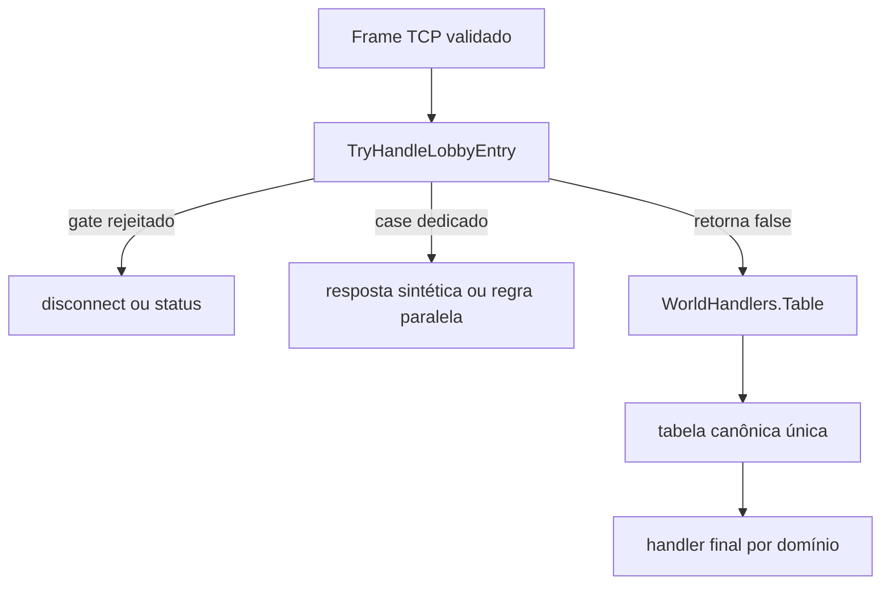

# Rakion v258 — protocolo World canônico (RE)

## Status e objetivo

Este documento é a fonte canônica do protocolo do World Server para o cliente em
`C:\Users\joaop\Desenvolvimento\Rakion\rakion-final`. Ele consolida o frame TCP,
sequências, cifra, máquina de estados, métodos `IScavengerWorldNet::Send*`, dispatch do
`worldserv.exe` original e a rota realmente executada pelo servidor .NET atual.

O vínculo entre contratos e artefatos verificáveis está em
[`world-evidence.md`](world-evidence.md).

O objetivo imediato é impedir que o número do opcode, o nome de um handler reconstruído e
a regra de negócio sejam tratados como três fontes de verdade diferentes. A regra adotada é:

1. o método `Send*` do cliente define a intenção C→S;
2. o corpo do handler original define validações, estado e resposta;
3. uma captura original define o layout final quando a decompilação é ambígua;
4. o servidor .NET deve implementar esse contrato sem mover regra de negócio para o cliente.

Classificação da evidência usada nas tabelas:

- **Confirmado**: opcode e payload lidos diretamente no corpo do `Send*` ou em captura;
- **Parcial**: opcode confirmado, mas algum campo variável ainda precisa ser nomeado;
- **Em aberto**: existe envio no cliente, mas a rota correspondente no servidor original ainda
  não foi localizada com segurança.

## Resultado executivo da auditoria

O protocolo não pode ser representado corretamente apenas por uma tabela plana de nomes.
Existem três dimensões que decidem o significado efetivo de um pacote:

- opcode enviado pelo cliente;
- estado da sessão, canal, sala ou partida;
- caminho de dispatch usado naquele estado.

No servidor .NET atual, `ClientSession.DispatchOpcode` chama primeiro
`TryHandleLobbyEntry`; só depois chama `WorldHandlers.Dispatch`. O interceptador mantém apenas
rotas cuja semântica realmente depende de estado, modo ou payload. `WorldHandlers.cs` é a única
tabela de delegates: não há construtor estático de sobrescrita, `Stub` nem `StubGates`.

Conflitos históricos já fechados incluem `0x46` como saída/morte do próprio remetente, `0x47`
como chat de field, `0x56/0x57` como tunneling, `0x59/0x5A` como ping e `0x6B..0x6D` como
presentes. O catch-all de campo foi removido; lacunas recebem `DISC C9` e cases aceitos alcançam
seus handlers independentemente do booleano local `InField`.

## Transporte TCP

Todos os inteiros são little-endian.

```text
[u16 size][u16 A][u16 B][data...]
size = 6 + len(data)
```

O campo `size` inclui os próprios dois bytes. O parser lê `size - 2` bytes de conteúdo.

### Cliente → servidor

```text
A = opcode
B = clientSeq
```

O servidor original valida `clientSeq == previous + 1`, com retorno a zero depois de 65000.
`0x0C` reinicia a sequência e, junto com `0x0F`, não passa pela validação normal. Sequência
inválida encerra a sessão com `DISC 2`. O contador original fica em `user+0x146e`.

### Servidor → cliente — canal de mensagem

```text
A = serverSeq
B = msgType
data = payload da mensagem
```

O contador é incrementado a cada envio em `FUN_0041b940` e fica em `user+0x1488`.
Tipos confirmados incluem `2` para conclusão do login e `4` para notificação de desconexão.
No canal FIELD, `0x54` e `0x55` são mensagens S→C vazias que chamam
`IScavengerWorldNet::SetHaveTunnelingClient(1/0)`: a primeira informa presença agregada de
tunneling na sala e a segunda informa que o último cliente desse tipo saiu.

### Servidor → cliente — canal lobby cifrado

`FUN_004038e0` envia um payload lógico iniciado por `[u16 subtype]`. Com a cifra ativa, cada
12 bytes de texto são transformados em 16 bytes AES:

```text
AES-128 key = E1 3A 7E F5 37 2C 10 4D 4E CE B3 0C 56 26 A4 8E
IV/seed     = 7F C4 00 00
bloco       = [4 bytes IV fixo][12 bytes plaintext]
wire        = [u16 size][ciphertext...]
```

O IV é fixo por bloco, não encadeado. Entrada C→S validada é lida em texto pelo dispatcher;
a cifra reconstruída é usada no caminho outbound lobby. `PacketCrypto` e `SendLobby` já
implementam esse formato no servidor atual.

## Dispatch e máquina de estados

### Servidor original

O receive loop `FUN_0042bd70` desmonta o frame, verifica sequência e chama
`FUN_0042ab40(slot, opcode, len, payload)`. A leitura direta da jump table em `0x42b80c`
confirma um único switch para `0x01..0x79`; valores fora da tabela e lacunas chamam
`Disconnect(0xC9)`.

O case `0x0C` é especial: quando `this+0x5b18 == 0`, chama `FUN_0041f6c0`; quando o World
já está autenticado, chama `FUN_0042a310`. A inspeção do assembly de `FUN_0042a310`
confirma que ele também interpreta o payload de login, valida servidor travado, handles
duplicados, lotação, nomes e comprimentos e envia a resposta correspondente. Portanto,
`FUN_0042a310` **não é um dispatcher in-game geral**.

Os exports do cliente `0x1D`, `0x1F`, `0x21`, `0x23..0x28`, `0x3C`, `0x44`, `0x66` e
`0x69` existem na mesma `engine.dll`, mas são rejeitados pelo `worldserv.exe` analisado.
A busca pelos 143 callers do accessor WorldNet da UI encontrou uma chamada ao slot `+0x60`
(`SendChannelList`, `0x1D`) em `FUN_0046A0F0`, evento `0x174`. O assembly fecha os argumentos como
`[primeiroId:u8][flag=1:u8]`: o primeiro byte vem do primeiro registro da última resposta
S→C `0x1D`, e cada registro decodificado ocupa `0x2D` bytes. Nos mesmos callers não há chamada
WorldNet aos slots dos demais exports rejeitados. Logo, `0x1D` é uma rota UI incompatível com o
World desta build, não uma operação sem layout; os demais permanecem ABI legado/dormente. Nenhum
deles deve ser implementado sem outra build compatível do World.

### Jump table comprovada

Entradas aceitas e seus handlers são a tabela de endereços em `WorldHandlers.cs`. A extração
independente da jump table confirmou todos esses pares. Lacunas que caem diretamente no default:

```text
06 07 0D 11 1D 1F 21 23 24 25 26 27 28 2B 30 37 3C 44 49 4E
51 52 54 55 58 5C 5F 63 66 67 68 69 6A
```

Comportamento do default:

```text
FUN_0042ab40 -> FUN_0041eb20(slot, reason=0xC9, sendText=1, flag=1)
```

Offsets de estado já confirmados no original:

| Offset | Uso |
|---|---|
| `user+0x1440` | fase da sessão: `0` livre, `1` conectada/seleção, `2` lobby de canal/lista de salas, `3` membro de sala; `4/5` são estados do opcode `0x01` normal/especial |
| `user+0x1460` | `usergameinfo.id` autenticado; carregado por `DBCommandLogin1`, usado no bloqueio de login duplicado |
| `user+0x1468` | `LogUserConnect.id`; vem de `mysql_insert_id`, identifica a atualização de `RealIP` no UDP Port1 e o fechamento da conexão |
| `user+0x146e` | sequência C→S |
| `user+0x1488` | sequência S→C |
| `user+0x148c/+0x148d` | índice e slot local do canal social; o `0x17/0x18` serializa somente o índice |
| `user+0x14a4` | `characterinfo.id` selecionado; zerado antes da seleção e preenchido por `FUN_0040AC30` |
| `user+0x14a0/+0x14a2` | `fieldId:u16` e `seat:u8`; preenchidos por `FUN_0040B7B0`, que promove `+0x1440` para `3` |

No `.NET`, as identidades equivalentes são `GameInfoId` e `ActiveCharId`; `FieldId` e `FieldSeat`
representam `+0x14A0/+0x14A2`. Os booleanos `InField`, `FieldSecondary`, `SlotActive` e
`SecondActive` são controles locais e não devem ser serializados como se fossem esses dwords.

O login original cria `LogUserConnect(userid,username,serverid,userip,country,connecttime)` e
guarda o ID gerado em `+0x1468`. O UDP Port1 executa o comando DB interno `5`, que atualiza
`RealIP` pelo IP anunciado. A desconexão usa o comando `4` para gravar `disconnecttime` e `note`,
e o subtype `4` W→C carrega
`[connectionLogId:u32][reason:u16][userGameInfoId:u32]`. Esses comandos internos não ampliam a
jump table C→S.

### Resposta de login `0x0C` e snapshot de clã

Uma captura diferencial do World original fechou o cabeçalho variável da resposta. Depois do
prefixo `[0C 00 00 01 00 00 00][networkSlot:u16][udpKey:u32][sessionHandle:4]`, o offset `+0x11`
contém `clanId:i32`. A partir de `+0x15`, a ordem é:

```text
clanName\0, clanRank:u32, members:u16, clanPoint:u32,
personalClanPoint:u32, personalClanRank:u32, masterCharacter\0,
displayName\0, powerTimeMarker:u32, powerLevelPoint:u16, country:u16,
treeUpperAccount\0, treeUpperCharacter\0, treeRank:u8, childCount:u8,
childCount * (childAccount\0, childCharacter\0), gold:u32, cash:u32,
slotCount:u8, characterRecords, trailer[20]
```

`displayName` usa `buddyname`, com fallback para `charname`; a árvore original limita a saída a sete
filhos. O `.NET` implementa o mesmo layout com goldens exatos e preserva o fixture sem clã. O mapa,
modelo de dados, implantação e limites visuais estão no documento canônico
[`systems/social/clan.md`](../systems/social/clan.md).

### Servidor .NET atual



Matriz executável do roteamento atual:

| Estado/condição | Rota dedicada antes da tabela | Rota liberada para `WorldHandlers` |
|---|---|---|
| não autenticado | `0x0C` login | nenhuma |
| qualquer estado autenticado | somente rotas com colisão real de estado/payload permanecem antes da tabela | demais cases `0x01..0x79` presentes na jump table; `0x0E`, `0x0F`, ciclo de personagem, inventário `0x2D..0x35` e `0x6F..0x71`, sala `0x36/0x38/0x39/0x3A/0x3B`, round start `0x48`, `0x53`, presentes `0x6B..0x6D`, `0x72` e `0x73` já são canônicos |
| `Status=2` (`FieldLobby`) | enchant commit `0x28`; sala `0x3C..0x43` | demais cases aceitos |
| `Status=3` (`InField`) | primeiro spawn `0x4B`; PvE `0x46`, clear `0x4A`, morte `0x4F` | `0x29/2A`, `0x3E..0x45`, `0x47`, relays `0x4B/4C`, `0x56/57`, `0x59..0x5E`, `0x60`, `0x72` |
| PvP (`Mode != 0`) | — | também `0x3D`, `0x4D`, `0x50` |
| case restante da jump table | — | `WorldHandlers`, com gate próprio do handler |
| lacuna da jump table | nenhuma | `DISC C9`, inclusive quando `InField=true` |

Até 2026-07-16 o catch-all em campo engolia primeiro lacunas e, depois da restrição à jump table,
continuava tornando handlers válidos inalcançáveis. Ele foi removido: a tabela de 87 cases voltou a
ser a única golden source do dispatch final e valores rejeitados pelo original recebem `DISC C9`.
Nenhum case da tabela final aponta para `Stub` ou `Op_InterceptedRoute`: os fallbacks duplicados de
inventário, entitlements, presentes e settlement PvE foram eliminados.

Os interceptores dedicados usam `WorldRequestGatePolicy`, com identidade, fase, razão de disconnect
e ação de falha extraídas por opcode. A exceção `0x38` preserva a resposta de status `5` fora da
fase em vez de transformá-la em disconnect. `0x34` continua no próprio fluxo porque seu gate é o
subestado de inventário `+0x144C`, não `user+0x1440`.

O `.NET` também separa `PreviewCharId`, usado para montar o `0x0C`, de `ActiveCharId`, equivalente
a `user+0x14A4` e preenchido apenas após `0x14`. No start `0x43`, todos os membros são promovidos
a `Status=3` antes do request `0x48`, reproduzindo a ordem observada no cliente real.

As sondas `world_tail_dispatch_probe.py` e `world_udp_probe.py` exercitam o dispatch final no
processo Release: `0x61/0x77` preservam a sessão sem resposta; `0x75` aplica `E7` antes de qualquer
mutação; `0x76/0x78` respondem; `0x79` encerra com razão `1`; e `0x62 [targetSeat]` chega somente ao
alvo como `0x62 [senderSeat]`.

## Registro canônico C→S

As assinaturas abaixo foram reconstruídas dos métodos `IScavengerWorldNet::Send*`. `cstr` é
string terminada em zero; `blob(n)` contém exatamente `n` bytes.

### Sessão, administração e personagem

| Op | Método do cliente | Payload | Evidência |
|---:|---|---|---|
| `04` | `SendAdminBan` | `[u8 flag][cstr text]` | Builder e eco original confirmados; não persiste ban |
| `05` | `SendAdminNotice` | `[u8 scope][cstr target][cstr text]` | Escopos `0/2/3`, alvo opcional e retorno confirmados |
| `09` | comando GM interno | `[u16 fieldId]` | `FUN_0041F5C0`; status `0/1/2`, ID ecoado e duas C-strings no sucesso |
| `0C` | `SendLogin` | `[u8 verifyMode][cstr md5][cstr account][cstr password][u16 tail]` | Confirmado em `FUN_0041F6C0` |
| `0E` | `SendSuccessUDP` | `[u8 result]` | Builder confirmado; nas capturas `result=0` e os sete zeros seguintes são padding AES |
| `0F` | `SendAlive` | vazio | Builder `engine.dll:0x36190C70`; isento de seq, gate de conta, sem resposta |
| `10` | `SendGameGuard` | report de compatibilidade após challenge S→C; challenge pode chegar antes do `0E` | Fechado para a política no-GG desta build; ver `client-integrity.md` |
| `12` | `SendCharacterCreate` | `[cstr name][u8 class][u8 slot]` | Confirmado por diff de slot e INSERT |
| `13` | `SendCharacterDelete` | `[u32 characterId][cstr key/name]` | Confirmado |
| `14` | `SendCharacterSelect` | `[u32 characterId]` | Confirmado |
| `15` | `SendCharacterChangeBuddyName` | `[cstr buddyName]` | Confirmado |
| `16` | `SendCharacterWhisper` | `[cstr target][cstr text]` | Confirmado |
| `17` | `SendCharacterWhereAmI` | vazio | Confirmado |
| `18` | `SendCharacterWhereAreYou` | `[cstr character]` | Confirmado |
| `19` | `SendCharacterGetUserName` | `[cstr value]`, comprimento `<13` | Builder `engine.dll:0x36191020`; World apenas ecoa em msgType `0x0D`, sem consulta DB |
| `1A` | `SendCharacterTutorialClear` | vazio | Confirmado |
| `1B` | `SendCharacterStateClear` | `[u8 type][u16 value se type!=0]` | Confirmado; corpo lógico 1/3 bytes |
| `1C` | `SendCharacterChangeCharName` | `[cstr newName][u8 type][u16 item/value se type!=0]` | Confirmado |

Os contratos completos de busca são globais ao World e exigem conta e personagem selecionado, não
os booleanos locais de gameplay. O nome é comparado por `lstrcmpA`, portanto com case exato:

```text
0x16 sucesso: [u16 0x16][u8 0][sender:cstr][text:cstr]
0x16 falha:   [u16 0x16][u8 1]
0x17:         [u16 0x17][u8 ServerId][u8 kind][u16 locationId]
0x18 sucesso: [u16 0x18][u8 0][target:cstr][u8 kind][u16 locationId]
0x18 falha:   [u16 0x18][u8 1][target:cstr]
```

`kind=0` significa lobby/lista de salas e usa `ChannelId` (`user+0x148C`); `kind=1` significa
membro de field/sala e usa `FieldId` (`user+0x14A0`). O byte inicial do `0x17` vem de
`[Server].ServerId`, carregado em `World+0x54`; não é um status constante.

### Canal

| Op | Método do cliente | Payload | Evidência |
|---:|---|---|---|
| `1D` | `SendChannelList` | `[u8 primeiroId][u8 flag]` | Evento UI `0x174` envia o primeiro ID armazenado e flag literal `1`; World rejeita |
| `1E` | `SendChannelCharacters` | vazio | Retorna amostra aleatória de até 8 membros do canal |
| `1F` | `SendChannelEnter` | `[u8 channel][cstr password/name]` | Export confirmado; rejeitado pelo World analisado |
| `20` | `SendChannelExit` | vazio | Remove o slot local e publica `0x20` aos membros restantes |
| `21` | `SendChannelCreate` | `[cstr name][cstr password][u8 max]` | Export confirmado; rejeitado pelo World analisado |
| `22` | `SendChannelChat` | `[cstr text]` | Broadcast no canal; saída limitada a 128 bytes |
| `23` | `SendChannelClose` | vazio | Export confirmado; rejeitado pelo World analisado |
| `24` | `SendChannelKick` | `[u8 slot]` | Export confirmado; rejeitado pelo World analisado |
| `25` | `SendChannelChangeName` | `[cstr name]` | Export confirmado; rejeitado pelo World analisado |
| `26` | `SendChannelChangePassword` | `[cstr password]` | Export confirmado; rejeitado pelo World analisado |
| `27` | `SendChannelChangeMaxCharacter` | `[u8 max]` | Export confirmado; rejeitado pelo World analisado |
| `28` | `SendChannelChangeBoss` / enchant commit | canal: `[u8 slot]`; enchant: 8 bytes | O export de canal colide com `FUN_0041DE40`, que trata C→S como enchant, não como gestão de canal. S→C usa `[u8 slot]` para notificar novo owner e é consumido em `engine.dll:0x361935F0` |
| `29` | `SendChannelFieldPingRequest` | `[u16 fieldId][u32 tick]` | World encaminha requester global + tick ao master do field |
| `2A` | `SendChannelFieldPingResponse` | `[u16 requesterGlobalSlot][u32 tick]` | World devolve field index do respondente + tick ao requester |

### Inventário, progressão e compra

| Op | Método do cliente | Payload | Evidência |
|---:|---|---|---|
| `2C` | `SendInventoryEnter` | `[u32 FFFFFFFF][u32 sessionHandle]` | Confirmado por captura |
| `2D` | `SendInventoryLeave` | vazio | Builder `engine.dll:0x36191700`, comprimento lógico `2`; os oito bytes posteriores da captura são padding |
| `2E` | `SendInventoryBuy` | `[u16 item][u8 currency][u8 useCoupon][u16 couponSlot se 1]` | Export `0x36191740` + handler `0x421210`; implementado |
| `2F` | `SendInventorySell` | `[u8 slot]` | Confirmado |
| `31` | `SendInventoryMove` | `[u8 srcType][u8 src][u8 dstType][u8 dst]` | Builder `engine.dll:0x36191810`; handler/helper e retorno de 21 bytes fechados |
| `32` | `SendInventoryBuyBag` | `[u8 mode][u16 couponSlot se mode!=0]` | Confirmado no client/World original; somente `mode=1` usa cupom; handler canônico |
| `33` | `SendInventoryAllocationPoint` | `[u8 stat]` | Confirmado |
| `34` | `SendInventoryBuyPowerUser` | `[u8 mode 0/1][u8 couponFlag][u16 couponSlot se 1]` | Confirmado no client/World e implementado transacionalmente |
| `35` | `SendInventoryBuyCharacterSlot` | `[u8 mode][u16 couponSlot se mode!=0]` | Confirmado no client/World original; somente `mode=1` usa cupom; handler canônico |
| `6F` | `SendInventoryBuyPotionSlot` | vazio | Confirmado |
| `70` | `SendInventoryBuyStageRankClear` | vazio | Confirmado |
| `71` | `SendInventoryBuyStageLevelFree` | vazio | Confirmado |
| `73` | `SendInventoryStackPotion` | `[u8 source][u8 destination]` | Builder `engine.dll:0x36191B40`; rota canônica implementada |
| `74` | EnchantReinforce (alias; sem export no `engine.dll`) | `[u8 target][u8 catalyst][u8 count][count*u8 material]` | World `FUN_00421E10`; implementado em duas fases |

### Sala, field e partida

| Op | Método do cliente | Payload | Evidência |
|---:|---|---|---|
| `36` | `SendFieldList` | `[u8 max<=10][u16 cursor][u8 direction][5*u8 includeMode0..4][u8 bypassEligibility]` | Builder `engine.dll:0x36191BA0`, call site `rakion.bin:0x00421620` e handler `FUN_00422C90`; 12 bytes lógicos, implementado |
| `38` | `SendFieldEnter` | `[u16 fieldId][cstr password]` | Confirmado |
| `39` | `SendFieldQuickEnter` | vazio | Confirmado |
| `3A` | `SendFieldExit` | vazio | Confirmado |
| `3B` | `SendFieldCreate` | `name\0 password\0 description\0 [u8 map][u8 mode][u8 rounds][u16 duration][u8 frag][u8 minLevel][u8 maxLevel][u8 levelRangeCode]` | `FUN_00423580/00405440` e produtor UI `0x0044AC70`; modos `0..4` e presets de level fechados |
| `3C` | `SendFieldChangeBoss` | vazio | Export confirmado; rejeitado pelo World analisado |
| `3D` | `SendFieldReady` | `[u8 ready]` | Confirmado |
| `3E` | `SendFieldChangeTeam` | vazio | Confirmado |
| `3F` | `SendFieldClose` | vazio | Confirmado |
| `40` | `SendFieldKick` | `[u8 slot]` | Confirmado |
| `41` | `SendFieldChangeRule` | `name\0 password\0 description\0 [u8 map][u8 mode][u16 duration][u8 minLevel][u8 maxLevel]` | Builder `engine.dll:0x36191FE0` e call site UI `rakion.bin:0x00421F90`; fechado |
| `42` | `SendFieldChangeSlotStatus` | `[u8 slot][u8 status]` | Confirmado |
| `43` | `SendFieldGameStart` | vazio | Builder `engine.dll:0x36192140`, comprimento lógico `2` |
| `44` | `SendFieldGameEnd` | vazio | Export confirmado; rejeitado pelo World analisado |
| `45` | `SendFieldGameEnter` | vazio | Confirmado |
| `46` | `SendFieldGameExit` | `[u8 reason]` | Confirmado |
| `47` | `SendFieldChat` | `[cstr text]` | Confirmado |
| `48` | `SendFieldGameRoundStart` | vazio | Builder `engine.dll:0x361922C0`, comprimento lógico `2` |
| `4A` | `SendFieldGameRoundEnd` | `[u8 result/reason]` | Confirmado |
| `4B` | `SendFieldGameAddPlayer` | `[u16 length][blob(length)]` | Confirmado |
| `4C` | `SendFieldGameAddPlayerReply` | `[u8 slot][u16 length][blob(length)]` | Confirmado |
| `4D` | `SendFieldGameMasterGolem` | `[u16 x/id][u16 y/state]` | Confirmado |
| `4F` | `SendFieldGameDiePlayer` | `[u8 cause][u8 killer]` | Confirmado |
| `50` | `SendFieldGamePoint` | `[u32 exp][u32 gold][u8 flag][3*u32 cellExp][u16 resultMarker]` (23 bytes) | Confirmado no `engine.dll` e no World |
| `53` | `SendFieldGameStagePoint` | `[u8 stage][u8 rank][u8 count][count*u16 mapSlot][u32 exp][u32 gold][3*u32 cellExp]` | Confirmado; comprimento exato e ranges validados antes do settlement transacional |
| `56` | `SendFieldGameTunnelingAll` | `[u16 length][blob(length)]` | Confirmado |
| `57` | `SendFieldGameTunnelingOne` | `[u8 target][u16 length][blob(length)]` | Confirmado |
| `59` | `SendFieldPingRequest` | `[u8 target][u32 tick]` | Confirmado |
| `5A` | `SendFieldPingResponse` | `[u16 target/slot][u32 tick]` | Confirmado |
| `5B` | `SendFieldForceChangeTeam` | `[u8 slot]` | Confirmado |
| `5D` | `SendFieldGameVoteOpen` | `[u8 target][cstr reason]` | Confirmado |
| `5E` | `SendFieldGameVote` | `[u8 vote]` | Confirmado |
| `60` | `SendFieldGameMasterBossHP` | `[u8 boss][u16 hp]` | Confirmado |
| `61` | eco automático do consumidor S→C `0x361945B0` | `[i32 value]` | O cliente remonta e devolve o challenge S→C; `FUN_0041C270` grava/compara o valor; não é `FieldReady` |
| `62` | `SendFieldSlotUDP` | `[u8 targetSeat]` | `FUN_0041C2B0/00406930`: resposta dirigida `0x62 [senderSeat]`; o callback alvo envia presença UDP unreliable |
| `6E` | `SendFieldGamePotion` | `[u8 slot/type][u16 item/value]` | Confirmado |
| `72` | `SendFieldInvitation` | `[u16 targetSessionSlot]` | Confirmado pelo handler World; o nome do parâmetro no export não informa a semântica |

O fluxo de voto usa respostas S→C no canal FIELD: `0x5D [target][reason cstr]` na abertura e
`0x5F [status=0][result=0][eligible][yes][no][abstain][target]` no encerramento. Erros vão somente
ao remetente pelo canal lobby como `0x5F [status]`. Status observados no assembly: `1` já ativo,
`2` já votou, `4` inativo, `5` alvo, `6` tabela cheia, `7` não-master e `9` poucos players.
O voto dura 60 s; aprovação instala bloqueio de reentrada de 30 min, retornado pelo join como
status `8`. Ver [votos, convites e expulsões](../systems/gameplay/votes-invites-kicks.md).

`0x40 [targetSeat]` é remoção direta em partida. Categoria normal só pode enviá-lo do seat master;
`Special=1` e `GM=0x34` contornam esse gate, enquanto alvo `Special=1` é protegido. A saída cancela
voto contra o alvo com `0x5F result=1`, publica `0x3A`, pode publicar `0x4A`, transfere master por
`0x3C` quando necessário e devolve a vítima conectada ao lobby (`Status=2`).

### Eventos, presentes e outros

| Op | Método do cliente | Payload | Evidência |
|---:|---|---|---|
| `64` | `SendGMOperation` | vazio | IP gate: substatus `0x34`; `B9` se status inválido, `BA` se IP negado, sem resposta se aceito |
| `65` | `SendChCode` | `[cstr md5]` (32 hex + NUL) | Seleção MD5_1/MD5_2, modos e `BB/BC` confirmados; sucesso sem resposta |
| `66` | `SendEvent1` | vazio | Export dormente sem call site ativo; World original responde `DISC C9` |
| `69` | `SendEvent4` | vazio | Export dormente sem call site ativo; World original responde `DISC C9` |
| `6B` | `SendPresentPeek` | vazio | Confirmado |
| `6C` | `SendPresentAccept` | `[u32 pendingId][u16 boxSlot]` | Confirmado |
| `6D` | `SendPresentDispose` | `[u32 pendingId]` | Confirmado |
| `75` | compra de loteria | `[u8 paymentType][5*u8 números]` | Request, respostas, débito e persistência fechados em `lottery.md` |
| `76` | consulta de loteria | `[u8 page]` | Página de dez registros e respostas `0/1/2` fechadas em `lottery.md` |
| `77` | diagnóstico de configuração do World | vazio | Original retorna `0x77` com 74 bytes globais, mas esta build cliente não possui case S→C nem produtor conhecido; `.NET` ignora sem sintetizar estado interno |
| `78` | consulta de membros do clã | vazio | DB command `0x2C`; retorno `0x78 [status][count+pairs]`; implementado para compatibilidade, mas sem produtor/case S→C nesta build cliente |
| `79` | disconnect sem texto | vazio | `FUN_00422270` encerra com razão `1`, sem notificação textual |

Exceção S→C do `0x22`: `/roominfo` produz 26 respostas diretas
`[u16 0x22][u8 0][ASCII sem NUL]`. São seis linhas do field e vinte linhas de slots; o contrato
completo e os nomes dos campos estão em
[`channel-lobby.md`](../systems/core/channel-lobby.md#0x22--chat-do-canal).

`SendPacketSpeedTest` tem corpo vazio nesta build e não deve gerar um handler fictício.

## Auditoria do mapa atual

| Op | Contrato canônico | Rota/nome atual | Avaliação |
|---:|---|---|---|
| `04` | AdminBan | `Op_AdminBanEcho` | fiel ao original; nome exportado não implica ban persistente |
| `05` | AdminNotice | `Op_AdminNotice` | fiel ao filtro original de escopo, field e nome exato |
| `12` | CharacterCreate | `Op_CharacterCreate` | rota única; parser cstr/class/slot e ack 3/7 bytes |
| `13` | CharacterDelete | `Op_CharacterDelete` | rota única; política DB completa e snapshot de clã no sucesso |
| `14` | CharacterSelect | `Op_CharacterSelect` | fechado: rota única, status `0/1/2`, bootstrap somente após sucesso |
| `15` | CharacterChangeBuddyName | `Op_CharacterChangeBuddyName` | rota única; identidade, commit e ack variável |
| `1A` | CharacterTutorialClear | `Op_CharacterTutorialClear` | rota única; body vazio/zerado, persistência idempotente e sem ack |
| `1B` | CharacterStateClear | `Op_CharacterStateClear` | fechado em rota única: parser 1/3 bytes, gate de conta, cash/coupon, ack lógico variável, random present e Gift Box; UI pendente |
| `1C` | CharacterChangeCharName | `Op_CharacterChangeCharName` | fechado em rota única: parser cstr/1/3, gate de conta, unicidade, cash/coupon e ack lógico variável; UI pendente |
| `2D` | InventoryLeave | `Op_InventoryLeave` | fechado; rota única e máquina `0/1/2` |
| `2E` | InventoryBuy | intercept transacional dedicado | implementado; sucesso após commit |
| `2F` | InventorySell | intercept transacional dedicado | implementado; remoção por row id |
| `31` | InventoryMove | `Op_InventoryMove` canônico | swap box/zona ativa, estados `0..4`, frame lógico de 21 bytes e persistência transacional |
| `32` | BuyBag | intercept transacional dedicado | cash/cupom, limite, ledger e callback implementados |
| `34` | BuyPowerUser | handler canônico transacional | compra/renovação, cupom, validade, pontos e ledger implementados |
| `35` | BuyCharacterSlot | intercept transacional dedicado | cash/cupom, limite, `0x0C`, ledger e callback implementados |
| `3D` | FieldReady no lobby | intercept por `Status=2`; `FieldWeaponChange` por `Status=3` | fechado por estado; payload `u8` é compartilhado |
| `3E` | ChangeTeam | intercept por `Status=2`; troca de bloco/assento por `Status=3` | fechado por estado; ambos preservam mudança de time/seat |
| `46` | FieldGameExit | `Op_0x46_Recon` | fechado: saída/morte própria, penalidade de EXP, retorno `0x58 [i32 remainingExp]` ao sender e broadcast `[seat]` |
| `47` | FieldChat | `Op_FieldChat` pelo canal FIELD | fechado: `[senderSeat][cstr text]`, broadcast aos ocupados e probe com seat 10 |
| `5B` | FieldForceChangeTeam | `Op_FieldForceChangeTeam` | fechado: target seat, janela pré-spawn `Status=3/state!=2`, mutação para time oposto e corpos `0x3E [0,old,new]`/`[2]` golden; visual pendente |
| `56/57` | TunnelingAll/One | handlers renomeados e roteamento original | implementado e validado headless |
| `59/5A` | Ping request/response | handlers renomeados; slot global/seat local separados | implementado e validado headless |
| `64` | GMOperation | `Op_GmOperationIpGate` | contrato original reconstruído e validado ao vivo |
| `6B..6D` | presentes | intercept dedicado Peek/Accept/Dispose | implementado e comparado com callbacks/probes originais |
| `6F` | BuyPotionSlot | handler canônico transacional | cash/gold, limite, ledger, callback e células implementados |
| `70` | stage rank clear | handler canônico transacional | faixas, cash, delete, ledger e callback implementados |
| `71` | stage level free | handler canônico transacional | cash, cooldown, ledger, marcador e callback implementados |
| `72` | FieldInvitation | `Op_FieldInvitation` | fechado: alvo por slot global, sender/field reais e blob completo da sala; golden + duas sessões |
| `73` | StackPotion | `Op_InventoryStackPotion` | fechado: limites `E0/E1`, estados `1..4`, erro `0x73` e confirmação `0x27`; visual pendente |
| `74` | EnchantReinforce | `FUN_00421E10` preview; commit chega em `0x28`/`FUN_0041DE40` | duas fases implementadas; roll autoritativo |

Os handlers de `0x12`, `0x13`, `0x14`, `0x15` e `0x1A` possuem rotas canônicas dedicadas.
Os aliases antigos `FieldAction`, `FieldName`, `FieldText` e `FieldPing` eram hipóteses de uma
transcrição anterior e foram removidos; não representavam semântica alternativa do binário.

## Respostas e capturas douradas já fechadas

Hashes, cadeia completa e separação entre comprimento lógico e padding estão no
[`catálogo de evidências`](world-evidence.md).

Os retornos de progressão que antes apareciam apenas pelo opcode agora têm contrato completo:

| Op S→C | Payload lógico | Efeito no cliente |
|---:|---|---|
| `51` | `[u8 newLevel][u16 levelPoints]` | atualiza nível e pontos disponíveis |
| `52` | `[u8 seat][u8 playerLevel][u8 cellLevel0][u8 cellLevel1][u8 cellLevel2]` | executa `CPlayer::LevelUp` e atualiza os três slots de cell |

`engine.dll:0x36194100` lê exatamente três bytes. `engine.dll:0x36194130` lê cinco bytes e os
encaminha individualmente ao callback `rakion.bin:0x00478CC0`. O produtor original empacota os
dois primeiros níveis de cell em um `u16` little-endian e o terceiro em `u8`; isso não transforma
o campo em um contador ou placar. O World .NET usa `ProgressionResponseBodies` para impedir que
caminhos de stage/PvP voltem a emitir corpos truncados.

Nos cases simples/dormentes, o contrato deve registrar o que o consumidor realmente faz:
`0x5C/0x63` tratam o corpo como `cstr`; `0x67/0x68` não leem corpo; `0x69/0x6A` apenas encaminham
o endereço inicial. Assim, `0x69` não pode ser declarado `u32` pela assinatura do decompilador.
O produtor World de `0x63` está em `FUN_0041F290`; `0x6A` é produzido por
`FUN_0041C330/0041D650`, com a gramática de presentes já fechada. `0x5C/0x67..0x69` permanecem
sem produtor ativo confirmado, apesar de seus consumidores estarem estruturalmente classificados.

Os nomes canônicos de opcode vêm dos exports `IScavengerWorldNet::Send*` do `engine.dll` fixado no
catálogo. `WorldHandlers.OpName` usa esses nomes; nomes herdados do primeiro passe de decompilação
permanecem apenas nos métodos ainda incompatíveis e não devem ser tratados como semântica do wire.

No fluxo inventário → Previous, a captura do World original confirmou:

| Request | Resposta lógica original | Regra |
|---:|---|---|
| `2C` | `[u16 0x2C][u8 status][u32 sessionRef]` | sete bytes lógicos; cauda do bloco AES não é contrato |
| `2D` | `[u16 0x2D][u8 status]` | `0=sucesso`, `1=fechado`, `2=DB ocupado`; cauda do bloco AES não é lógica |
| `36` | duas respostas de lista vazia apenas na primeira armação | repetir mantém polling/telas sobrepostas |

A resposta `36` não é uma lista de registros genéricos. Cada entrada é
`[fieldId:u16][hasPassword][inGame][map][mode][min][max][option][round][maxRounds]`
`[players][capacity][masterUserId:i32][masterSeat:u16][reserved:i32][reserved:u16]`
`[name:cstr][marker:u16]`. A ordem foi confirmada no serializer `FUN_00405790` e no consumidor
`engine.dll:0x36193900`, além de golden byte a byte no World .NET.

Handles são validados pelo cliente e precisam vir da sessão atual. Capturas não autorizam
copiar ids fixos de outra conta.

## Arquitetura de implementação

O World .NET deve usar vertical slices por contrato de opcode, com domínio separado de rede e
persistência. A migração recomendada é incremental:

1. criar um registro `WorldRequestContract` com opcode, nome canônico, estados permitidos,
   parser e handler final;
2. substituir nomes da tabela sem alterar comportamento já validado;
3. mover cada case de `TryHandleLobbyEntry` para o slice canônico correspondente;
4. trocar os quatro booleanos de estado por uma transição explícita de sessão;
5. remover `if (InField) return true` somente depois que todos os opcodes observados tiverem
   política explícita: handle, ignore protocolar ou disconnect;
6. manter regras de personagem, economia, sala e partida no domínio/backend;
7. usar DTOs de request/response nas bordas e transações para compras, rename, resets e gifts;
8. registrar auth, economia, moderação, transições de partida e falhas; não logar CRUD trivial.

Não é seguro fazer uma troca em massa da tabela: fluxos como inventário, quickslot e stage solo
dependem de respostas capturadas que hoje vivem no interceptador.

## Plano de validação

Para cada opcode migrado:

1. teste do parser com payload mínimo, completo, truncado e excedente;
2. teste de estado permitido/proibido e razão de disconnect;
3. teste de regra de negócio sem socket nem banco;
4. golden test do frame S→C, incluindo sequência e AES quando aplicável;
5. integração com persistência para operações transacionais;
6. captura cliente ↔ World original quando o layout S→C ainda for parcial;
7. teste visual no cliente da tela/efeito correspondente;
8. para field/PvP, teste com dois clientes e UDP/tunneling ativo.

Build verde, ausência de disconnect ou log de handler não substituem validação visual.

## Ativação e rollback

Durante a migração, cada slice canônico deve ser ativável por configuração, por exemplo
`World:CanonicalHandlers:<Nome>=true`. O fallback deve chamar o comportamento atual daquele
opcode, nunca um stub genérico. Recomendações operacionais:

- ativar primeiro sessão/personagem fora de combate;
- depois inventário e canal;
- migrar sala/field em ambiente com dois clientes;
- guardar contadores de handler canônico, fallback e rejeição por estado;
- rollback por opcode, sem reverter banco ou misturar schemas;
- qualquer alteração persistente precisa ser backward-compatible durante a janela de migração.

Essa flag ainda não existe no código; esta seção define o contrato de rollout para a fase de
implementação, não afirma que o protocolo canônico já está ativado.

## Pontos em aberto

- manter `0x1D` fora do dispatcher: o produtor, os dois bytes e o consumidor S→C estão fechados,
  mas o World v258 original rejeita a operação;
- a fila `IScavengerWorldNet` S→C `engine.dll:0x36197320` está fechada em 88/88 cases no
  [`world-response-dispatch.md`](world-response-dispatch.md), inclusive respostas de controle FIELD,
  e o dispatcher CNet/P2P está fechado em 24 cases explícitos em
  [`field-message-dispatch.md`](field-message-dispatch.md); a antiga suposta fila FIELD de
  `FUN_0041B940` foi identificada como fila de requisições do worker DB do World;
- validar visualmente presentes `0x6B..0x6D` (`0x6A` termina em callback vazio) e capturar eventos,
  administração e fluxos PvP com dois clientes;
- manter build e testes sem warnings a cada promoção de contrato para golden.

## Fontes locais

- cliente analisado: `C:\Users\joaop\Desenvolvimento\Rakion\rakion-final`;
- transporte e RE anterior: [`../archive/protocol-world-legacy.md`](../archive/protocol-world-legacy.md);
- cobertura global: [`../audits/re-coverage.md`](../audits/re-coverage.md);
- dispatch atual: `server/RakionServer/src/RakionServer.World/Network/ClientSession.cs`;
- interceptador atual: `server/RakionServer/src/RakionServer.World/Network/ClientSession.LobbyFlow.cs`;
- tabela única: `WorldHandlers.cs`; corpos organizados nos partials `WorldHandlers.*.cs`;
- golden tests: `server/RakionServer/tests/RakionServer.World.Tests`.
- evidência assembly preservada: `C:\temp\worldserv_full.asm`;
- exports/decompilação do cliente preservados: `C:\temp\dll_dispatch.txt`,
  `C:\temp\client_vtbl2.txt`, `C:\temp\rakion_worldnet_accessor.txt` e
  `C:\temp\client_dormant_world_callsites.txt`.
