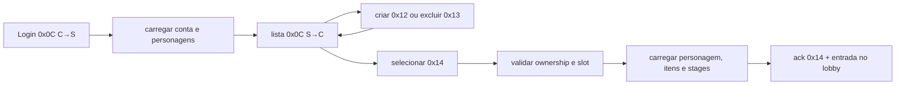

# Rakion v258 — ciclo de personagem (RE e auditoria)

## Escopo e conclusão

Este documento cobre a lista do char-select, criação, exclusão, seleção, identidade de buddy,
tutorial, reset de atributos e troca de nome. A análise combina:

- exports `IScavengerWorldNet::Send*` da `engine.dll` do cliente atual;
- jump table e handlers do `worldserv.exe` analisado;
- captura do request `0x14` e fixtures do response `0x0C`;
- schema original `rakion_all.sql` da imagem `openrakion-server:latest`;
- implementação .NET atual.

Conclusão: listagem `0x0C`, criação `0x12`, exclusão `0x13`, seleção `0x14`, buddyname `0x15` e
tutorial `0x1A` possuem implementação e probes de integração. Reset `0x1B` e rename `0x1C` estão
fechados para cash e coupon, incluindo fórmulas, consumo, logs, callbacks e random presents. A
notificação `0x6A` e a Gift Box `0x6B`–`0x6D` também estão implementadas. O delete foi fechado no
worker original e implementado com exclusão física, proteção por idade, emissão de chave em pickup
de e-mail e soft-delete. O `0x0C` foi confrontado com o consumidor do cliente: conta é C-string
variável e cada registro começa pelo `characterinfo.id`. Permanecem pendentes a validação visual e
a entrega por um serviço SMTP operacional fora do pickup local.

## Terminologia

| Termo | Significado |
|---|---|
| conta | linha `user` + perfil `usergameinfo` |
| personagem | linha `characterinfo`, identificada por `characterinfo.id` |
| slot | posição visual do personagem, `characterinfo.slot` |
| ativo | personagem cujo nome está em `usergameinfo.charname`; a lista original inclui `auth<>10`, mesmo com `used=0` |
| session handle | quatro bytes variáveis do login, reutilizados em acks do inventário |
| cauda do `0x14` | quatro bytes de padding do bloco capturado; não fazem parte do builder lógico |

`usergameinfo.charname` é a seleção persistida do legado. Ela só é aceita depois de resolver um
`characterinfo` habilitado pertencente à conta autenticada; nome sem ownership nunca vira estado.

## Fluxo principal



O servidor deve serializar mutações por conta. Criar, excluir, selecionar, resetar e renomear
não podem correr em paralelo ou confiar no estado enviado pelo cliente.

Ao sair do lobby para criar outro personagem, o cliente envia `0x20 SessionCleanup`. Essa
transição deve remover o usuário do canal/field e zerar o personagem selecionado
(`user+0x14A4`/`ActiveCharId`), preservando apenas o preview. Sem esse reset, o `0x12` seguinte cai
corretamente no gate original `DISC 0x19`. O E2E cobre a sequência real
`login → selecionar → 0x20 → criar` e exige que a sessão permaneça conectada.

## Contratos C→S

### `0x12` — criar personagem

Export do cliente:

```text
SendCharacterCreate(char *name, u8 class, u8 slot)
payload = [cstr name][u8 class][u8 slot]
```

`FUN_0041fcd0` confirma:

- exige `usergameinfo.id` em `user+0x1460` e nenhum `characterinfo.id` ativo em
  `user+0x14a4`, senão `DISC 0x19`;
- nome com menos de 13 bytes, senão `DISC 0x1A`;
- `class < 5`, senão `DISC 0x1B`;
- `slot < 6`, senão `DISC 0xEA`;
- resposta pelo canal de mensagem, subtype `0x07`:

```text
[cstr name][u8 class][u8 slot]
```

O primeiro probe enviava slot `0`, já ocupado, e por isso parava após a consulta de slots. Com slot
`1`, o original executou `SELECT id FROM CharacterInfo WHERE name`, inseriu nome, conta, classe e
slot e atualizou `usergameinfo.charname` somente quando vazio. Status observados: `0` sucesso, `2`
slot ocupado e `4` nome duplicado. `FUN_0041C3D0` envia exatamente
`[12 00][00][characterId:u32]` com comprimento lógico 7; `engine.dll:0x36192E30` lê somente status
e id. Os bytes antes interpretados como slot/flag eram cauda alheia ao contrato. O parser C→S e a
identidade de personagem aceitam o limite original de 12 bytes; o `buddyname` mantém seu contrato
separado de 11 bytes. O padding criptográfico é ignorado. A rota atual é exclusivamente
`Op_CharacterCreate`.

O backend usa transação serializable, índice único global de nome, lock por conta e lock global de
identidade. A listagem passou a seguir o original (`auth<>10`): a linha recém-criada tem `used=0`,
mas apareceu no `0x0C` do relog. A integração local validou sucesso, os dois erros, relog e remoção
da fixture. O teste `CharacterCreateE2ETests` valida também o retorno do lobby pelo `0x20`, criação
em slot livre, ACK com ID, persistência e conexão mantida.

### `0x13` — excluir personagem

Export do cliente:

```text
SendCharacterDelete(u32 characterId, char *deleteKey)
payload = [u32 characterId][cstr deleteKey]
```

`FUN_0041fe10` lê o id e uma string curta. Probe ao vivo com id `1` e chave `sirmaster` confirmou
a política original:

```sql
SELECT ... FROM characterinfo a, usergameinfo b WHERE a.userid=b.id AND a.id=1;
DELETE FROM CharacterInfo WHERE id=1;
DELETE FROM UserItemInfo WHERE characterid=1;
DELETE FROM UserStageInfo WHERE characterid=1;
```

O callback cliente em `FUN_0047C7A0` trata os status abaixo:

| Status | Texto/efeito no cliente |
|---:|---|
| `0` | sucesso; remove o personagem da lista |
| `1` | erro interno do servidor |
| `2` | personagem inexistente |
| `3` | personagem criado há menos de sete dias |
| `4` | autoridade de mestre/knight do clã; tratado pelo cliente, não emitido pelo worker analisado |
| `5` | delete key incorreta |
| `6` | e-mail inválido; chave não pôde ser enviada |
| `7` | delete key enviada ao e-mail |
| `8` | personagem mestre do clã; tratado pelo cliente, não emitido pelo worker analisado |
| `9` | personagem principal/selecionado |

O assembly de `FUN_00412530` fecha a ordem efetiva:

1. nome igual a `usergameinfo.charname` retorna `9`;
2. `used != 0` e idade menor que sete dias retorna `3`;
3. nível abaixo de `15` exclui fisicamente, sem validar delete key;
4. nível `15+`, chave vazia ou `changetime` mais antigo que uma hora gera nova chave;
5. chave recente incorreta retorna `5`; correta marca `auth=10`.

Embora a consulta também selecione `clangrade`, a montagem nunca lê essa coluna e não há branch
que produza `4` ou `8`. A comparação antes atribuída ao clã é ownership: o worker consulta pelo ID
do personagem, compara o `usergameinfo.id` retornado com o ID do request interno e, se divergir,
emite `0x34`. Como o cliente cai em “unknown error” e esse comportamento revela existência de ID,
o backend usa consulta por `(userid, characterId)` e retorna `2` de forma uniforme.

O backend implementa a sequência real em transação serializable. Hard-delete remove itens, stages e
personagem; soft-delete preserva a linha com `auth=10`; ambos gravam `logdeletecharacter`. A delete
key tem dez caracteres do mesmo alfabeto observado no original (`0-9`, `A/B`, `a/b`) e validade de
uma hora. A regra foi isolada em `CharacterDeletePolicy` e não depende de socket ou SQL.

A entrega da chave ocorre depois do commit. Se o notifier do pickup falhar, o World executa uma
compensação compare-and-swap: limpa somente a chave recém-gerada esperada e envelhece `changetime`,
permitindo que o próximo pedido gere e entregue outra chave. Isso evita a janela antiga em que o
cliente recebia erro, mas toda tentativa durante uma hora retornava “chave incorreta”. Se a própria
compensação falhar, o fluxo crítico é registrado sem expor a chave.

O boot converte as quatro tabelas envolvidas (`characterinfo`, `usergameinfo`, `useriteminfo`,
`userstageinfo`) para InnoDB; sem isso o dump MyISAM ignoraria commit/rollback.

No sucesso, `FUN_00427570` não envia apenas status: publica
`[13 00][00][clanId:u32][clanGrade:u8][clanName\0][rank:u32][members:u16][point:u32]` seguido por
`[memberPoint:u32][memberRank:u32][masterName\0]`. O parser `engine.dll:0x36192E70` consome todos
esses campos antes do callback `rakion.bin:0x0047C7A0` remover o personagem da lista. Falhas são o
frame curto `[13 00][status]`. O servidor agora projeta esse snapshot do contrato de clã já carregado,
e `Op_CharacterDelete` é a única rota; a chave é truncada nos mesmos dez bytes de `lstrcpynA` e a
cauda da cifra não vira parte da chave.

A migração foi executada contra `rakion-db` em 2026-07-14 e as quatro tabelas foram verificadas em
`information_schema.tables` com `ENGINE=InnoDB` antes de restaurar o stack normal.

### `0x14` — selecionar personagem

Captura original, incluindo padding do bloco:

```text
[u16 opcode=0x14][u16 seq][u32 characterId][u32 padding variável]
14 00 | 02 00 | 01 00 00 00 | 10 7f 1a 00
```

`SendCharacterSelect @ engine.dll:0x36190E20` monta exatamente seis bytes lógicos:
`[u16 0x14][u32 characterId]`. Portanto, os quatro bytes finais da captura variam porque são
padding, não token. `FUN_0041fef0`:

1. exige `usergameinfo.id` ativo e `characterinfo.id` ainda vazio;
2. rejeita `characterId == 0` com `DISC 0x1E`;
3. procura o id nos seis registros carregados da própria conta;
4. ao encontrar, aplica os dados com `FUN_0040be30`, `FUN_0040d3f0` e `FUN_0040ac30`;
5. responde no lobby com `[u16 0x14][u8 status]`;
6. status `0` significa sucesso e `2` significa id não encontrado; o cliente também trata `1` como erro
   interno do servidor;
7. estado inválido encerra com `DISC 0x1D`.

O parser `engine.dll:0x36192F90` lê somente o status e o callback
`rakion.bin:0x0047CB40` distingue `1`, `2` e erro desconhecido; no sucesso, ativa o registro local do
personagem. O original seleciona entre seis registros já carregados no login e não enfileira comando
DB nessa etapa. `FUN_0041B8B0` procura o canal compatível e vincula a presença depois da resposta.

No servidor atual, `Op_CharacterSelect` é a única rota da tabela. A consulta transacional substitui o
array residente do legado sem alterar o contrato: `NotFound` gera `2`, falha de infraestrutura gera
`1`, e o bootstrap de canal (`0x1F`/`0x1E`) só ocorre após sucesso. O DTO aceita os quatro bytes
lógicos e ignora qualquer padding posterior, sem promovê-lo a campo de domínio.

O estado inicial de `ClientSession.ActiveCharId` é `0`, como `user+0x14A4` no original. Um default
antigo de `-1` fazia `CharacterLifecycleRules.CanSelect` rejeitar toda primeira seleção antes da
consulta; o smoke Stage 3 em processo Release atravessou `0x14 -> 0x1F/0x1E -> 0x3B` após a
correção. `PreviewCharId` continua separado e pode apontar o personagem usado para pintar `0x0C`
sem torná-lo selecionado para o domínio.

### `0x15` — identidade pública de buddy

```text
SendCharacterChangeBuddyName(char *buddyName)
payload = [cstr buddyName]
```

O schema armazena `usergameinfo.buddyname varchar(11)`. Probe ao vivo confirmou o `UPDATE` por id
e o response `0x15 [status=0][buddyName\0]`. O backend agora valida até 11 bytes ASCII imprimíveis,
rejeita colisão case-insensitive, persiste em transação, atualiza a sessão e responde somente após
commit. `FUN_0041CB60` e `engine.dll:0x36192FB0` fecham a resposta lógica variável, sem padding
manual: `[15 00][status][buddyName\0]`. A rota única é `Op_CharacterChangeBuddyName`.

Teste de integração contra o World desta worktree alterou `GoHeroi → ProbeBuddy`, recebeu o mesmo
corpo lógico do original, confirmou a coluna no MariaDB e restaurou `GoHeroi`.

### `0x1A` — tutorial

O export do cliente é `SendCharacterTutorialClear()` sem payload. Com `tutorial=0` em uma conta
descartável, o probe contra o World original confirmou exatamente:

```sql
UPDATE UserGameInfo SET tutorial=1 WHERE id=1
```

Não houve resposta `0x1A`; o único frame posterior foi o challenge `0x10` assíncrono do login.
A implementação .NET consome apenas o body vazio/zerado, serializa a mutação por conta, persiste
`tutorial=1`, atualiza a sessão e não fabrica ack. Reenvios na mesma sessão são idempotentes.
O builder `engine.dll:0x36191090` envia somente o opcode e o handler `FUN_00420840` enfileira o
comando DB interno `0x0E`; não existe case de callback `0x0E` no dispatcher de respostas DB. A rota
única `Op_CharacterTutorialClear` preserva `DISC 0x2A` para payload lógico inesperado.
O probe de integração desta worktree partiu de `tutorial=0`, não recebeu ack `0x1A`, confirmou o
valor `1` no MariaDB e restaurou a fixture para `0` ao terminar.

### `0x1B` — reset de atributos

Exports do cliente:

```text
SendCharacterStateClear(u8 paymentType, u16 couponItem)
```

`paymentType=0` omite o `u16` e paga em cash. O original soma os dez stats ao `levelpoint`, calcula
`baseLevelPoint=(level-1)*3`, devolve o excedente para `powerlevelpoint`, zera os dez stats e cobra:

| Level | Cash |
|---:|---:|
| `<16` | 7.000 |
| `16..40` | 12.000 |
| `>=41` | 19.000 |

O probe em level 40 confirmou `levelpoint 100 + stats 55 = total 155`, novo levelpoint `117`,
`powerlevelpoint +38`, cash `50000→38000` e `LogCharStateClear`. Status `1` é saldo insuficiente e
`2` significa nenhum stat alocado. O callback `FUN_00427760` produz
`[1B 00][status][cash:u32][levelPoint:u16][powerLevelPoint:u16][presentCount:u8]` no sucesso.
O builder `engine.dll:0x361910D0` fecha o request em 3 bytes totais no cash e 5 no caminho não zero;
descontado o opcode, o parser canônico consome 1 ou 3 bytes e ignora apenas a cauda da cifra. Erros
retornam somente `[1B 00][status]`. A rota .NET é única (`Op_CharacterStateClear`) e conserva o gate
original de conta autenticada (`DISC 0x2B`), sem exigir estado de field.

Com `paymentType=1`, o `u16` é a célula do box, não o id do item. `FUN_0040bd80` resolve a linha e o
item nos arrays da sessão, exige item `11000..11999`, definição em `couponinfo` e `for_cash=1`.
Os erros são `0x14` item/célula inválida, `0x15` cupom não habilitado para cash e `0x16` definição
ausente. Um cupom de 50% reduziu o custo de level 40 de 12.000 para 6.000; o original consumiu a
linha, debitou cash e gravou `logcoupon(item_id=10003, discount_amount=6000)`. O dump legado não
possuía identidade em `logcoupon`, por isso o campo de vínculo do reset ficou `0`; o `.NET` corrige
essa inconsistência com uma identidade real e grava o `coupon_log_id` na mesma transação.

### `0x1C` — troca de nome

```text
SendCharacterChangeCharName(cstr newName, u8 paymentType, u16 couponItem)
```

No caminho cash (`paymentType=0`), o original verifica unicidade global, cobra 3.000 cash, atualiza
`characterinfo.name`, atualiza `usergameinfo.charname` apenas se o nome antigo era o ativo e insere
`LogChangeCharName`. Status `1` é nome duplicado e `2` é saldo insuficiente. O callback
`FUN_004278d0` produz `[1C 00][status][cash:u32][newName\0][presentCount:u8]`.
O builder `engine.dll:0x36191140` envia `newName\0 + paymentType` e acrescenta o `u16` quando o tipo
é não zero. O parser limita o nome ao contrato de 11 caracteres, rejeita truncamento e ignora o
padding criptográfico posterior. Erros retornam somente `[1C 00][status]`. A rota canônica
`Op_CharacterChangeCharName` usa apenas o gate de conta (`DISC 0x2C`); os antigos delegates
`FieldJoinById/FieldJoinByName` eram interpretações falsas e foram removidos.

No caminho coupon, a mesma validação antecede a unicidade. O probe com 50% consumiu a célula,
cobrou 1.500, gravou `logcoupon(item_id=10005, discount_amount=1500)` e atualizou os dois nomes.
O `.NET` reproduziu saldo, consumo e vínculo pelo id real de `logcoupon` em uma única transação.

### Random presents de gasto

Somente pagamento direto em cash participa do sorteio; usar coupon suprime o presente. O original:

1. calcula `grade=min(5,(cost-1)/5000)`;
2. gera `roll=((rand()+1)^2) mod 1.000.000`;
3. compara o roll com dois thresholds por grade;
4. sorteia uma das quatro variantes e escolhe item pela classe;
5. insere `pendingpresents` e `logpresent`;
6. acrescenta `[presentId:u32]` ao callback e publica notificação `0x6A`.

| Grade | Custo | threshold comum | threshold raro |
|---:|---:|---:|---:|
| 0 | `1..5000` | 1.000 | 230 |
| 1 | `5001..10000` | 4.000 | 857 |
| 2 | `10001..15000` | 40.000 | 8.571 |
| 3 | `15001..20000` | 72.000 | 15.429 |
| 4 | `20001..25000` | 102.667 | 22.000 |
| 5 | `>=25001` | 153.333 | 32.857 |

O raro sobrescreve o comum. Por classe `0..4`, o comum seleciona `1040..1043`, `2040..2043`, ...,
`5040..5043`; o raro seleciona `1240..1243`, ..., `5240..5243`. A implementação usa RNG seguro
para produzir o domínio do `rand()` legado, preserva a transformação e grava o inbox no mesmo commit.
O broadcast compatível `0x6A` e o aceite/descarte da Gift Box foram fechados no sistema de
presentes, com goldens e integração MySQL. O callback final de `0x6A` é vazio nesta build; logo ele
não deve ser esperado como notificação visual. A persistência exata da célula após
movimentação/relog pertence ao RE de inventário.

Os primeiros probes cash do original executaram toda a sequência SQL, mas o container devolveu em
algumas execuções um buffer interno contaminado. Probes coupon posteriores produziram os callbacks
finais corretos. A implementação normaliza somente o padding não lógico com zeros. Faltam:

- validação visual das duas telas.

## Response `0x0C` — lista do char-select

O servidor atual gera o frame por `LoginCharListWriter`, sem replay fixo. O formato validado pelo
consumer `FUN_36195e10` é:

```text
prefixo até a conta: 41 bytes
conta: [accountName\0], variável, até 15 bytes pelo buffer do cliente
cauda do header: 22 bytes
record: [characterId:i32][name\0][fields:360]
slots ausentes: characterId=0
```

Com a conta `JP`, o primeiro `characterId` continua em `+66` e as fixtures existentes permanecem
idênticas. Para uma conta de tamanho diferente, todos os campos após `+41` deslocam junto com o
terminador da C-string; não existe header fixo de 65 bytes.

### Header conhecido

| Offset | Tipo | Campo |
|---:|---|---|
| `0` | `u16` | subtype/opcode `0x0C` |
| `3` | `u8` | resultado `1` |
| `7` | `u16` | slot da sessão TCP |
| `9` | `u32` | chave da sessão UDP |
| `13` | 4 bytes | session handle |
| `41` | C-string variável | account ID; o callback copia para `AccountInfo_s` |
| `tail+4` | `u16` | Power User level points |
| `tail+12` | `u32` | gold |
| `tail+16` | `u32` | cash/EX points |
| `tail+20` | `u8` | quantidade de slots da conta; o consumer limita a quatro |

`tail = 41 + byteLength(accountName) + 1`. O builder usa `ClientSession.UserId`, rejeita contas que
excedam o buffer de 16 bytes do cliente e nunca trunca silenciosamente o identificador.

### Record por personagem

`fieldsStart = characterIdOffset + 4 + len(name) + 1`.

| Relativo | Campo |
|---:|---|
| `+0` | win `u32` |
| `+4` | lose `u32` |
| `+8` | draw `u32` |
| `+22` | classe `u8` |
| `+23` | level `u8` |
| `+24` | EXP `u32` |
| `+28` | level points `u16` |
| `+30` | 10 stats `u16` |
| `+50` | 7 equips `u16` |
| `+76` | 6 quickslots `u16` |
| `+88` | 7 níveis de enhance `u8` |
| `+260` | ranks de stage, começando no stage 1 |

Os sete equips e níveis de enhance são projetados por `CharacterPreviewProjection`. A projeção usa
a classe e o nível de cada personagem, ignora itens incompatíveis/expirados e foi coberta para as
cinco classes sem montar um frame impossível com mais de quatro records.

## Persistência original

### `characterinfo`

Campos relevantes do schema original:

```text
id AI PK, userid, name varchar(11), used, deletekey, auth, Class, level,
win, lose, draw, exp, levelpoint, slot,
hit1, hit2, hit3, hit4, chit, hp, ap, attackspeed, speed, maxcp,
rankgrade, totalrank, classrank, potionslot, changetime, createtime
```

Problemas estruturais do schema legado:

- MyISAM não oferece transações nem foreign keys;
- não existe unique constraint para `(userid, slot)`;
- não existe unique constraint para `name`;
- `used` não controla a lista: o create original deixa `0` e o login filtra por `auth<>10`;
- datas com default `0000-00-00` são incompatíveis com modos SQL modernos.

Na implementação definitiva, as invariantes devem ser garantidas por InnoDB, índices únicos e
transação. Não basta reproduzir as fragilidades do dump.

O cliente v258 aceita e transmite nomes de personagem com até 12 bytes, e o registro `0x0C`
também reserva esse limite. O bootstrap do World amplia `characterinfo.name` e as colunas de
auditoria relacionadas para `VARCHAR(12)`; manter o `VARCHAR(11)` do dump fazia um nome válido no
cliente retornar genericamente `Character Created System Error`. O `buddyname` permanece limitado
a 11 bytes porque usa outro contrato.

### Relações

- `characterinfo.userid -> usergameinfo.id`;
- `useriteminfo.characterid -> characterinfo.id`;
- `userstageinfo.characterid -> characterinfo.id`;
- `usergameinfo.slot` limita slots comprados;
- `usergameinfo.buddyname` guarda a identidade do messenger;
- `usergameinfo.tutorial` guarda conclusão do tutorial;
- clã é account-level em `usergameinfo`, não character-level.

## Auditoria da implementação atual

| Parte | Estado | Evidência |
|---|---|---|
| carregar personagens | implementado | `LoadCharactersAsync` |
| escolher ativo no login | implementado | resolve `usergameinfo.charname` entre chars habilitados, com fallback por slot |
| lista `0x0C` | implementada | consumer decompilado, conta variável, ID real + goldens e teste diferencial |
| classe/stats/ranks | implementados na lista | `BuildCharSummary` |
| equip no preview | implementado com filtro | matriz das cinco classes, nível, expiração e incompatibilidade |
| criar `0x12` | backend implementado; transição visual aberta | slot, nome de 12 bytes, INSERT, ACK e lista na mesma sessão confirmados; recusar tutorial deixa a janela de criação presa |
| excluir `0x13` | implementado e validado headless/SQL; visual pendente | hard-delete `<15`, gate `used/7 dias`, chave com uma hora, compensação de falha do pickup, soft-delete `auth=10`, audit log e statuses ativos |
| selecionar `0x14` | implementado, não validado visualmente | ownership, `auth<>10`, estado sem char ativo, lock por conta, update de `charname` e reload antes do ack |
| buddy name `0x15` | implementado, não validado com dois clientes | SQL e ack confirmados por probe; unicidade e commit protegidos no backend |
| tutorial `0x1A` | implementado, aguardando validação visual | SQL e ausência de ack confirmados no original; mutação idempotente por conta |
| state reset `0x1B` | implementado para cash/coupon | fórmula, preços, consumo, logs, callback e sorteio confirmados; UI pendente |
| rename `0x1C` | implementado para cash/coupon | unicidade, preço, consumo, logs, callback e sorteio confirmados; UI pendente |
| ownership | implementado no select | consulta por `(userid, characterId)` dentro da transação |
| concorrência | todas as mutações implementadas protegidas | locks por conta, locks globais de nome e transações serializable |

O bug funcional de entrar no lobby com o personagem anterior foi corrigido no backend. Falta a
prova visual com uma conta de dois personagens e relog para classificar o fluxo como encerrado.

### Falha aberta ao criar e recusar o tutorial

No sucesso de `0x12`, `rakion.exe:0x0047C4D0` adiciona o ID retornado ao slot, reconstrói a tela por
`0x00468540` e abre o diálogo tipo `9` que oferece o tutorial. A rotina de reconstrução zerava
`CharacterSelect+0xA00` sem chamar o fechamento virtual da janela de criação. Assim, ao responder
“Não”, a janela permanecia órfã: `Create` reenviava o slot já ocupado e `Cancel` não alcançava mais
o owner.

Uma tentativa de chamar diretamente o método virtual `+0x0C` da janela em
`rakion.exe+0x685B8` foi descartada: durante o callback de rede ela causa reentrância na árvore de
componentes e acesso inválido em `engine.dll+0x37F31`. A build estável não aplica esse patch. A
correção definitiva precisa reproduzir o evento/transição normal da UI depois que o diálogo tipo
`9` termina, sem destruir o componente durante a reconstrução.

A recuperação segura preserva o owner em `CharacterSelect+0xA00`, neutralizando apenas o reset em
`rakion.exe+0x685BF`. Nenhum método da engine é chamado no callback. Com o ponteiro ainda válido, o
evento `0x10C` do Cancel volta a usar o fechamento original em `0x00468B45`. Esta etapa recupera a
saída manual da tela e serve como limite de validação antes de automatizar o mesmo evento ao
responder “Não”.

## Arquitetura de implementação

Aplicar vertical slices no World:

```text
Character/Create
Character/Delete
Character/Select
Character/ChangeBuddyName
Character/TutorialClear
Character/ResetStats
Character/Rename
```

Cada slice deve ter:

- DTO de wire estrito;
- validação de estado e ownership;
- serviço de domínio sem socket ou SQL;
- repositório transacional;
- builder de resposta separado;
- log para criação, exclusão, seleção, rename e reset;
- teste de regra e golden frame.

### Invariantes backend

1. nome ASCII permitido, normalizado e único de forma case-insensitive;
2. classe e slot devem pertencer ao catálogo suportado, não só ao range numérico;
3. slot deve respeitar o limite de seis do protocolo; o probe original aceitou slot 5 com `usergameinfo.slot=4`, portanto a semântica dessa coluna segue aberta;
4. todo `characterId` deve pertencer à conta autenticada;
5. seleção deve persistir `usergameinfo.charname`; não alterar `used` sem outra evidência;
6. exclusão deve definir política explícita para itens, stages, clã e logs;
7. personagem ativo/em sala não pode ser excluído ou renomeado;
8. rename deve reservar o nome antes de debitar item/moeda;
9. reset deve calcular custo e novos pontos no backend;
10. resposta só pode indicar sucesso depois do commit.

## Ativação e rollback

O fluxo de personagem já está registrado no dispatcher e não usa feature flag. Para habilitar a
entrega da chave de personagens nível `15+`, configure:

```ini
[EMail]
CharacterDeleteSubject=Rakion
CharacterDeleteBodyFileName=deletion.txt

[MailSender]
Enabled=1
Sender=administrator@example.com
PickupFolder=C:\Inetpub\mailroot\Pickup
```

O arquivo `deletion.txt` fica ao lado do `worldserver.ini`. `{0}` recebe a chave e `{1}` o nome do
personagem. `PickupFolder` pode ser relativo ao INI; em produção deve apontar para um pickup
monitorado por IIS SMTP ou outro agente que consuma `.eml`. Nunca exponha a chave em logs.

Ordem segura de ativação:

1. garantir `e_mail` válido na tabela `user` do `[USERDB]`;
2. criar o diretório de pickup com escrita exclusiva para o processo do World;
3. deixar `Enabled=0`, iniciar o World e confirmar a migração de `logdeletecharacter`;
4. trocar para `Enabled=1`, reiniciar e testar com uma conta descartável nível `15+`;
5. confirmar o `.eml`, reenviar a chave pelo cliente e verificar `characterinfo.auth=10`.

Rollback operacional é `Enabled=0`; hard-delete de nível baixo continua disponível, enquanto nível
alto recebe erro interno se tentar emitir a chave. Não restaure linhas `auth=10` automaticamente.

## Testes necessários

### Já existentes

- três golden tests do `0x0C`, conta variável, ID real, limite do buffer e preview das cinco classes;
- golden do ack `0x14` para sucesso e ownership inválido (`status=2`);
- goldens de create, reset e rename, incluindo statuses de create/coupon e lista de presentes;
- regras de desconto, arredondamento e sorteio por grade/classe;
- integração de create/reset/rename cash/coupon com persistência, consumo, logs e relog;
- oito testes da política de delete, golden frames dos status ativos e teste do pickup `.eml`;
- testes da coordenação notifier/compensação e smoke MySQL com emissão, revogação, retry e soft-delete;
- regras de create/select protegendo conta, estado ativo, classe, slot e ID;
- testes gerais do World continuam verdes.

### Faltantes

- create: concorrência real entre duas contas e validação visual;
- delete: captura visual dos textos `3/5/6/7/9`, entrega por SMTP real, ownership, ativo e
  concorrência/idempotência com duas sessões;
- select: integração com id zero/inexistente/outra conta, dois chars, concorrência e troca de inventário/stages;
- buddy name: tamanho, duplicidade e persistência;
- tutorial: reenvio idempotente, relog e confirmação visual;
- integração transacional com falha entre updates;
- relog após cada mutação;
- teste visual do char-select, preview equipado e entrada no lobby;
- validação visual original/.NET para reset/rename.

## Pontos não resolvidos

- validação visual e entrega SMTP externa do pickup de delete key;
- semântica do byte logo após a quantidade de slots no `0x0C` (preservado pelas capturas);
- causa da contaminação intermitente do padding/buffer interno em algumas respostas cash;
- validação visual da Gift Box `0x6B..0x6D` no cliente; `0x6A` é visualmente inerte nesta build.

## Fontes locais

- [`../../protocol/world.md`](../../protocol/world.md);
- `server/RakionServer/src/RakionServer.World/CharSelect/`;
- `server/RakionServer/src/RakionServer.World/Database/WorldDatabase.cs`;
- `server/RakionServer/src/RakionServer.World/Domain/CharacterDeletePolicy.cs`;
- `server/RakionServer/src/RakionServer.World/Domain/CharacterLifecycleRules.cs`;
- `server/RakionServer/src/RakionServer.World/CharacterDeleteKeyDelivery.cs`;
- `server/RakionServer/src/RakionServer.World/CharacterDeletePickupNotifier.cs`;
- `server/RakionServer/src/RakionServer.World/Network/WorldHandlers.FieldMsg.cs`;
- `server/RakionServer/src/RakionServer.World/Network/ClientSession.LobbyFlow.cs`;
- `server/RakionServer/src/RakionServer.World/WorldServer.cs`;
- `server/RakionServer/tests/RakionServer.World.Tests/CharListWriterGoldenTests.cs`;
- `server/RakionServer/tests/RakionServer.World.Tests/CharacterDeletePolicyTests.cs`;
- `server/RakionServer/tests/RakionServer.World.Tests/CharacterDeleteDatabaseSmokeTests.cs`;
- `C:\temp\server_1fef0.txt`, `C:\temp\character_lifecycle_worldserv_exe.txt`,
  `C:\temp\character_lifecycle_rakion_orig_exe.txt`, `C:\temp\shop_drafts.txt` e
  `C:\temp\worldserv_full.asm`;
- `/server/DB/rakion_all.sql` dentro da imagem `openrakion-server:latest`.
