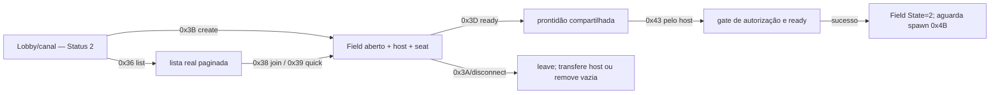

# Engenharia reversa do gerenciamento de salas — Rakion v258

## Escopo e veredito

Este documento cobre o ciclo entre a lista de salas e a entrada no campo: listar, criar,
entrar, entrada rápida, senha, dono, regra, time, slots, ready, fechar, expulsar e voltar ao
lobby. Partida, rounds e combate ficam em
[`field-match-lifecycle.md`](field-match-lifecycle.md) e documentos seguintes.

**Veredito atualizado em 2026-07-16:** o World agora possui uma fonte efêmera compartilhada em
`Field` para listar, criar, entrar por ID, quick enter, validar senha/capacidade, sair, liberar a
sala vazia e transferir o host. Ready e start também estão integrados: não-host é rejeitado, o
host não inicia enquanto houver membro não pronto e o sucesso é transmitido a todos. A sonda
`tools/world_room_probe.py` comprovou esse recorte com duas conexões TCP simultâneas.

O snapshot e a entrada incremental do roster foram reconstruídos do builder original e exercitados
por duas sessões headless: o membro recebe `0x38` e o snapshot completo `0x37`; o host recebe o
`0x38`. A listagem `0x36` agora preserva cursor, direção, cinco filtros de modo e o bypass de
elegibilidade do original. Entrada competitiva e quick join não emitem mais o `0x26` sintético;
esse ack é exclusivo do caminho `mode=0`. O sistema ainda não está completo visualmente: falta
levar dois clientes gráficos ao mesmo stage e comparar a interpretação dos erros/broadcasts.
Time, regra, slot, host, kick e close também passaram na sonda headless. A entrada de lista `0x36`
foi corrigida para a ordem exata do original; criação competitiva usa 12 vagas (6+6), IDs são
limitados por `MaxField` e reutilizados, e os fluxos concorrentes de join/close/list foram testados.

Há ainda uma incompatibilidade central: os exports do `worldnet.dll` dão aos opcodes
`0x36..0x43` significado de gerenciamento de sala, enquanto os handlers do `worldserv.exe`
analisado usam vários desses mesmos valores como comandos já dentro do field. O código .NET
mistura as duas interpretações e adiciona um terceiro caminho no interceptador.

## Fontes e confiança

| Fonte | Uso | Confiança |
|---|---|---|
| `worldnet.dll`, exports `IScavengerWorldNet::SendField*` | intenção da API do cliente e contratos C→S | alta |
| `worldserv.exe` v258, jump table `0x42B80C` e handlers `FUN_00422C90..00424210` | rota e semântica do servidor original analisado | alta para esta build |
| `<diretorio-de-evidencias>/dll_dispatch.txt`, `<diretorio-de-evidencias>/client_vtbl2.txt` | nomes, endereços e vtable do cliente | alta |
| `ClientSession.LobbyFlow.cs` e `LobbyFrames.cs` | fluxo realmente interceptado no .NET | alta |
| `WorldHandlers*.cs`, `Domain/Field.cs`, `WorldServer.cs` | dispatcher e domínio atuais | alta |
| `LobbyFrameGoldenTests.cs`, `RoomRosterFrameGoldenTests.cs` | respostas e layout variável do roster | alta para o codec .NET; visual ainda pendente |

Os nomes exportados provam a intenção da DLL do cliente. Eles não provam que essa DLL e o
`worldserv.exe` analisado pertencem exatamente ao mesmo contrato de build. Os conflitos abaixo
devem ser tratados como incompatibilidade de versão/estado até uma captura fechar a questão.

## Fluxo implementado e validado sem interface gráfica



O teste headless executa login e seleção de dois personagens, criação competitiva, listagem filtrada, entrada,
rejeição de start por não-host (`status=1`), rejeição por membro não pronto (`status=2`), ready,
start entregue às duas sessões e novo start pelo host transferido. Os 61 testes direcionados de
sala/lista passaram, incluindo corrida pelo último seat, fechamento concorrente e reutilização de
ID. Isso valida domínio e wire no .NET; não prova
que todos os widgets do cliente gráfico interpretam roster/ready corretamente.

## Contrato C→S confirmado no cliente

Todos os frames usam o envelope World documentado em
[`../../protocol/world.md`](../../protocol/world.md). A tabela
abaixo descreve apenas o payload após o opcode.

| Opcode | Export do cliente | Payload confirmado | Estado no World analisado |
|---:|---|---|---|
| `0x36` | `SendFieldList` | `[u8 max<=10][u16 cursor][u8 direction][5*u8 includeMode0..4][u8 bypassEligibility]` | fechado em `FUN_00422C90`; implementado |
| `0x38` | `SendFieldEnter` | `[u16 fieldId][cstr password<9]` | fechado em `FUN_00423100`; status inválido responde `0x38 status=5` |
| `0x39` | `SendFieldQuickEnter` | vazio | fechado em `FUN_00423300`; sempre encerra com lobby `0x39` |
| `0x3A` | `SendFieldExit` | vazio | aceito; interceptado como retorno à lista |
| `0x3B` | `SendFieldCreate` | `name\0 password\0 description\0` + opções | fechado em `FUN_00423580`; implementado pela rota canônica |
| `0x3C` | `SendFieldChangeBoss` | vazio | rejeitado pelo dispatcher original com `DISC 0xC9` |
| `0x3D` | `SendFieldReady` | `[u8 ready]` | aceito, mas original analisado trata troca de arma em status 3 |
| `0x3E` | `SendFieldChangeTeam` | vazio | aceito, mas original analisado trata troca de assento em status 3 |
| `0x3F` | `SendFieldClose` | vazio | aceito, mas original analisado libera o field em status 3 |
| `0x40` | `SendFieldKick` | `[u8 slot]` | aceito; original remove um player-object no field |
| `0x41` | `SendFieldChangeRule` | três `cstr`, quatro bytes e um `u16` de opções | aceito; original altera regra do field pelo host |
| `0x42` | `SendFieldChangeSlotStatus` | `[u8 slot][u8 status]` | aceito; original trava/destrava slot pelo host |
| `0x43` | `SendFieldGameStart` | vazio | aceito; interceptado como start simplificado |
| `0x44` | `SendFieldGameEnd` | vazio | rejeitado como C→S pelo World analisado; `0x44` também existe como S→C de fim |

### Layout de criação `0x3B`

O parser mais fiel do repositório reconstrói:

```text
cstr name        máximo 0x28 caracteres
cstr password    máximo 8 caracteres
cstr description máximo 0xC8 caracteres
u8   map
u8   mode
u8   timeFlag/rounds
u16  mapSlot/duration
u8   fragLimit
u8   minLevel
u8   maxLevel
u8   levelRangeCode
```

O parser de `ClientSession.Rooms` lê as três strings e os nove bytes finais na ordem do original. O inicializador
`FUN_00405440` confirmou os destinos: `map @ +0x118`, `mode @ +0x119`, `rounds @ +0x11A`,
`duration @ +0x11C`, `fragLimit @ +0x11E`, `minLevel @ +0x111`, `maxLevel @ +0x112` e
`levelRangeCode @ +0x113`. Em modos `1..4`, `rounds < 22`, `duration` fica entre `290..1210`, o
criador precisa estar em `minLevel..maxLevel` e a capacidade original é fixa em `6+6=12`.
`mode=0` envia internamente ao worker de banco o comando `0x25`. O callback `FUN_0041DA40`
consome essa resposta, valida a elegibilidade, cria o field e só então responde ao cliente com o
mesmo ACK público dos outros modos: `[0x3B:u16][status:u8][fieldId:u16]`. Enviar a resposta interna
`0x25` diretamente ao cliente deixa a janela “Creating field” aguardando indefinidamente. O field
do stage solo permanece não pesquisável na lista pública.

O produtor da UI `rakion.bin:0x0044AC70` fecha as enumerações. `mode` é `0=Stage`, `1=Golem`,
`2=Deathmatch`, `3=Team Death` e `4=Boss`. Os sete presets de level são:

| Índice da UI | `minLevel..maxLevel` | `levelRangeCode` |
|---:|---:|---:|
| `0` | `1..10` | `0` |
| `1` | `11..30` | `2` |
| `2` | level atual `-5..+5` | `0` |
| `3` | level atual `-10..+10` | `0` |
| `4` | `31..99` | `3` |
| `5` | `11..99` | `0` |
| `6` | `1..99` | `1` |

O código é uma classificação auxiliar, não o índice do preset; por isso várias faixas usam `0`.
Os limites efetivos continuam sendo os dois bytes `minLevel/maxLevel`. O World original preserva
também códigos desconhecidos, então o contrato permanece `u8` e não rejeita extensões apenas por
estarem fora de `0..3`.

`WorldHandlers.Table` liga `0x3B` diretamente a `Op_FieldCreate`, que chama a única implementação
ativa em `ClientSession.Rooms`. Os corpos históricos `Op_0x3B_Recon` e `Op_RoomCreate` foram
removidos, portanto não há mais uma segunda interpretação silenciosa desse request.

## Respostas S→C conhecidas

| Subtipo | Layout atual/confirmado | Observação |
|---:|---|---|
| `0x36` | `[u16 0x36][u8 count][count * (u16 fieldId + listEntry)]` | variável; padding AES após o comprimento lógico |
| `0x37` | snapshot variável da sala e 20 slots | reconstruído do builder `FUN_00406F40`; enviado ao membro que entra |
| `0x38` | `[u16 0x38][status][seat][state][u16 userSlot][auth][player]` | entrada incremental transmitida aos membros; `player` usa o serializer original |
| `0x39` | `[u16 0x39]` | conclusão do quick join, exista ou não sala elegível |
| `0x26` FIELD | `[u32 fieldHandle][u16 fieldId][cstr password]` | somente entrada direta no caminho especial `mode=0`; não pertence à sala competitiva |
| `0x3B` | `[u16 0x3B][u8 status][u16 fieldId]` | golden e probe confirmam 5 bytes úteis; ID pesquisável começa em 1 |
| `0x43` | `[u16 0x43][u8 status]` | comprimento lógico 3; `0` sucesso, demais falhas de autorização/prontidão |
| `0x1F` | info de sessão | reenviado ao voltar para a lista |
| `0x1E` | lista de canais | reenviado ao voltar para a lista |
| `0x3A` | `[seat]` | saída, desconexão e kick usam a mesma notificação FIELD |
| `0x3C` | `[newMasterSeat]` | troca de host; o assento antigo não faz parte do wire |
| `0x3E` | sucesso `[status=0][oldSeat][newSeat]`; falha `[status=2]` | troca de time/assento |
| `0x41` | regra completa concatenada | broadcast FIELD do original reconstruído |
| `0x42` | `[slot][status]` | broadcast FIELD de lock/unlock de slot |

O corpo de `0x37`, após o subtipo, é:

```text
u16 fieldId; u8 state; u8 masterSeat; u8 map; u8 mode
u8 minLevel; u8 maxLevel; u8 option; u8 round
u8 maxRounds; u16 roundDuration; u8 fragLimit
cstr name; cstr password; cstr description
20 vezes: u8 slotState
  se state != 0 e != 5:
    u16 serverUserSlot; u8 auth; playerRecord variável
```

Em salas competitivas comuns, o World original abre seis assentos por time e publica os slots
`6..9` e `16..19` com estado `5` (fechado). O `0x3D [ready]` não mantém um booleano paralelo:
ele alterna o estado do registro entre `1` (aguardando) e `2` (pronto). No `0x43`, status `2`
indica capacidade aberta diferente entre os times e status `3` indica outro jogador ainda não
pronto. O start bem-sucedido promove estados `1/2` para `3`.

Cada entrada da lista `0x36`, após `fieldId`, segue exatamente:

```text
u8 hasPassword; u8 inGame; u8 map; u8 mode
u8 minLevel; u8 maxLevel; u8 option; u8 currentRound
u8 maxRounds; u8 playerCount; u8 capacity
i32 masterUserId; u16 masterSeat; i32 reserved0; u16 reserved1
cstr name; u16 marker
```

O consumidor `engine.dll:0x36193900` lê essa mesma ordem. A implementação anterior trocava
rounds por contagem e níveis por capacidade; uma sala `1..99` podia aparecer visualmente como
`1/99` jogadores. `RoomListSnapshot` e `RoomListFrames` agora preservam o layout original, com
golden byte a byte e validação equivalente no probe.

`playerRecord` contém dois `cstr` (personagem e buddy), estado/grupo, IPv4 e duas portas UDP,
classe, nível, 19 IDs `u16` de equipamento/quickslot e 19 níveis `u8`. O endpoint foi confirmado
pelo setter `FUN_0040AB90` (`+0x1454/+0x1458/+0x145A`). Esse contrato vem de `FUN_0040B7F0`, não da estrutura
interna de `0xDE` bytes para a qual o cliente expande cada slot. Há evidência runtime do .NET para
sala não vazia, roster, senha inválida, troca de time/dono, ready, regra, slot, kick e fechamento.
O serializer não lê `user+0x14D0` nem outro campo de clã; `GroupId` pertence ao estado da sala e não
pode ser substituído por `clanId`. A presença de canal é o único registro multijogador confirmado
que transporta esse ID.

O cliente também não reaproveita a presença como cache: `engine.dll:0x361932A0/0x361933F0`
mantém os registros `0x24` na pilha, e `rakion.bin:FUN_0043F700` os copia apenas para as linhas da
tela de canal. `FUN_0047A370` destrói essa tela antes de criar a tela de sala. O `FieldInfo` de
`0x378` bytes construído por `0x37/0x38` vem exclusivamente do roster acima e não recebe
`clanId`. Logo, sala, loading e HUD não têm tag remota de clã por esse fluxo na v258.

Os formatos de saída, time, host e slot também foram extraídos diretamente de
`FUN_004091E0`, `FUN_004075A0`, `FUN_00407910` e `FUN_004097C0`. Ainda não há captura visual.

## Roteamento efetivo no servidor .NET

O protocolo passa pelo gate de identidade/fase em `ClientSession.TryHandleLobbyEntry` e depois pela
tabela. Para `0x36`, `0x38`, `0x39` e `0x3B`, a tabela é a única entrada do corpo da operação.

| Opcode | Rota efetiva comum | Resultado |
|---:|---|---|
| `0x36` | `Op_FieldList` → `ClientSession.Rooms` | valida os 10 bytes, pagina antes/depois do cursor e filtra modo, nível e capacidade, no máximo 10 |
| `0x38` | `Op_FieldEnter` → `ClientSession.Rooms` | valida ID, estado, senha, penalidade e capacidade; em sala competitiva publica `0x38` e entrega `0x37`, sem `0x26` |
| `0x39` | `Op_FieldQuickEnter` → `ClientSession.Rooms` | escolhe sala pública aberta e não cheia; entrega `0x38/0x37` e conclui com `0x39`, sem `0x26` |
| `0x3A` | `Op_FieldExit` → `ClientSession.FieldTransitions` | publica `0x3A [seat]`, transfere host com `0x3C [novo]` ou remove vazia e reenvia `0x1F/0x1E/0x36` |
| `0x3B` | `Op_FieldCreate` → `ClientSession.Rooms` | todos os modos respondem `[0x3B][status][fieldId]`; `mode=0` prepara field interno não pesquisável para o lifecycle solo e modos `1..4` publicam `Field` completo |
| `0x3C` | `ClientSession.Rooms` em lobby | host transfere autoridade ao próximo membro |
| `0x3D` | interceptado somente em `FieldLobby`; dispatcher em stage | no lobby altera `LobbyReady`; no stage preserva a ação de combate |
| `0x3E` | `ClientSession.Rooms` em lobby; dispatcher em stage | alterna entre blocos de time e atualiza seat |
| `0x3F` | `ClientSession.Rooms` em lobby; dispatcher em stage | host fecha sala e devolve todos à lista |
| `0x40` | `ClientSession.Rooms` em lobby; dispatcher em stage | host remove membro; os restantes recebem `0x3A` e a vítima recebe lista atualizada |

Na saída voluntária de Battle, `0x46` devolve o jogador ao game room antes de `0x3A` removê-lo da
sala. Datagramas e reports já enfileirados podem produzir `0x46`, `0x4B`, `0x4F` ou `0x50` depois
da mudança para `Status=2`; eles são consumidos como frames tardios enquanto a sessão ainda está
associada à sala. Encaminhá-los aos gates de combate causava disconnect ao clicar em **Previous**.
| `0x41` | `ClientSession.Rooms` em lobby; dispatcher em stage | host atualiza regra e reseta ready |
| `0x42` | `ClientSession.Rooms` em lobby; dispatcher em stage | host trava/destrava slot vazio e reseta ready |
| `0x43` | `ClientSession.Rooms` | valida sala, host e ready dos membros; sucesso fecha novos joins e é broadcast |

A tabela canônica aponta de propósito para as versões `Recon` de `0x3D` e outros. Para
`0x3D/0x3E`, o roteamento não depende de ordem de registro: o interceptador aceita ready/team
somente em `Status=2`; em `Status=3`, os pacotes chegam aos handlers do World original. Estados
inválidos mantêm os motivos de desconexão do dispatcher.

## Modelo de domínio atual

Existem dois conceitos com o nome de sala:

- `Domain.Room`: apenas `Id`, lista de membros e broadcast lobby. `WorldServer.Rooms` nasce com
  uma única `Room(0)`. Não possui título, senha, dono, regra, capacidade, times ou slots;
- `Domain.Field`: nome, modo, mapa, dono, 20 player-records, slots, regras e máquina da partida.

Na prática, gerenciamento e partida estão concentrados em `Field`, enquanto `Room` fica quase
restrito a chat/cleanup. A sessão também mantém `RoomId`, `FieldId`, `FieldSeat`, `InField`,
`FieldSecondary`, `SecondActive`, `Status` e `SubStatus`, sem uma transição atômica central.

Consequências observáveis atuais:

- `CreateField`, `TryJoinRoom`, `JoinField` e `LeaveField` centralizam membership, seat e papel host/member;
- `AssignSeat` limita a busca por `MaxPlayers`, entre 1 e os 20 records físicos;
- saída chama `LeaveField`, transfere o master deterministicamente ou remove a sala vazia;
- senha e descrição ficam no domínio efêmero; senha não é escrita em log;
- `Field.SyncRoot` protege join/leave/ready/start; snapshots copiam a lista global antes de obter
  locks de field, evitando inversão com close/remove;
- criação reserva o ID sob lock próprio e só publica o field após host/seat estarem completos;
- o alocador varre IDs livres em `1..MaxField-1`, recusa saturação e reutiliza IDs liberados;
- `Domain.Room` ainda é legado de chat e `Field` concentra sala e partida;
- `Status=2` continua representando canal e sala pré-jogo, ocultando essa fronteira no tipo.

## Auditoria por funcionalidade

| Função | Estado | Evidência/problema |
|---|---|---|
| listar salas | RE estático + headless | `0x36` retornou a sala ID 1 usando cursor 0, direção forward e filtro mode 1 |
| criar sala solo | RE estático + headless | `mode=0` responde `[0x3B][status][fieldId]`; o .NET prepara field interno para `0x43`, mas ele nunca entra na lista pública |
| criar sala pesquisável | headless validada | segunda sessão encontrou a sala pelo wire |
| entrar por ID | RE estático + headless | `0x38` competitivo alocou seat e entregou `0x38/0x37`, sem o antigo `FIELD 0x26` sintético |
| quick enter | RE estático + headless | `0x39` selecionou sala pública aberta, entregou `0x38/0x37` e não emitiu `0x26`; visual pendente |
| senha | RE + golden + probe | flag correta na lista, comparação atômica no join, status `3` em erro; nunca logada |
| roster/membros | codec implementado e headless validado | `Field.Slots` é canônico; `0x38` incremental e `0x37` completo chegaram às duas sessões; UI pendente |
| capacidade | RE + concorrência | modos competitivos usam 12 vagas, seis por time; slots `6..9` e `16..19` começam fechados; 40 candidatos não excederam capacidade nem duplicaram seat |
| dono/boss | RE estático + headless | `0x3C [newSeat]` transferiu host `seat 0→10`; visual ainda falta |
| troca de time | RE estático + headless | membro mudou `seat 1→10`; ambos receberam `0x3E [0][1][10]` |
| ready | RE + headless + visual | `0x3D` alterna o estado canônico `1/2` e transmite seat/ready; a divergência que exibia `Wrong number of closed slots` foi corrigida |
| regra | headless validada | broadcast idêntico do payload, domínio atualizado e ready resetado |
| lock de slot | headless validado | somente host altera slot vazio utilizável |
| kick | RE estático + headless | original chama a rotina de saída e devolve o alvo ao canal (`Status=2`); .NET publica `0x3A`, preserva a conexão e devolve a vítima por `0x1F/0x1E/0x36` |
| close | headless validado | host fecha, limpa membros/field e recebe lista vazia |
| start | headless validado | não-host e falta de ready falham; sucesso é entregue a todos |
| sair/retornar | domínio validado | remove membro, transfere host e elimina field vazio |
| concorrência | testes aprovados | join simultâneo e join/close/list terminam sem excesso, seat duplicado, deadlock ou identidade órfã |

## Problemas de arquitetura e qualidade

1. **Colisões restantes por estado:** `0x3C..0x43` ainda dividem lobby e stage entre o switch de
   estado e a tabela; `0x36/0x38/0x39/0x3A/0x3B` já possuem entrada canônica única.
2. **Domínio misturado com wire:** `Domain/Field.cs` supera 500 linhas e contém máquina de jogo,
   estado de sala e builders de pacotes. Ultrapassa o alvo de 400 linhas do projeto.
3. **Categorias e host separados:** `SubStatus` representa `Normal=0`, `Special=1` ou `GM=0x34`;
   ownership da sala é exclusivamente `Master/MasterSlot`. Novos handlers não devem misturá-los.
4. **Validação incompleta:** há testes de domínio, goldens de roster e duas sondas com duas
   sessões, mas falta a jornada gráfica e comparação byte a byte com uma captura original.

## Implementação e ativação atuais

Arquitetura: vertical slices no World. `RoomCreationOptions`, `RoomListQuery` e o estado de
`Field` contêm a regra; `RoomListFrames`, `RoomRosterFrames` e `LobbyFrames` serializam o wire;
`ClientSession.Rooms` apenas faz parse, chama o domínio e envia o resultado. Sala é efêmera e não
exige migração de banco.

Para ativar:

1. configure `MaxField` em `worldserver.ini`; como o ID `0` é reservado neste servidor, o intervalo
   pesquisável é `1..MaxField-1`;
2. compile `RakionServer.sln` em Release e execute a suíte `RakionServer.World.Tests`;
3. suba a stack com MariaDB e duas contas de fixture;
4. execute `tools/world_room_probe.py <porta>` e `tools/world_room_admin_probe.py <porta>`;
5. confirme nos logs criação, join/rejeição, troca de host, start, leave e ausência de sala órfã;
6. antes de produção, faça a jornada gráfica com dois clientes da mesma build.

Não existe `ROOM_SYSTEM_V2`: o fluxo documentado é o caminho ativo. Rollback operacional é voltar
ao binário anterior e reiniciar o World; todas as salas são descartáveis. Senhas não são logadas.
Payloads truncados e C-strings sem NUL dentro dos limites são rejeitados antes de alterar estado.

## Matriz mínima de testes

### Domínio

- criar sala pública/privada e impedir título/capacidade inválidos;
- senha correta, incorreta e tentativa concorrente no último seat;
- quick join ignora cheia/in-match/privada conforme regra confirmada;
- seat único, capacidade respeitada e troca de time balanceada;
- somente host muda regra, trava slot, expulsa, fecha e inicia;
- ready é resetado após mudança relevante de regra/time;
- saída do host transfere host deterministicamente;
- saída do último membro fecha e remove a sala;
- kick remove vítima e a leva ao lobby;
- start falha sem requisitos e cria exatamente um match.

### Protocolo

- golden de lista vazia e com 1/2 salas;
- create success e todos os códigos de erro;
- enter público, senha inválida, sala cheia e não encontrada;
- quick enter com nenhuma/elegível/múltiplas salas;
- broadcasts de join/leave/ready/team/rule/slot/host/kick;
- reordenação e repetição de pacotes não duplica membro nem match;
- payloads truncados e strings sem NUL são rejeitados com segurança.

### Integração visual

- dois clientes veem a mesma sala e roster;
- ambos veem ready/time/regra sem reabrir a tela;
- vítima de kick retorna à lista, não congela nem permanece fantasma;
- start leva todos ao mesmo mapa/time/seat;
- fim/saída retorna à sala ou lista conforme a captura;
- reconexão não deixa field, seat ou master órfão.

Build e testes unitários não substituem esta validação visual multi-cliente.

## Critério de conclusão

O sistema só pode ser marcado completo quando:

- os conflitos `0x36..0x44` forem fechados por captura da build em uso;
- todas as operações usarem uma única fonte de verdade;
- lista, create, enter, quick enter, senha, roster, host, team, ready, regra, slot, kick,
  close, start e retorno funcionarem com pelo menos dois clientes;
- frames críticos tiverem golden tests;
- não houver sala/field/seat órfão após saída, kick, disconnect ou fim de match;
- a jornada visual for reproduzida no cliente sem depender dos acks sintéticos atuais.
