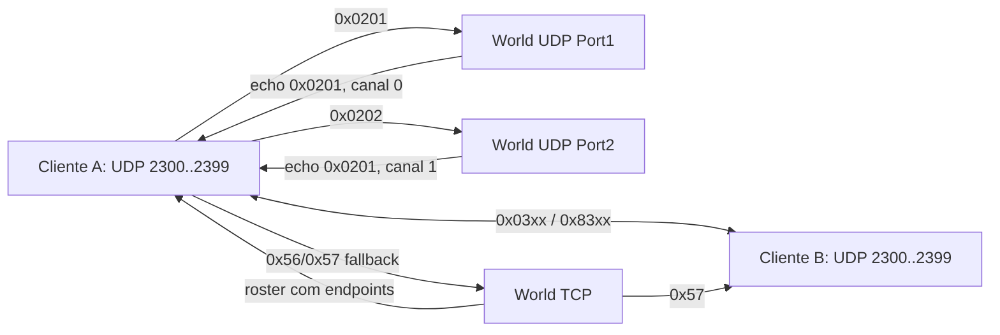

# Engenharia reversa de UDP, P2P e tunneling — Rakion v258

## Veredito

O transporte possui três caminhos diferentes:

1. o World autentica e publica endpoints pelas portas UDP `40708/40709`;
2. os clientes trocam gameplay e reliable diretamente em sockets `2300..2399`;
3. `0x56/0x57` oferecem tunneling TCP quando o canal direto não é utilizável.

O World ainda publica o estado agregado desse fallback: `0x54` informa que existe pelo menos um
cliente em tunneling no field e `0x55` informa que o último saiu.

O bootstrap direcionado `0x62` também está fechado: C→S leva `targetSeat`; o World resolve esse
record e envia somente ao alvo `S→C 0x62 [senderSeat]`. O callback
`rakion.bin:0x00473980` publica então um datagrama unreliable com o próprio seat. A implementação
.NET deixou de fazer broadcast e agora preserva alvo e origem do original.

O handshake, o brokering de endpoints, os codecs conhecidos e o fallback TCP estão reconstruídos
estaticamente. A implementação .NET passa o probe headless com três sessões. Entretanto, uma
captura direta nas portas `2300..2399` ainda é necessária para declarar o transporte P2P completo
em runtime e para provar LAN/NAT/firewall.

Uma correção importante desta auditoria: o `worldserv.exe` original não interpreta nem relaya
`0x03xx/0x83xx`. O relay desses tipos pela porta `40709` no servidor .NET é uma extensão de
compatibilidade, ativada por configuração, e não deve ser apresentada como fidelidade ao original.

## Fontes canônicas

- World v258:
  - `FUN_00404010`: `sendto`;
  - `FUN_004040D0`: `recvfrom`, limite `0x4B0`;
  - `FUN_0040AB90/0040ABE0`: grava/le endpoint;
  - `FUN_00425D80/00425FA0`: handshake das duas portas;
  - `FUN_00429530`: dispatcher UDP;
  - `FUN_00405620..00405860` e `00425620..00425860`: tunnel/ping TCP;
- engine v258:
  - `CNet::InitNetwork @ 0x360FF750`;
  - `CNet::SendData @ 0x360FFB10`;
  - `PacketBufferRecvUpdate @ 0x361001F0`;
  - builders/fila reliable `0x36100BF0..0x361011B0`;
- `tools/ghidra/DecompileWorldGameplayTransport.py`;
- `tools/ghidra/DecompileWorldTcpGameplayFallback.py`;
- `tools/ghidra/DecompileClientReliableTransport.py`;
- `tools/world_udp_probe.py` e testes `Gameplay*DatagramTests`.

## Topologia comprovada



`CNet::InitNetwork` cria um socket UDP não bloqueante e tenta bind a partir de
`2300 + (último byte do IP % 100)`, incrementando até `2399`. `CNet::SendData` recebe endereço e
porta como argumentos: não há destino fixo no servidor para o canal direto.

## Dispatcher UDP do World

`FUN_00429530` remove sete bytes do envelope externo e reconhece somente:

| Tipo | Handler | Papel |
|---:|---|---|
| `0x0201` | `FUN_00425D80` | handshake Port1 |
| `0x0202` | `FUN_00425FA0` | handshake Port2 |
| `0x0401` | `FUN_00426160` | controle auxiliar do World |
| `0x0402` | `FUN_0041C330` | controle auxiliar do World |

Qualquer outro tipo retorna sem ação. As funções `0x004261D0`, `0x00426290`, `0x00426B30` e
`0x004295C9`, antes listadas como transporte, pertencem ao dispatcher de comandos de banco/IPC.
O script do repositório foi corrigido para não misturar essas superfícies.

## Handshake `0x0201/0x0202`

Datagrama completo observado:

```text
offset  tamanho  campo
0       2        type: 0x0201 ou 0x0202
2       5        envelope de transporte
7       2        slot global
9       4        sessionKey
13      4        IPv4 P2P anunciado
17      2        porta P2P anunciada, big-endian
19      4        echoData
```

O World valida:

- slot dentro do limite e sessão ativa;
- perfil/character selecionado;
- IP de origem UDP igual ao IP TCP;
- `sessionKey` igual à chave gerada no login.

O reply sempre começa por `0x0201`:

```text
u16 0x0201 | u32 echoData | u8 canal | u8 canal | u32 echoData
```

Canal é `0` para Port1 e `1` para Port2. Um novo handshake válido substitui o endpoint daquele
canal; o probe comprova que o endpoint antigo deixa de ser aceito imediatamente. O original não
possui TTL, nonce consumível ou janela anti-replay: adicioná-los seria hardening incompatível sem
negociação de protocolo.

## Publicação de endpoints

O servidor preserva duas informações:

- endpoint observado pelo `recvfrom`;
- endpoint direto anunciado pelo cliente.

`FUN_0040B7F0`, usado no roster, serializa porta observada, IPv4 observado e porta anunciada.
Os frames `.NET` `0x0E`, `0x37` e `0x38` usam `NetworkEndpointCodec` para network byte order.
Sem handshake, publicam zero; não inventam `127.0.0.1`.

O handshake TCP `0x0E SuccessUDP` ocorre com a conta autenticada e antes da seleção do personagem.
O request lógico é `[result:u8]`; o World original ignora o valor, zera o flag de tunneling da
sessão e responde com 15 bytes lógicos:

```text
[0x0E:u16][status=0:u8][observed IPv4:u32][observed port:u16]
[advertised IPv4:u32][advertised port:u16]
```

IPv4 e porta usam network byte order. Os bytes que completam o bloco cifrado não fazem parte do
corpo lógico; a captura gráfica de 2026-07-18 mostrou que eles podem conter resíduos não nulos
(`00 DF 19 00 68 DD 19 00`). O handler original não os lê, portanto o `.NET` consome somente o
primeiro byte. Ele mantém uma única rota canônica em
`Op_SuccessUdp`; o antigo alias `Op_LeaveField` era incompatível com `FUN_0041FA40` e foi removido.

O Port1 original também enfileira o comando DB interno `5` após migrar o endereço. Ele não é uma
notificação W→C: `FUN_00425D80` monta
`[requestSeq:u16][command=5:u16][advertisedIPv4:u32][connectionLogId:u32]` e chama
`FUN_0041B940`. O consumidor `FUN_004121E0` executa
`UPDATE LogUserConnect SET RealIP='<ip anunciado>' WHERE id=<connectionLogId>` sem callback.
O `.NET` reproduz essa atualização apenas no handshake Port1; Port2 não altera `RealIP`.

O ID usado acima é `user+0x1468`, retornado por `mysql_insert_id` quando o login cria
`LogUserConnect`. O encerramento usa o comando DB `4` e grava `disconnecttime=NOW()` e o motivo
em `note`; o frame subtype `4` enviado ao cliente contém
`[connectionLogId:u32][reason:u16][userGameInfoId:u32]`. Login, queda do socket e desconexão
explícita agora preservam esse ciclo no servidor `.NET`.

## Canal direto do engine

Formato reliable geral:

```text
u16 typeWithReliableBit | u32 sequence | u8 sourceSeat | payload
```

O bit `0x8000` marca reliable. O receptor responde `0x4000`, remove o bit e entrega o tipo lógico
ao `CSessionState`. O sender mantém cópia e reavalia retransmissão aproximadamente a cada segundo.
O builder aceita no máximo 1000 bytes de payload por datagrama.

`CNet::SendToOtherClient @ 0x36100780` e a variante reliable `0x36100980` fecham a decisão de
rota. Quando o World TCP está conectado, o cliente primeiro oferece o payload a
`SendFieldGameTunnelingAll`; em seguida lê `IsTunneling_Client(localSeat)`. Flag `1` encerra o
fluxo ali, sem UDP direto. Flag `0` percorre os 20 seats e envia diretamente aos peers ativos,
exceto o próprio seat. Para a maioria dos tipos exige o estado direto do peer; `0x0306..0x0309`
também podem passar durante o bootstrap inicial.

Shapes já fechados por disassembly/captura indireta:

| Tipo | Tamanho | Semântica |
|---:|---:|---|
| `0x0304` | 12/13 | push do protocolo de aplicação |
| `0x0305` | 12/13 | ack correspondente |
| `0x030A` | 26 | movimento |
| `0x030F` | 14 | snapshot de seis estados `u8` do jogador |
| `0x0311` | 10/12 | união de animação normal/ataque/dano |
| `0x0319` | 8 | atualização de endereço |
| `0x4000` | 11 | ack reliable genérico |
| `0x8307/08/09/0B/10/12` | variável | entidades/NPC/itens |
| `0x830C` | `19 + payload` | evento de entidade |
| `0x8313` | 9 | bad-ping, flag `0/1` |
| `0x8315` | 8 | tick/feedback |

`GameplayPeerDatagramCodec` rejeita tamanhos, rotas, source seat, snapshot de itens e flag de
bad-ping inválidos. Isso protege a extensão de relay; não transforma o World em autoridade sobre
o P2P original.

## Extensão de relay do servidor .NET

Configuração:

```ini
[UDP]
Port1=40708
Port2=40709
RelayCompatibilityEnabled=1
ForceTunneling=1
RelayPacketsPerSecond=300
RelayBurst=600
```

Com `RelayCompatibilityEnabled=1`, frames conhecidos recebidos em Port2 são retransmitidos aos
demais membros do mesmo field. Há autenticação por endpoint, validação de seat e token bucket. O
bucket é recriado quando um slot é reutilizado com outra chave de sessão, evitando herdar o limite
do login anterior.

Com `RelayCompatibilityEnabled=0`, Port2 mantém apenas o handshake original e ignora `0x03xx` e
`0x83xx`. Esse é o modo mais fiel ao World v258, mas exige que os clientes consigam estabelecer o
canal direto. O padrão permanece `1` porque o projeto prioriza jogabilidade em localhost enquanto
a captura gráfica P2P não foi concluída.

`ForceTunneling=1` marca os jogadores da sala para usar o fallback TCP original mesmo quando o
handshake UDP individual foi concluído. Essa é a configuração de distribuição: evita interpretar
um endpoint observado pelo World como prova de que os dois clientes conseguem trocar datagramas
diretamente entre si. Movimento, animação, dano e mensagens reliable passam por `0x56/0x57`. Para
ambientes com P2P direto comprovado, use `ForceTunneling=0`.

## Tunneling e ping TCP

### Presença agregada

No World original, `user+0x1478` identifica uma sessão em tunneling e `field+0x2CC` guarda o
agregado da sala. No `0x45 FieldGameEnter`, `FUN_004066C0` envia `0x54` a todos quando o agregado
muda para ativo;
se ele já estava ativo, sincroniza somente o jogador que entrou. Na saída, `FUN_004067C0` envia
`0x55` quando não resta sessão ativa com o flag.

No cliente, `engine.dll:0x36197320` despacha `0x54/0x55` e os callbacks concretos
`rakion.bin:0x00472F00/0x00472F10` chamam
`IScavengerWorldNet::SetHaveTunnelingClient(1/0)`. Os dois frames não possuem payload.

`FUN_0040B7F0` serializa `user+0x1478` imediatamente após `CharName\0` e `BuddyName\0` nos
rosters `0x37/0x38`. O parser do engine grava esse byte em `FieldInfo+0x2A`; dentro do agregado da
sessão ele aparece em `session+0x1D6+seat*0x378`, exatamente o endereço lido por
`IsTunneling_Client`. A implementação `.NET` agora deriva `UsesTunneling` da ausência do endpoint
UDP observado já na entrada da sala, antes de publicar o roster, e recompõe o agregado no spawn.
Uma varredura integral de operandos escalares no `worldserv.exe` encontrou 11 referências ao
literal `0x1478`. As referências reais são: leitor `FUN_0040AC20`, serializer `FUN_0040B7F0`,
construtor `FUN_0040E680` zerando o byte e `SuccessUDP` `FUN_0041FA40` zerando-o novamente. As
demais pertencem a tabela de constantes ou frame de stack. Não existe escrita direta de `1` nem
accessor que devolva o endereço do campo nesta build.

Portanto, o ramo verdadeiro está presente e totalmente consumido, mas seu produtor é indireto,
externo ou dormente no executável disponível. A política .NET “sem endpoint UDP observado =
tunneling” deve ser tratada como extensão explícita de compatibilidade para manter localhost/NAT
funcional, não como reprodução comprovada do critério de ativação original. O modo fiel continua
sendo `RelayCompatibilityEnabled=0`.

| Request | Payload | Saída |
|---:|---|---|
| `0x56` TunnelAll | `[u16 len][blob]` | sender tunnel: todos os outros `state=4`; sender direto: somente targets tunnel |
| `0x57` TunnelOne | `[u8 target][u16 len][blob]` | envia se sender ou target usa tunnel; par direto/direto é ignorado |
| `0x59` PingRequest | `[u8 targetSeat][u32 tick]` | host recebe sender global + tick |
| `0x5A` PingResponse | `[u16 targetGlobal][u32 tick]` | target recebe seat local do responder + tick |

O blob é limitado a 1000 bytes. O tick é opaco. Esses handlers são fallback/control plane; não
substituem o stream de estado completo do Serious Engine.

Ambos exigem `field state=2`, agregado `field+0x2CC != 0` e pontas `state=4`. Essa matriz evita
duplicar por TCP o pacote que já foi enviado pelo canal UDP direto. O servidor `.NET` antes
relayava para todos; `TunnelingRelayPolicy` agora reproduz os filtros do original.

## Validação atual

- parsers/goldens: handshake, endpoints, ações, reliable, eventos, bad-ping e rate limit;
- probe com três sessões no mesmo IP e dois fields;
- chave cruzada, endpoint não autenticado e source seat forjado rejeitados;
- migração autenticada invalida a rota antiga;
- relay compatível isolado por field;
- modo fiel (`RelayCompatibilityEnabled=0`) mantém handshake/roster e não retransmite gameplay;
- sequência `0x43 → 0x45 → 0x4B`, TunnelAll/One direto-direto sem duplicação e
  direto-tunnel nos dois sentidos validados headless;
- `TwoClientP2PMatrixTests` prova em sockets reais de loopback que o par direto/direto troca
  `0x030A` sem passar pelo World, não recebe fallback TCP duplicado e que o par direto/túnel
  entrega `TunnelOne/TunnelAll` nos dois sentidos após o agregado `0x54`;
- roster `0x38` confirma o flag de rota antes do spawn;
- transições agregadas `0x54/0x55` cobertas por testes de domínio;
- Ghidra reproduz o dispatcher restrito do World e o reliable do engine.

## Pendências reais

- captura PCAP/ETL do tráfego direto `2300..2399` produzido pelo engine de dois clientes gráficos;
- observar conexão direta e retransmissão em dois clientes gráficos na LAN;
- repetir em NAT diferente e com UDP bloqueado;
- decidir, após essas provas, se produção usa relay compatível ou modo fiel.

TTL, anti-replay criptográfico, fila por destino e autoridade server-side são melhorias de
segurança/operabilidade. Não fazem parte do protocolo v258 e não são usadas como critério artificial
para declarar o RE estático completo.

## Procedimento de captura

1. Inicie o stack e dois clientes na mesma sala Battle.
2. Como administrador, execute `tools\capture_gameplay_p2p.ps1 Start -Ports 2301,2302`.
3. Complete start, spawn, movimento, ataque e uma morte.
4. Execute `tools\capture_gameplay_p2p.ps1 Stop`.
5. Converta/inspecione o ETL e passe os payloads ao `tools/decode_gameplay_p2p.py`.
6. Repita com `RelayCompatibilityEnabled=0` e depois com UDP bloqueado para provar o fallback.

Até essa captura, o status correto é: “RE estático avançado, handshake/fallback e compatibilidade
headless validados; canal P2P direto ainda não validado graficamente”.
