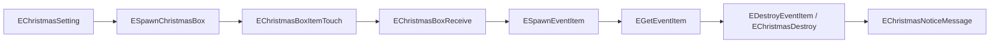
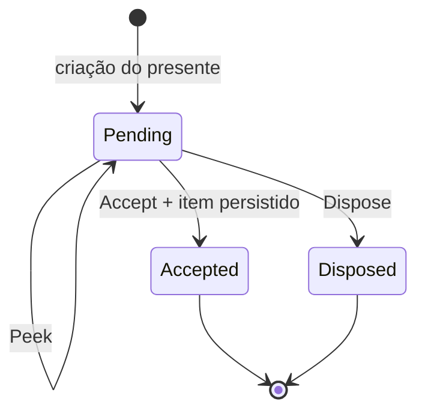

# RE do sistema de Natal e presentes

## Estado do documento

- Cliente analisado: `C:\Users\joaop\Desenvolvimento\Rakion\rakion-final`
- Servidor atual: `server/RakionServer`
- Base original consultada: executável/saídas do Ghidra e `rakion_data.sql`
- Tipo de análise: engenharia reversa estática, decompile de callbacks e probes dinâmicos
- Data: 2026-07-16

Este documento descreve o que foi confirmado no cliente e no servidor original e audita a
implementação .NET. A Gift Box foi fechada byte a byte e validada por integração. Os dez eventos
natalinos de entidade também foram fechados por tamanho, cópia e consumidor e possuem codecs no
relay. O evento de stage, porém, está inativo nesta distribuição: não há configuração, produtor no
World nem o modelo do Santa exigido pelo cliente.

Legenda:

- **Confirmado**: evidência direta em binário, asset, SQL ou código.
- **Inferido**: conclusão forte, mas sem captura dinâmica.
- **Não resolvido**: layout, dado ou comportamento que precisa de captura/teste.

## Resumo executivo

| Parte | Cliente | Servidor original | Servidor .NET atual | Veredito |
|---|---|---|---|---|
| Caixa de presentes | UI, textos e envios `0x6B`–`0x6D` | Fila, aceite, recusa, inventário e auditoria | FIFO transacional, `0x6A`–`0x6D`, célula física, box e logs implementados | Completo headless; falta validação visual no cliente |
| Evento de Natal em estágio | entidades, eventos, textura e mensagens; configuração encerrada | backend específico não localizado | relay valida os dez eventos; não há produtor | RE fechado como pipeline dormente nesta build |
| Santa | classe, thumbnail, sons e referência de modelo | não localizado | não implementado | `SantaSam.smc` ausente de todos os XFS; não ativável fielmente |
| Catálogo natalino | vários itens no `items.dat` | catálogo SQL parcial | depende do catálogo legado | Não premiar IDs sem validar/semear |
| Pontos de Present Box | textos e UI indicam mecânica própria | não reconstruído | não implementado | Não confundir com a fila de presentes |
| Mensagem de presente entre amigos | `P2P_SVC_SEND_GIFTMSG` | notificação P2P | sistema buddy separado | Não entrega item por si só |

Os conflitos antigos de `0x6B`, `0x6C` e `0x6D` foram removidos; os opcodes chegam exclusivamente
aos handlers canônicos de presentes na tabela World. Não há bloqueador de RE que autorize ligar o
Natal: o bloqueio é conteúdo original ausente. Uma campanha nova exigiria configuração e assets
novos, explicitamente tratados como extensão do produto.

## Sistemas que não devem ser misturados

1. **Evento de Natal em estágio**: usa `ChristmasBox`, `EventItem`, eventos de spawn/coleta/destruição e, possivelmente, Santa.
2. **Gift Box persistente**: fila no banco, consultada pela UI; usa `0x6B`–`0x6D`.
3. **Present Box points**: textos `1100`–`1104` indicam pontos obtidos no login/evento e trocados por item.
4. **Buddy gift message**: `P2P_SVC_SEND_GIFTMSG` (`0xC018` no protocolo buddy) é uma mensagem/notificação, não a transação autoritativa de item.

Recompensas do Natal podem ser entregues pelo Gift Box, mas os domínios continuam separados: Natal decide elegibilidade e recompensa; Presentes garante entrega persistente e idempotente.

## Evidências e fontes

- Cliente e arquivos XFS: `C:\Users\joaop\Desenvolvimento\Rakion\rakion-final`
- Extrações: `C:\Users\joaop\Desenvolvimento\Rakion\rakion-work\ragezone`
- Envios do cliente: `C:\Users\joaop\Desenvolvimento\Rakion\rakion-work\ghidra-proj\stage_spawn_re3.out.txt`
- Handlers originais: `C:\Users\joaop\Desenvolvimento\Rakion\rakion-work\ghidra-proj\handlers.out.txt`
- Banco legado: `C:\Users\joaop\Desenvolvimento\Rakion\rakion-tutorial\server\DB\rakion_data.sql`
- Servidor atual: `server/RakionServer/src/RakionServer.World`

## Evento de Natal no cliente

### Assets confirmados

| Arquivo XFS | Conteúdo relevante |
|---|---|
| `Classes.xfs` | `classes\christmasbox.ecl`, `eventitem.ecl`, `santa.ecl` |
| `TexturesSV.xfs` | textura da Christmas Box, Event Item e `ui\presentbox\img_presentbox.tex` |
| `Thumbnails.xfs` | `thumbnails\santa.tbn` |
| `Sounds.xfs` / `SamxSounds.xfs` | `santagrunt.wav`, `santastuck.wav` |
| `DataSetup.xfs` | `eventmessage.txt` e marcadores de estágios natalinos |

O `entitiesmp.dll` exporta as classes `CChristmasBoxItem_DLLClass`, `CEventItem_DLLClass` e `CSanta_DLLClass`. Também contém os seguintes eventos:

- `EChristmasSetting`
- `ESpawnChristmasBox`
- `EChristmasBoxItemTouch`
- `EChristmasBoxReceive`
- `EChristmasDestroy`
- `EChristmasNoticeMessage`
- `EEventItemSetting`
- `ESpawnEventItem`
- `EGetEventItem`
- `EDestroyEventItem`

O jogador possui métodos `SetChristmasBox`, `SetEventItem`, `EventMessage`, `RenderEventMessage` e
`RenderEventTime`. Isso confirma um fluxo dirigido por entidades/eventos de partida, não um simples
opcode do lobby. `tools/ghidra/DecompileClientChristmasEvents.py` reproduz a extração em
`C:\temp\client_christmas_events.txt`.

### Contratos dos eventos

Todos trafegam no envelope de entidade `0x830C`. `vec3f` representa três `float32` little-endian;
padding é preservado e não deve ser exigido como zero, pois os construtores nativos não o
inicializam em todos os casos.

| Event ID | Classe | Payload exato |
|---:|---|---|
| `0x0191001D` | `EChristmasDestroy` | vazio |
| `0x0191001F` | `EChristmasNoticeMessage` | `i32 messageId` |
| `0x01910020` | `EChristmasSetting` | `u8 kind; u8 padding[3]; vec3f position` |
| `0x01910021` | `EEventItemSetting` | `u8 kind; u8 padding[3]; vec3f position` |
| `0x01910022` | `EGetEventItem` | `i32 collectorId; i32 argument` |
| `0x01910023` | `EDestroyEventItem` | `i32 entityId` |
| `0x52B30000` | `ESpawnChristmasBox` | `vec3f position; u8 kind; u8 padding[3]; i32 argument` |
| `0x52B30001` | `EChristmasBoxItemTouch` | `u8 actorId; u8 padding[3]` |
| `0x52B30002` | `EChristmasBoxReceive` | `u8 actorId; u8 padding[3]` |
| `0x52B50000` | `ESpawnEventItem` | `i32 entityId; i32 argument; u8 kind; u8 ownerId; u8 padding[2]` |

Os nomes neutros `argument`, `kind` e `actorId` são intencionais: a cópia prova posição e largura,
mas a configuração encerrada não fornece a enum de domínio. O handler ativo do player confirma que
`EChristmasSetting` cria a caixa na posição recebida, `EEventItemSetting` cria o EventItem,
`EGetEventItem` condiciona o efeito ao coletor e `EDestroyEventItem` procura a entidade pelo primeiro
word. O relay implementa parsers tipados para os dez eventos e rejeita somente IDs conhecidos com
tamanho incompatível.

Fluxo confirmado no consumidor, embora sem produtor ativo nesta distribuição:



### Configuração encerrada e ausência de gramática ativa

Os arquivos extraídos:

- `DataSetup\LevelData\christmaseventstage1st.txt`
- `DataSetup\LevelData\christmaseventstage2nd.txt`

contêm somente `// 종료` (“encerrado”). Nenhum deles entra no `levellist`, e uma busca nos binários
do cliente não encontra os nomes desses arquivos. Portanto, esta distribuição não traz uma
configuração ativa nem um consumidor específico do qual recuperar a gramática. Esse ponto está
fechado por ausência de conteúdo: remover o comentário ou criar tokens por analogia não é uma forma
válida de ativação.

`eventmessage.txt` contém apenas `1 None`, também sem uma configuração natalina operacional.

### Santa e asset ausente

O binário referencia `Models\CutSequences\Santa\SantaSam.smc`. A enumeração integral de todos os
XFS encontrou `classes\santa.ecl`, `thumbnails\santa.tbn` e os dois sons, mas nenhum `SantaSam.smc`.
Logo, o modelo está ausente desta distribuição. A existência de `CSanta_DLLClass` não torna Santa
ativável; publicar um modelo obtido de outra build seria importação de conteúdo externo, não RE do
v258 analisado.

### Itens natalinos

O `items.dat` do cliente contém conjuntos Santa para as cinco classes:

| Classe | IDs |
|---|---|
| Swordman | `1051`, `1151`, `1251`, `1351` |
| Blacksmith | `2051`, `2151`, `2251`, `2351` |
| Mage | `3051`, `3151`, `3251`, `3351` |
| Archer | `4051`, `4151`, `4251`, `4351` |
| Ninja | `5051`, `5151`, `5251`, `5351` |

Também foram localizados `13006 Event Core`, `7016 Royal Gift(3)` e os pacotes `9032`–`9036 Frozen Set(event)`.

Na base `rakion_data.sql`, `7016`, `9032`–`9036` e `13006` existem, mas os equipamentos Santa acima não aparecem no catálogo `iteminfo`. Não se deve inventar atributos ou copiar somente IDs: a recompensa precisa existir no catálogo autoritativo com classe, duração, preço, stats e regras compatíveis.

## Engenharia reversa da caixa de presentes

### Requisições enviadas pelo cliente

| Ação | Opcode | Layout little-endian | Tamanho |
|---|---:|---|---:|
| Consultar próximo presente | `0x006B` | `u16 opcode` | 2 bytes |
| Aceitar presente | `0x006C` | `u16 opcode + u32 pending_id + u16 slot` | 8 bytes |
| Recusar presente | `0x006D` | `u16 opcode + u32 pending_id` | 6 bytes |

Funções confirmadas no cliente:

- `IScavengerWorldNet::SendPresentPeek` em `0x36192B00`
- `IScavengerWorldNet::SendPresentAccept` em `0x36192B40`
- `IScavengerWorldNet::SendPresentDispose` em `0x36192BB0`

O cliente guarda o slot solicitado durante o aceite. O servidor nunca deve confiar que esse slot está livre: ele precisa validar o inventário autoritativamente.

### Textos de UI confirmados

Os IDs de idioma `739`–`750`, `774` e `1083` cobrem receber, confirmar, aceitar, recusar, inventário cheio e ausência de presente. A mensagem usa “Softnyx” como remetente genérico. Os IDs `1100`–`1104` pertencem à mecânica de pontos/caixa de evento e não definem o protocolo persistente.

### Fluxo no servidor original

Os handlers de requisição ficam em:

| Opcode | Endereço | Comando interno de DB |
|---|---:|---:|
| `0x6B` | `0x4286A0` | `0x1E` |
| `0x6C` | `0x428750` | `0x1F` |
| `0x6D` | `0x428A10` | `0x20` |

Rotinas de banco reconstruídas:

- Peek: `0x416BF0`–`0x416D8F`
- Accept: `0x416D90`–`0x4175DF`
- Dispose: `0x4175E0`–`0x4177FF`

O presente é uma fila FIFO. Peek seleciona o primeiro registro por `id`; Accept opera sobre o primeiro presente e cria o item; Dispose compara o `pending_id` recebido com o primeiro registro antes de removê-lo.



SQL original identificado:

- Peek: `SELECT id, present_id FROM pendingpresents WHERE user_id=? ORDER BY id LIMIT 1`
- Accept: consulta o primeiro presente, verifica catálogo/slot, insere em `useriteminfo`, remove de `pendingpresents` e grava `logpresent.accept_time`.
- Dispose: consulta o primeiro presente, valida o ID, remove da fila e grava `logpresent.dispose_time`.
- Login: soma `loggoldpresents` não processados, marca-os e credita `usergameinfo.gold`.

Tabelas legadas relacionadas:

- `pendingpresents(id, present_id, user_id, added_time)`
- `logpresent(pending_id, present_id, sender_id, user_id, present_time, dispose_time, accept_time)`
- `loggoldpresents(user_id, process_flg, gold, accept_time)`
- `useriteminfo(id, userid, characterid, itemid, item_sn, level, limittime, slot, exp)`
- `itembox(...)` apenas como origem legada da migração de boot

As tabelas de presente usam MyISAM na base legada analisada. O boot atual converte
`pendingpresents`, `logpresent` e `useriteminfo` para InnoDB antes de servir tráfego; sem essa
migração, não existe atomicidade real entre remoção da fila, criação do item e auditoria.

### Status e respostas

Há evidência dos seguintes resultados internos:

| Operação | Status | Significado |
|---|---:|---|
| Accept | `0` | sucesso |
| Accept | `3` | inventário cheio |
| Accept | `1` | ID solicitado não é o primeiro da fila; o original desconecta com razão `0xC5` |
| Accept | `2` | fila vazia/falha de consulta; o original desconecta com razão `0xC5` |
| Accept | `4` | falha de persistência/validação |
| Dispose | `0` | sucesso |
| Dispose | `1` | ID solicitado não é o primeiro da fila |
| Dispose | `2` | registro ausente/falha de consulta |
| Dispose | `4` | falha interna/persistência |

Callbacks e probes fecharam os layouts S→C:

```text
0x6A [count:u8][itemId:u32 * count][accountName\0]
0x6B [status:u8][pendingId:u32][itemId:u32][itemOption:u16]
0x6C [status:u8][responseValue:u32]
0x6D [status:u8]
```

Os tamanhos sem padding são `13`, `7` e `3` bytes para `0x6B`, `0x6C` e `0x6D`. O AES completa o bloco; bytes de stack observados depois do tamanho lógico não fazem parte do contrato.

O passe completo do dispatcher acrescentou uma restrição importante: o consumidor engine de
`0x6A` encaminha o ponteiro bruto para `callback+0x2E0`, mas a implementação final
`rakion.bin:0x00473520` retorna imediatamente. `0x67`, `0x68` e `0x69` terminam em callbacks vazios
equivalentes. Portanto `0x6A` pode ser mantido como publicação compatível do backend, mas não
produz notificação visual nesta build; a UI funcional da Gift Box começa em `0x6B`.

### Catálogo dos random presents

Uma leitura anterior tratava `0x44A + rand(0..3)` como o id persistido. O decompile ampliado mostrou
que esse valor é **índice de uma tabela por classe**, não o item final. Para classes `0..4`, os grupos
comuns são `1040..1043`, `2040..2043`, ..., `5040..5043`; os raros são `1240..1243`, ...,
`5240..5243`. É o valor resolvido da tabela que entra em `pendingpresents` e no callback.

Peek vazio e preenchido, célula ocupada e Dispose foram exercitados no original. O Accept do binário
legado inseriu o item, mas retornou `4` porque a etapa de auditoria dessa imagem falhou; o `.NET`
executou o mesmo ciclo com commit atômico. A faixa `11000..11999` continua sendo de cupom e não deve
ser generalizada para todo conteúdo do inbox.

## Auditoria do servidor .NET atual

Os nomes históricos conflitantes eram:

| Opcode | Nome atual incorreto | Nome correto confirmado |
|---|---|---|
| `0x6B` | `RequestFieldTick` | `PresentPeek` |
| `0x6C` | `RequestFieldSnapshot` | `PresentAccept` |
| `0x6D` | `FieldEmoteEcho` | `PresentDispose` |

O fluxo ativo agora fica em `ClientSession.Presents.cs`, `WorldServer.Presents.cs` e
`WorldDatabase.Presents.cs`. `Op_PresentPeek/Accept/Dispose` são as únicas entradas da tabela;
os interceptores e fallbacks foram removidos. Reset/rename produzem a fila e publicam `0x6A`;
Peek/Accept/Dispose aplicam FIFO sob lock
de conta, transação InnoDB, catálogo autoritativo, capacidade, `accept_time`/`dispose_time` e storage
canônico `useriteminfo.characterid=0`. O Accept bloqueia as linhas do inventário, consulta o slot no
banco e só atualiza a sessão depois do commit. A mesma trava da sessão cobre Accept e movimento de
storage; o salvamento rejeita colisões de itens não empilháveis produzidas por outra sessão antiga.
No relog, `LoadStorageItemsAsync` restaura diretamente `useriteminfo.slot`.

Os requests lógicos são vazio para Peek, `[pendingId:i32][slot:u16]` para Accept e
`[pendingId:i32]` para Dispose. Os parsers usam apenas esses prefixos, como os handlers originais,
e não rejeitam bytes posteriores pertencentes ao padding do transporte.

O probe local confirmou `0x6B` preenchido, Accept `0`, Accept `3` em célula ocupada e Dispose `0`,
incluindo remoção da fila, criação do item e auditoria. Goldens cobrem os callbacks; testes de sessão
cobrem aplicação da célula física e preservação de célula ocupada. O smoke MySQL reproduz dois
Accept simultâneos, replay, slot ocupado, Dispose e auditoria quando
`RAKION_MYSQL_SMOKE_CONNECTION` está configurada.

## Arquitetura implementada

O slice está separado nas bordas já usadas pelo World:

```text
RakionServer.World/
  Network/ClientSession.Presents.cs
  Network/LobbyFrames.cs
  WorldServer.Presents.cs
  Database/WorldDatabase.Presents.cs
  Database/WorldDatabase.InventoryItems.cs
```

Regras:

- handlers somente decodificam DTOs, chamam o caso de uso e serializam a resposta;
- regra FIFO, catálogo, capacidade, duração e idempotência ficam no backend;
- repositório concentra SQL e transações;
- Natal entrega recompensas chamando uma interface de criação de presente;
- nenhuma entidade de persistência deve atravessar diretamente a borda de rede;
- registrar criação, aceite, descarte, replay, conflito e falha; não logar CRUD trivial.

### Persistência proposta

Migrar para InnoDB e usar uma representação canônica. Campos mínimos:

```sql
CREATE TABLE present_inbox (
    id BIGINT UNSIGNED AUTO_INCREMENT PRIMARY KEY,
    recipient_user_id INT UNSIGNED NOT NULL,
    sender_user_id INT UNSIGNED NULL,
    item_id INT UNSIGNED NOT NULL,
    item_level SMALLINT UNSIGNED NOT NULL DEFAULT 0,
    duration_minutes INT UNSIGNED NULL,
    source VARCHAR(32) NOT NULL,
    status TINYINT UNSIGNED NOT NULL DEFAULT 0,
    idempotency_key VARCHAR(96) NOT NULL,
    created_at DATETIME(6) NOT NULL,
    accepted_at DATETIME(6) NULL,
    disposed_at DATETIME(6) NULL,
    version INT UNSIGNED NOT NULL DEFAULT 0,
    UNIQUE KEY uq_present_idempotency (idempotency_key),
    KEY ix_present_fifo (recipient_user_id, status, id)
) ENGINE=InnoDB;
```

Criar também `present_audit` append-only com `present_id`, usuário, ação, resultado, correlação e horário. Se for necessário manter nomes legados, faça uma migração explícita ou uma camada de compatibilidade; não mantenha duas fontes graváveis.

### Casos de uso

**Peek**

1. Buscar o primeiro `Pending` do usuário por `id`.
2. Resolver o item no catálogo autoritativo.
3. Retornar ausência ou DTO compatível com o cliente.

**Accept**

1. Abrir transação e selecionar o primeiro `Pending` com `FOR UPDATE`.
2. Confirmar usuário, `pending_id`, status e catálogo.
3. Validar classe, limite e slot livre; não confiar no slot do pacote.
4. Inserir `useriteminfo`, preservando duração/serial conforme a regra do item.
5. Marcar o presente como aceito e inserir auditoria.
6. Commit; só então responder/notificar.

**Dispose**

1. Bloquear o primeiro `Pending` do usuário.
2. Exigir que o ID seja o primeiro da fila.
3. Marcar como descartado e auditar na mesma transação.
4. Commit e resposta.

Replays de Accept/Dispose encontram a fila vazia ou um novo primeiro ID e nunca repetem a mutação.
O handler preserva a política original de desconectar em `Empty/NotFirst`; isso não é uma resposta
idempotente moderna, mas impede item duplicado. Mensagem buddy não participa da transação.

## Implementação do Natal

O v258 analisado não oferece um evento de Natal fiel para ativar: faltam o conteúdo dos stages, o
produtor original e o modelo do Santa. A implementação atual limita-se ao comportamento comprovado
e seguro para compatibilidade:

- aceita e valida no relay os dez contratos de entidade existentes;
- não fabrica spawns ou recompensas sem uma configuração original;
- mantém a Gift Box como sistema independente e funcional;
- não expõe uma flag `Christmas` que daria a impressão de ativar conteúdo inexistente.

Uma campanha natalina nova seria uma extensão. Nesse caso, o backend deveria ser autoritativo
sobre:

- janela UTC de início/fim;
- stages e modos permitidos;
- spawn e identidade única de cada caixa/item;
- validação de coleta, distância e elegibilidade;
- limite por conta/personagem/dia;
- tabela de recompensas e pesos;
- criação idempotente da recompensa na caixa de presentes.

Exemplo de configuração para essa extensão futura, não para o RE fiel:

```ini
[Features]
Presents=0
Christmas=0

[Christmas]
StartUtc=2026-12-01T00:00:00Z
EndUtc=2026-12-31T23:59:59Z
AllowedStages=1,2
DailyLimit=3
```

Essas chaves não existem em `WorldConfig` e não devem ser adicionadas até haver uma especificação de
produto, conteúdo redistribuível e testes visuais. O evento deve continuar indisponível se datas,
catálogo, stages ou assets forem inválidos.

Os layouts já estão reconstruídos e validados pelo codec. Isso não basta para emitir eventos: a
ordem, os valores de configuração, a elegibilidade e a tabela de recompensas não existem nos
artefatos distribuídos.

## Ordem de implementação

1. **Concluído:** corrigir `0x6B`–`0x6D`, callbacks e persistência InnoDB.
2. **Concluído:** implementar FIFO transacional, catálogo, box, logs e goldens.
3. **Concluído:** validar Peek/Accept/Dispose no World local e comparar os callbacks com o original.
4. **Concluído headless:** persistir e recarregar a célula física do box; serializar Accept/move.
5. **Concluído em suíte:** adicionar smoke de concorrência MySQL; a execução requer a variável de conexão.
6. Validar a Gift Box e a célula após relog visualmente no cliente.
7. **Concluído:** recuperar layouts dos dez eventos natalinos.
8. **Concluído por ausência:** stages encerrados, sem entrada no `levellist`; `SantaSam.smc` ausente.
9. Somente para extensão futura: obter conteúdo redistribuível, definir a campanha e implementar
   `ChristmasEventService` usando a caixa de presentes para entrega.

## Runbook de ativação

### Preparação

1. Fazer backup do banco e dos XFS distribuídos.
2. Confirmar os IDs de recompensa no catálogo do cliente e do backend.
3. Manter Santa desabilitado; `SantaSam.smc` não existe nos XFS desta distribuição.
4. Iniciar o World uma vez e confirmar no log que `EnsureSchemaAsync` concluiu sem erro; ele converte
   as tabelas necessárias para InnoDB.
5. Não adicionar `Presents` ou `Christmas` ao INI: essas chaves não existem na implementação atual.

### Ativar presentes primeiro

1. Publicar o World em staging; os handlers `0x6B`–`0x6D` ficam ativos automaticamente.
2. Criar um presente por comando administrativo/serviço, não por SQL manual em produção.
3. Abrir Gift Box e validar Peek.
4. Aceitar em slot livre e confirmar exatamente um item após relog/restart.
5. Repetir com inventário cheio e validar status/mensagem.
6. Criar dois presentes, provar FIFO e testar recusa.
7. Reenviar o mesmo Accept e confirmar ausência/desconexão sem criar outro item.
8. Só então habilitar em produção com monitoramento.

### Ativar Natal

Não há procedimento de ativação fiel para o evento de stage nesta build. Para uma extensão futura:

1. Licenciar/publicar assets e configuração de stage por um pipeline reproduzível de XFS.
2. Configurar janela UTC, allowlist e limites com `Christmas=0`.
3. Entrar no stage e validar visualmente caixa, item, texto e tempo.
4. Testar coleta válida, duplicada, fora de distância e após o fim da janela.
5. Confirmar recompensa na Gift Box, aceite, inventário e auditoria.
6. Habilitar Santa apenas depois do teste de modelo/animação/sons.
7. Ativar `Christmas=1` primeiro em um world/canal canário.

### Rollback

- Na extensão futura, desligar `Christmas` interrompe novos spawns/coletas, mas não apaga presentes já criados.
- A implementação atual não possui flag `Presents`; para rollback, retire o World de rotação e volte
  o binário, preservando `pendingpresents` e `logpresent`.
- Não apagar registros para reverter deploy; use status e auditoria.
- Restaurar XFS somente se o cliente não puder carregar os novos assets; assets inativos podem permanecer.

## Testes obrigatórios

| Área | Cenário |
|---|---|
| Protocolo | tamanhos exatos 2/8/6 e endianess dos requests |
| Compatibilidade | resposta Peek/Accept/Dispose comparada com captura dourada |
| Fila | nenhum presente, um presente, dois presentes em FIFO |
| Inventário | slot livre, ocupado, limite total, item temporário |
| Segurança | ID de outro usuário, item inexistente, slot forjado, pacote truncado |
| Repetição | replay, timeout após commit e clique duplo não duplicam item |
| Concorrência | dois Accept simultâneos geram somente um item |
| Persistência | restart entre criação, Peek e Accept |
| Natal | bordas da janela UTC, stage inválido, limite diário |
| Coleta | duplicada, distante, item já destruído, jogador desconectado |
| Visual | caixa, EventItem, texto, contador, Santa e inventário após relog |

O build deve terminar sem warnings e regras de negócio devem ter cobertura. Testes verdes do servidor não substituem a validação visual no cliente.

## Observabilidade

Logs estruturados mínimos:

- `present_created`: ID, destinatário, origem e chave idempotente;
- `present_accepted` / `present_disposed`: ID, usuário, item e correlação;
- `present_conflict` / `present_replay`: ação e estado encontrado;
- `christmas_spawn` / `christmas_collect`: stage, entidade e jogador;
- falhas de banco, catálogo, protocolo e integração buddy.

Métricas: presentes pendentes, aceitos, descartados, erros por status, tempo até aceite, coletas natalinas e duplicatas bloqueadas. Não incluir senha, token ou payload bruto com dados sensíveis.

## Critérios de pronto

O sistema só pode ser chamado de completo quando:

- `0x6A`–`0x6D` estiverem compatíveis com captura/decompile; **cumprido no backend**;
- aceite/descarte forem transacionais e exatamente uma mutação ocorrer sob concorrência; **cumprido headless**;
- inventário e catálogo forem autoritativos no backend;
- os layouts de evento estiverem confirmados; **cumprido**;
- uma extensão de Natal só for ativada depois de fornecer configuração, assets e recompensas novos;
- recompensas existirem em ambos os catálogos;
- houver procedimento de rollback que preserve a fila; **cumprido sem feature flag**;
- Gift Box `0x6B..0x6D` e Natal forem testados visualmente no cliente, inclusive após relog.

## Limites desta validação

O SDK .NET está instalado em `C:\Users\joaop\.dotnet`. A contagem atual deve ser obtida executando
as suítes do repositório. Houve probes contra o original e integração no World local, mas ainda não
houve validação visual da Gift Box `0x6B..0x6D`. A célula física está comprovada por persistência,
recarga e testes headless, mas ainda não foi observada após relog no cliente gráfico. O smoke MySQL
fica inerte sem `RAKION_MYSQL_SMOKE_CONNECTION`. Os eventos de entidade estão tipados; o evento de
stage permanece sem produtor porque o conteúdo necessário não faz parte desta build.
