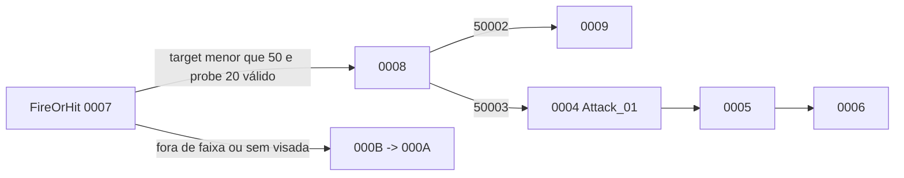

# Família NPC Blazer — Rakion v258

## Escopo e veredito

Este documento fecha o passe estático de `NpcBlazer`, `NpcBlazer2`, `NpcBlazer3` e
`NpcBlazer4`. O recorte cobre classes, efeitos permanentes das mãos, seleção por alcance,
animação de ataque e integração do projétil de fogo com os assets `Flame/FireBall`.

**Veredito:** as quatro variantes compartilham `CNpcBlazerBase`, 13 eventos locais e um único
caminho ofensivo à distância. O Blazer ataca até `50.0f`, usa probe de visada `20.0f` e delay
herdado `3.0f`. Não há caminho corpo a corpo próprio nos handlers. Modelo/curva distinguem as
variantes; não existem quatro máquinas de IA.

## Golden source e reprodução

- `Bin/entitiesmp.dll`, SHA-256
  `3235f03638a87779afeec43fd975d0f9bf49825551a32acb48795fa15372d621`;
- imagem runtime Ghidra `entmemoryfast/entitiesmp_dump.bin`;
- `tools/ghidra/DecompileClientNpcBlazer.py`;
- extrator compartilhado `tools/ghidra/NpcFamilyExtractor.py`.

O extrator lê descritores, tabela `0x3538BC88`, handlers, defaults, assets, inicializador dos
quatro emissores das mãos e inicializador do som do FireBall.

## Classes

| Classe | ID compilado | Descritor | Factory | Pai |
|---|---:|---:|---:|---:|
| `NpcBlazer` / `CNpcBlazer1` | `0x0461` | `0x3538BB38` | `0x35111410` | `CNpcBlazerBase` `0x3538BD68` |
| `NpcBlazer2` / `CNpcBlazer2` | `0x047A` | `0x3538BB98` | `0x351117A0` | igual |
| `NpcBlazer3` / `CNpcBlazer3` | `0x047B` | `0x3538BBF8` | `0x35112070` | igual |
| `NpcBlazer4` / `CNpcBlazer4` | `0x047C` | `0x3538BC58` | `0x35112400` | igual |

Os `SetDefaultProperties` em `0x35111130`, `0x351114C0`, `0x35111D90`, `0x35112120` e
`0x351124B0` são `RET`. As propriedades de combate vêm do default já instalado por `CNpcBase`.

`NpcBlazer` referencia `EFNMModelsSV\NPC\Blazer\Blazer.smc`; `NpcBlazer2` referencia
`EFNMModelsSV\NPC\BlackBlazer\Blazer.smc`. Variantes 3/4 não possuem um terceiro modelo literal
no bloco, portanto a aparência final delas continua dependente do manifest/runtime.

## Assets

| Uso | Recurso |
|---|---|
| animação ofensiva | `Attack_01` |
| modelo do projétil | `EFNMModelsSV\NPC\Blazer\Weapon\FireBall\FireBall.smc` |
| disparo | `SoundsSV\Npcs\NpcBlazer\FireBall.wav` |
| impacto/explosão | `SoundsSV\Npcs\NpcBlazer\FireBallExp.wav` |
| efeitos das mãos | `BlazerHandFlameEffect01.tex`, `BlazerHandFlameEffect02.tex` |
| ciclo | `Summon.wav`, `Die.wav`, `Attacked.wav` |

O helper `0x3517F420` registra `FireBall.wav` no bloco de som do projétil (`+0x3E0`) com
parâmetros literais `50.0f`, `10.0f`, `0.8f`, `1.0f`, `0.0f` e slot `6`. Isso é configuração de
áudio; não representa alcance, dano nem lifetime do projétil.

## Efeitos permanentes das mãos

`0x351134E0` carrega as duas texturas e cria quatro emissores em
`+0x38EC/+0x38F0/+0x38F4/+0x38F8`. Todos usam o tipo `0x48F01` e o mesmo conjunto de escalares,
incluindo:

| Campo do emissor | Bits | Valor |
|---:|---:|---:|
| `+0x150` | `0x41200000` | `10.0f` |
| `+0x190` | `0x41000000` | `8.0f` |
| `+0x18C` | `0x3F000000` | `0.5f` |
| `+0x168/+0x170` | `0x42C80000` | `100.0f` |
| `+0x16C` | `0x43480000` | `200.0f` |

Esses valores pertencem ao renderizador de partículas. Eles não devem ser reutilizados como
estatística de gameplay no backend.

## Máquina local `0x048F`

A tabela contém `0000..000C` mais default. Três pontos substituem a máquina comum:

| Evento Blazer | Evento base | Handler | Responsabilidade |
|---:|---:|---:|---|
| `0x048F0000` | `0x044D0045` | `0x35113C50` | reação temporizada e transição de estado |
| `0x048F0004` | `0x044D0044` | `0x35113250` | início do ciclo `Attack_01` |
| `0x048F0007` | `0x044D0039` | `0x35113380` | FireOrHit e decisão de alcance |

Morte, active/inactive e main loop são herdados. `000C` apenas encaminha para `0x044D0064`.

| Faixa | Responsabilidade |
|---|---|
| `0000..0003` | reação temporizada, recuperação e eventual encaminhamento à morte |
| `0004..0006` | animação ofensiva `Attack_01` |
| `0007..0009` | validação de target/visada e preparação do disparo |
| `000A..000B` | espera e retorno quando o ataque não pode começar |
| `000C` | entrada do loop comum |

`0001` também trata o evento base `0x044D000A`: quando a consulta virtual cruza o limiar global
ou o payload contém sentinela `-1`, ele encaminha para `0x044D0055`, preservando o fluxo de morte
comum. Isso não cria uma segunda regra de HP.

## Fluxo ofensivo

`0007` exige target em `CNpcBase+0x368`, mede distância e compara com `+0x584 = 50.0f`. Dentro
da faixa, chama o probe herdado com `20.0f`. Quando ambos passam:

1. atualiza orientação/movimento;
2. agenda `+0x5BC` com relógio, duração corrente e `+0x58C = 3.0f`;
3. entra em `0008`;
4. `0x50002` avança para `0009`;
5. `0x50003` converge para `0004`;
6. `0004` inicia `Attack_01`, seguindo por `0005 -> 0006`.



O modelo/som do FireBall e seu som de explosão estão no módulo, mas o spawn e o hit trafegam
pelo caminho comum de ação/projétil, fora da tabela local `0x048F`. Portanto, não se deve atribuir
velocidade ou dano usando apenas os parâmetros de áudio/partícula. A base de dano continua sendo
`NpcSetup[level]+0x14` (`Attack`) no preenchimento comum de `DamageInfoParam`.

## Contrato de implementação

Uma porta server-authoritative futura deve separar o ator do projétil:

```text
BlazerDefinition { npcType, level, projectileRange = 50, attackDelay = 3, statCurve }
BlazerState { entityId, targetId, localEventId, animationDeadline }
BlazerProjectile { ownerId, targetId, origin, direction, spawnedAt }
```

Targeting, decisão de disparo, spawn e dano pertencem ao backend. Partículas e áudio permanecem
no cliente. Não se deve manter o hit simultaneamente autoritativo no host original e no World.

## Limite de validação

Fechado estaticamente:

- quatro classes, IDs, factories, pai e defaults;
- 13 eventos locais, default e três overrides;
- `Attack_01`, faixa `50`, probe `20` e delay `3`;
- modelo e sons do FireBall, explosão e quatro emissores das mãos;
- reação temporizada, espera e retorno ao main loop.

Ainda dinâmico:

- frame exato em que o FireBall é materializado;
- velocidade, gravidade, lifetime, raio e homing do projétil;
- volume de hit e multiplicador de dano;
- sincronização visual do projétil em duas sessões.

Esses dados precisam de captura do cliente e não devem ser sintetizados no World.
