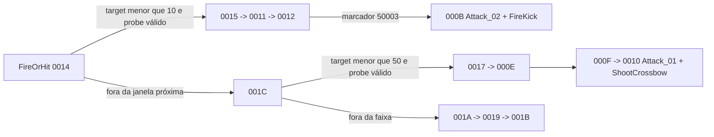

# Família NPC CrossBow — Rakion v258

## Escopo e veredito

Este documento fecha o passe estático de `NpcCrossBow`, `NpcCrossBow2`, `NpcCrossBow3` e
`NpcCrossBow4`. O recorte cobre classes, modelos, projétil, reação a impacto, ataque próximo,
disparo, seleção por alcance e a submáquina exclusiva da segunda variante.

**Veredito:** as quatro classes herdam `CNpcCrossBowBase`. A base possui 30 eventos locais mais
o default e alterna entre `Attack_02`/FireKick a curta distância e `Attack_01`/ShootCrossbow na
faixa de projétil. `NpcCrossBow2` não é apenas troca de curva/modelo: ela acrescenta cinco
eventos de perseguição e posicionamento. As variantes 1, 3 e 4 não possuem tabela adicional.

## Golden source e reprodução

- `Bin/entitiesmp.dll`, SHA-256
  `3235f03638a87779afeec43fd975d0f9bf49825551a32acb48795fa15372d621`;
- imagem runtime Ghidra `entmemoryfast/entitiesmp_dump.bin`;
- `tools/ghidra/DecompileClientNpcCrossBow.py`;
- extrator compartilhado `tools/ghidra/NpcFamilyExtractor.py`.

O extrator lê descritores, a tabela base `0x3538A990`, a tabela CrossBow2 `0x3538A820`, assets,
escalares, handlers substituídos e o inicializador do som de disparo.

## Classes

| Classe | ID compilado | Descritor | Factory | Pai |
|---|---:|---:|---:|---:|
| `NpcCrossBow` / `CNpcCrossBow1` | `0x046C` | `0x3538A7F0` | `0x350F8300` | `CNpcCrossBowBase` `0x3538AB80` |
| `NpcCrossBow2` / `CNpcCrossBow2` | `0x0477` | `0x3538A8A0` | `0x350F8890` | igual |
| `NpcCrossBow3` / `CNpcCrossBow3` | `0x0478` | `0x3538A900` | `0x350F9500` | igual |
| `NpcCrossBow4` / `CNpcCrossBow4` | `0x0479` | `0x3538A960` | `0x350F9830` | igual |

Os cinco `SetDefaultProperties` em `0x350F8050`, `0x350F83B0`, `0x350F9280`, `0x350F95B0` e
`0x350F98E0` retornam imediatamente. Portanto, a família conserva os defaults inicializados por
`CNpcBase`; não há uma curva de propriedades escondida nesses overrides.

`NpcCrossBow` referencia `EFNMModelsSV\NPC\Crossbow\Crossbow.smc`; `NpcCrossBow2` referencia
`EFNMModelsSV\NPC\BlackCrossbow\Crossbow.smc`. Não há terceiro modelo literal no bloco das
variantes 3/4, então sua aparência deve ser confirmada no manifest/runtime.

## Assets e pontos de montagem

| Uso | Recurso |
|---|---|
| projétil | `ModelsSV\NPC\Crossbow\Weapon\Arrow.SMC` |
| ponto de colisão | `HIT_Flag` |
| origem do disparo | `FIRE_Point` |
| marcador de disparo | `FIRE_Flag` |
| tiro | `Attack_01`, `SoundsSV\Npcs\NpcCrossbow\ShootCrossbow.wav` |
| ataque próximo | `Attack_02`, `SoundsSV\Npcs\NpcCrossbow\FireKick.wav` |
| ciclo | `Summon.wav`, `Die.wav`, `Run.wav`, `BeAttacked00/01.wav` |
| reações próprias | `Struck_BackDown`, `Struck_FrontDown`, `Struck_StabBackDown`, `Struck_StabFrontDown`, `Struck_UpSlide`, `Struck_DownSlide`, `Struck_Right`, `Struck_Left` |

O helper `0x350F9F20` registra `ShootCrossbow.wav` no bloco `+0x38E0`, com literais
`30.0f`, `5.0f`, `1.0f`, `1.0f`, `0.0f` e slot `6`. O handler do FireKick usa os mesmos
`30/5/1/1/0` e o bloco comum `+0x4C0`.

## Máquina base `0x048E`

A tabela possui `0000..001D` e um default. Os quatro vínculos com `CNpcBase` são:

| Evento CrossBow | Evento base | Handler | Semântica |
|---:|---:|---:|---|
| `0x048E0000` | `0x044D0046` | `0x350FA1A0` | entrada de impacto/struck |
| `0x048E000E` | `0x044D0044` | `0x350FB230` | início/saída do ataque de tiro |
| `0x048E0011` | `0x044D0043` | `0x350FB360` | seleção do ataque próximo |
| `0x048E0014` | `0x044D0039` | `0x350FB420` | FireOrHit e seleção por alcance |

| Faixa | Responsabilidade |
|---|---|
| `0000..0007` | struck, queda e recuperação |
| `0008..000A` | cadeia alternativa de `Attack_02` |
| `000B..000D` | `Attack_02` com FireKick |
| `000E..0010` | `Attack_01` com ShootCrossbow |
| `0011..0013` | preparação do golpe próximo |
| `0014..001B` | FireOrHit, aproximação, espera e retorno |
| `001C` | decisão da faixa de projétil |
| `001D` | encaminhamento ao main loop `0x044D0064` |

Morte, active/inactive e loops principais permanecem herdados. Os eventos `0x50002/03/04`,
`0x16` e `0x044F0001` avançam ou encerram as cadeias de animação; eles não são mensagens World.

## Seleção de ataque e tempo

Os campos vêm do default comum de `CNpcBase`:

| Campo | Valor | Uso nesta família |
|---:|---:|---|
| `+0x580` | `10.0f` | limite do caminho próximo |
| `+0x584` | `50.0f` | limite do caminho de projétil |
| `+0x588` | `2.0f` | delay do caminho próximo |
| `+0x58C` | `3.0f` | delay do tiro |
| literal | `20.0f` | probe herdado de visada/alcance |



`0014` agenda `+0x5BC` com relógio, delay `+0x588` e duração corrente. `001C` faz o mesmo com
`+0x58C`. O disparo não tem um cooldown comercial em milissegundos separado: sua janela é parte
da máquina de animação/relógio.

## Submáquina exclusiva de CrossBow2

`NpcCrossBow2` registra `0x04770000..0x04770004` mais default. O evento `0000` substitui
`0x044D0034`, a mesma entrada de deslocamento/perseguição usada pela base. Ele salva posição em
`+0x590/+0x594/+0x598`, inicializa o controle em `+0x5A8` e entra em `0003`.

`0003` consulta estado de movimento/target, calcula distância e duração por chamadas virtuais e
retorna por `0001/0002`. No marcador `0x50003`, `0001` pode convergir para o FireOrHit comum
`0x048E0014`; fora da condição, reposiciona e atualiza orientação. O default registra os IDs
`0x40000207`, `0x00037C02` e `0x0004770A`, depois encaminha para `0x048E001D`.

Essa tabela prova comportamento próprio da segunda variante, mas não prova teleport, dodge ou
qualquer nome visual específico. A descrição correta, sem captura, é reposicionamento/perseguição
antes do ataque.

## Contrato de implementação

Uma porta server-authoritative futura precisa separar definição e estado:

```text
CrossBowDefinition { npcType, level, closeRange = 10, projectileRange = 50, statCurve }
CrossBowState { entityId, targetId, localEventId, animationDeadline, variant2RepositionState }
CrossBowAttack { FireKick, ArrowShot }
CrossBowProjectile { ownerId, origin, direction, spawnedAt }
```

Targeting, seleção de faixa, spawn do projétil e dano pertencem ao backend. O cliente deve receber
contratos de ação/projétil; não se deve manter o hit simultaneamente autoritativo no host legado e
no World.

## Limite de validação

Fechado estaticamente:

- quatro classes, IDs, factories, pai e defaults;
- 30 eventos base, cinco eventos exclusivos de CrossBow2 e seus defaults;
- ataque próximo, tiro, faixas `10/50`, delays `2/3` e probe `20`;
- modelo do projétil, pontos `HIT/FIRE`, animações e sons;
- impacto, FireOrHit e encaminhamento ao main loop.

Ainda dinâmico:

- velocidade, gravidade, lifetime e volume exato da flecha;
- frame exato de criação e multiplicador do hit;
- trajetória visual do reposicionamento de CrossBow2;
- sincronização do projétil e do FireKick em duas sessões.

Esses valores exigem captura do cliente e não devem ser inventados no World.
