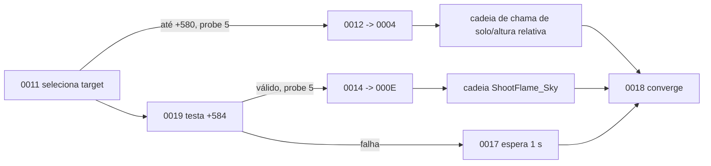

# Família NPC Dragon — Rakion v258

## Escopo e veredito

Este documento fecha o passe estático de `NpcDragon`, `NpcDragon2`, `NpcDragon3` e
`NpcDragon4`: classes, voo, seleção por alcance, ataques de chama no solo/céu, áudio, attachments
e máquina local.

**Veredito:** as quatro variantes compartilham `CNpcDragonBase` e 27 estados locais. Diferente
das famílias terrestres anteriores, Dragon possui correção contínua de altura e movimento aéreo.
O selector divide combate próximo e distante pelos campos carregados do `NpcSetup`; as cadeias
usam `ShootFlame_Ground*` ou `ShootFlame_Sky`. Existe um projectile genérico disponível, mas não
uma classe carregável `NpcBlackDragon` nesta build.

## Golden source e reprodução

- `Bin/entitiesmp.dll`, SHA-256
  `3235f03638a87779afeec43fd975d0f9bf49825551a32acb48795fa15372d621`;
- imagem runtime Ghidra `entmemoryfast/entitiesmp_dump.bin`;
- `tools/ghidra/DecompileClientNpcDragon.py`;
- extrator compartilhado `tools/ghidra/NpcFamilyExtractor.py`.

O extrator lê descritores, tabela `0x3538AD50`, default `0x3538AF00`, handlers comuns
substituídos, inicialização, assets e helpers de voo/áudio.

## Classes

| Classe | ID compilado | Descritor | Factory | Pai |
|---|---:|---:|---:|---:|
| `NpcDragon` / `CNpcDragon1` | `0x0463` | `0x3538AC00` | `0x350FC4B0` | `CNpcDragonBase` `0x3538AF10` |
| `NpcDragon2` / `CNpcDragon2` | `0x0489` | `0x3538AC60` | `0x350FC890` | igual |
| `NpcDragon3` / `CNpcDragon3` | `0x048A` | `0x3538ACC0` | `0x350FCBE0` | igual |
| `NpcDragon4` / `CNpcDragon4` | `0x048B` | `0x3538AD20` | `0x350FCF30` | igual |
| `CNpcDragonBase` | `0x0494` | `0x3538AF30` | `0x350FE9B0` | `CNpcBase` |

Todas as factories alocam `0x38F0` bytes, chamam o construtor comum `0x350F0C80` e então
instalam a vtable da variante. Modelo e curva de atributos continuam dados externos; não há
quatro cópias da máquina de comportamento.

`NpcDragon2` não deve ser renomeado automaticamente para Black Dragon. O catálogo possui o alias
de conteúdo `blackdragon`, mas os manifests `NpcBlackDragon*` referenciados por snapshots de outra
build não existem nos XFS v258 disponíveis.

## Defaults e controle aéreo

Os campos de seleção `+0x57C/+0x580/+0x584/+0x588/+0x58C` são preenchidos a partir do record do
NPC, em vez de uma tabela de constantes exclusiva da família. Assim:

- `+0x580` é o limiar do primeiro selector;
- `+0x584` é o alcance do segundo selector;
- `+0x588` agenda o cooldown do primeiro ramo;
- `+0x58C` agenda o cooldown do segundo ramo;
- ambos exigem a sonda de target com literal `5.0f`.

O helper `0x350FD110` inicializa o estado de resposta do movimento em `+0x3850..+0x386C`, incluindo
os valores float32 `1,6` e `1,4`. O estado `0000 @ 0x350FF460` mede a componente vertical, calcula
uma resposta em torno de `5,25`, limita o regime superior em `5,5` e usa escala `-2` no ramo de
correção. Quando há target, ele também normaliza a direção, atualiza a velocidade virtual e
avança para `0001`; sem condição válida, permanece em `0000`.

Essas constantes descrevem a correção compilada, mas a unidade física depende da engine. Elas
não devem ser documentadas como metros ou graus sem captura dinâmica.

## Seleção de ataque

`0011 @ 0x350FE730` é a primeira decisão:

1. exige target em `+0x368`;
2. mede a distância pelo helper Dragon;
3. compara com `+0x580`;
4. executa probe `5.0`;
5. agenda `+0x5BC = agora + tick + +0x588`;
6. segue por `0012` para o ramo `0004`.

Falha no primeiro selector encaminha para `0019 @ 0x350FE890`. Ele repete distância e probe com
`+0x584`, agenda `+0x58C` e entra em `0014 -> 000E`. Se também falhar, usa `0017`, que agenda uma
espera literal de um segundo antes da convergência.



## Duas cadeias de chama

O override `0004 @ 0x350FE470` compara altura própria e do target. Um ramo inicia
`ShootFlame_Sky` e segue `0005 -> 0006`; o outro segue `0007 -> 0008 -> 0009`.

No estado `0009 @ 0x350FE600`, Dragon:

- inicia `ShootFlame_Ground_Start`;
- obtém duração/posição de animação;
- relaciona a diferença vertical com o target;
- grava o resultado em `+0x38E8`, com clamp para zero;
- passa por `000A` até `000B`.

`000B` inicia `ShootFlame_Ground`, seleciona o canal de animação `8` e agenda o fim pela duração
retornada. `000C/000D` aguardam sinais de animação e encerram o ramo.

O override `000E @ 0x350FDD50` inicia diretamente `ShootFlame_Sky`, também no canal `8`, e passa
por `000F/0010`. Os estados `0012..0018` cuidam de sinais `0x50002/03`, retorno ao ataque
selecionado e convergência. Eventos de dano, morte ou desaparecimento interrompem as cadeias que
mantêm chama ativa, evitando que o efeito sobreviva ao estado da entidade.

Os nomes de asset e o recurso `NpcProjectile.ecl` sustentam a apresentação de FireBall, mas
velocidade, lifetime, colisão e splash não aparecem como literais completos nesta tabela. Esses
parâmetros continuam dependentes de observação runtime.

## Máquina local `0x0494`

A tabela possui `0000..001A` e default. Quatro entradas substituem estados comuns:

| Evento Dragon | Evento base | Handler | Responsabilidade |
|---:|---:|---:|---|
| `0x04940000` | `0x044D0045` | `0x350FF460` | correção vertical, direção e avanço aéreo |
| `0x04940004` | `0x044D0043` | `0x350FE470` | escolhe cadeia pela altura relativa do target |
| `0x0494000E` | `0x044D0044` | `0x350FDD50` | abre o ramo `ShootFlame_Sky` |
| `0x04940011` | `0x044D0039` | `0x350FE730` | selector próximo, probe e cooldown |

`0001..0003` fecham a transição inicial de voo. `0005..000D` compõem o ramo de chama no solo;
`000E..0010`, o ramo aéreo. `0011..0019` selecionam alcance, cooldown e recuperação. `001A`
limpa o estado de apresentação, publica o efeito compilado `0x20000205` e retorna ao loop comum
`0x044D0064`. O default encaminha eventos não locais para a base.

## Assets e apresentação

| Uso | Recurso |
|---|---|
| modelo | `EFNMModelsSV\NPC\Dragon\Dragon.smc` |
| projectile genérico | `EFNMClasses\NpcProjectile.ecl` |
| chama de solo | `ShootFlame_Ground_Start`, `ShootFlame_Ground` |
| chama aérea | `ShootFlame_Sky` |
| attachment de raiz | `TRANS_Root` |
| flag/emissor | `FLAME_Flag` |
| áudio de fogo contínuo | `SoundsSV\Npcs\NpcDragon\FireFlame.wav` |
| áudio de disparo | `SoundsSV\Npcs\NpcDragon\FireBall.wav` |
| ciclo | `Summon.wav`, `Die.wav`, `Attacked.wav` |

Os helpers `0x350FD160/1F0/280/310/3A0` instalam os cinco sons em emissores da entidade. O helper
`0x350FEA30` acompanha `TRANS_Root`, guarda posição anterior em `+0x640..+0x648` e calcula o
delta normalizado usado pela apresentação. `FLAME_Flag` é consultado pelos caminhos de efeito;
isso não o transforma em hitbox autoritativa.

## Contrato de implementação

```text
DragonDefinition { npcType, level, nearRange, farRange, nearDelay, farDelay, statCurve }
DragonState { entityId, targetId, localEventId, attackDeadline, altitudeResponse, flameState }
DragonAttack { kind: GroundFlame | SkyFire, origin, targetId, startedAt }
```

Targeting, voo, decisão de ataque, projectile, colisão e dano pertencem ao backend autoritativo
quando esse modo for habilitado. Modelo, animação, attachments, som e chama visual permanecem no
cliente. A fidelidade host-authoritative original não exige duplicar a simulação no World.

## Limite de validação

Fechado estaticamente:

- cinco classes, IDs, factories e herança;
- 27 estados, default e quatro overrides;
- correção vertical e tracking de `TRANS_Root`;
- seleção por dois alcances configuráveis, probe `5` e dois cooldowns;
- cadeias `ShootFlame_Ground*` e `ShootFlame_Sky`;
- modelo, projectile genérico, attachments e cinco sons;
- ausência de classe carregável `NpcBlackDragon*` nos XFS v258.

Ainda dinâmico:

- unidades e curva visual exata do controle de altitude;
- frame de emissão de cada ataque;
- formato final, velocidade, gravidade, lifetime e colisão do FireBall;
- volume, alcance, dano, knockback e splash da chama;
- skin/aparência das variantes 2/3/4;
- sincronização, morte e efeitos em duas sessões.

Esses pontos exigem captura real e não devem ser inferidos apenas dos nomes dos assets.
