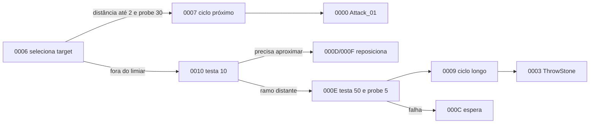

# Família NPC Golem — Rakion v258

## Escopo e veredito

Este documento fecha o passe estático de `NpcGolem`, `NpcGolem2`, `NpcGolem3`, `NpcGolem4` e
da entidade auxiliar `NpcGolemStoneDebris`. Master Golem, Gold Golem, Golden Sword e encerramento
do round pertencem ao fluxo de objetivo descrito em
[`golem-boss-objectives.md`](golem-boss-objectives.md), não à IA desta família.

**Veredito:** as quatro variantes comuns compartilham `CNpcGolemBase`, 18 eventos locais e dois
ciclos ofensivos: golpe `Attack_01` e arremesso `ThrowStone`. A seleção usa três limiares de
distância (`2`, `10`, `50`), delays de `2/3` segundos e probes de visada `30/5`. A pedra gera uma
classe de debris própria, que escolhe um de cinco modelos, aplica trajetória e se desativa ao fim
do ciclo. Modelo/curva distinguem as variantes; não existem quatro máquinas de IA.

## Golden source e reprodução

- `Bin/entitiesmp.dll`, SHA-256
  `3235f03638a87779afeec43fd975d0f9bf49825551a32acb48795fa15372d621`;
- imagem runtime Ghidra `entmemoryfast/entitiesmp_dump.bin`;
- `tools/ghidra/DecompileClientNpcGolem.py`;
- extrator compartilhado `tools/ghidra/NpcFamilyExtractor.py`.

O extrator lê os descritores, a tabela base `0x3538B298`, a subtabela de debris
`0x3538B428`, handlers, defaults, assets e constantes de alcance/visada.

## Classes

| Classe | ID compilado | Descritor | Factory | Pai |
|---|---:|---:|---:|---:|
| `NpcGolem` / `CNpcGolem1` | `0x0468` | `0x3538B148` | `0x35106590` | `CNpcGolemBase` `0x3538B3C8` |
| `NpcGolem2` / `CNpcGolem2` | `0x047D` | `0x3538B1A8` | `0x35106AA0` | igual |
| `NpcGolem3` / `CNpcGolem3` | `0x047E` | `0x3538B208` | `0x35106DD0` | igual |
| `NpcGolem4` / `CNpcGolem4` | `0x047F` | `0x3538B268` | `0x35107100` | igual |
| `CNpcGolemBase` | `0x0490` | `0x3538B3E8` | `0x35109780` | `CNpcBase` |
| `NpcGolemStoneDebris` | `0x045A` | `0x3538B468` | `0x3510A0A0` | entidade de efeito |

Os quatro `SetDefaultProperties` das variantes saltam para `CNpcGolemBase::SetDefaultProperties`
em `0x35107220`. Assim, diferenças de nível/atributos vêm de `creatures.dat`; não são defaults de
IA duplicados nas subclasses.

## Defaults e seleção por distância

| Campo runtime | Valor | Uso comprovado |
|---:|---:|---|
| `+0x57C` | `2.0f` | limiar do ataque próximo |
| `+0x580` | `10.0f` | limiar intermediário/reposicionamento |
| `+0x584` | `50.0f` | alcance máximo do arremesso |
| `+0x588` | `2.0f` | delay do ramo curto |
| `+0x58C` | `3.0f` | delay do ramo longo |
| probe curto/intermediário | `30.0f` | teste de visada nos ramos `0006/0010` |
| probe longo | `5.0f` | teste de visada no ramo `000E` |

O selector começa em `0006`. Até `2`, com target e probe válidos, segue
`0007 -> 0008 -> 000F -> 0000`, iniciando `Attack_01`. Fora desse limiar, `0010` testa `10` e
encaminha o reposicionamento por `000D/000F`; se ainda estiver longe, `000E` aceita até `50` e
segue `0009 -> 000A -> 000B -> 000D -> 000F -> 0003`, iniciando `ThrowStone`. Falha de alcance ou
visada passa por `000C` antes de retornar ao ciclo.



## Máquina local `0x0490`

A tabela contém `0000..0011` mais default. Três entradas substituem eventos comuns de
`CNpcBase`; as demais compõem os ciclos internos.

| Evento Golem | Evento base | Handler | Responsabilidade |
|---:|---:|---:|---|
| `0x04900000` | `0x044D0043` | `0x351078A0` | inicia `Attack_01` |
| `0x04900003` | `0x044D0044` | `0x35107A90` | prepara pedra, áudio e `ThrowStone` |
| `0x04900006` | `0x044D0039` | `0x35108190` | entrada de targeting/seleção de ataque |
| `0x04900011` | — | `0x35109670` | retorna ao loop comum `0x044D0064` |

`0001/0002` finalizam o golpe; `0004/0005`, o arremesso. `0007..000F` tratam os sinais de
animação `0x50002/03/04`, cooldown, visada, aproximação e convergência ao ataque selecionado.
O default local preserva o tratamento global de eventos; dano e morte continuam na máquina
comum de `CNpcBase`.

## Pedra e debris

O arremesso usa os seguintes recursos:

| Uso | Recurso |
|---|---|
| animação | `ThrowStone` |
| som de escavação/preparo | `SoundsSV\Npcs\NpcGolem\DigStone.wav` |
| som do arremesso | `SoundsSV\Npcs\NpcGolem\ThrowStone.wav` |
| pedra presa ao ator | `Golem\Weapon\Stone\AttachStone.smc` |
| pedra lançada | `Golem\Weapon\Stone\ThrowStone.smc` |
| classe de fragmento | `EFNMClasses\NpcGolemStoneDebris.ecl` |
| fragmentos | `Debris00.smc` até `Debris04.smc` |
| quebra | `SoundsSV\Npcs\NpcGolem\BreakStone.wav` |
| partículas | `GolemFragment.tex` e `GolemDust.tex` |

`NpcGolemStoneDebris` possui `045A0000`, `045A0001` e default. O default escolhe por
`random % 5` um dos IDs `0x045A01..05`, normaliza a direção, aplica uma perturbação aleatória,
ativa a entidade e agenda `4.0f`. `045A0000` aguarda os sinais de animação; `045A0001` limpa o
estado ativo, desliga a entidade e encerra. Esses fragmentos são apresentação/física local, não
uma quinta variante invocável de Cell.

## Contrato de implementação

Uma porta server-authoritative futura deve manter decisão e apresentação separadas:

```text
GolemDefinition { npcType, level, nearRange = 2, midRange = 10, throwRange = 50, statCurve }
GolemState { entityId, targetId, localEventId, attackDeadline }
GolemStone { ownerId, origin, direction, spawnedAt }
GolemDebrisFx { variant, origin, direction, expiresAt }
```

Targeting, escolha do ataque, spawn da pedra e dano pertencem ao backend. Modelo, som, poeira e
debris permanecem no cliente. Não se deve tornar o mesmo hit autoritativo no host original e no
World simultaneamente.

## Limite de validação

Fechado estaticamente:

- seis classes, IDs, factories, herança e defaults;
- 18 eventos do Golem, default e três overrides de `CNpcBase`;
- dois eventos mais default do debris;
- limiares `2/10/50`, delays `2/3` e probes `30/5`;
- `Attack_01`, `ThrowStone`, pedra anexada/lançada, cinco debris, sons e partículas;
- fronteira entre a família comum e Master/Gold Golem.

Ainda dinâmico:

- frame exato de soltura da pedra e sincronização em duas sessões;
- velocidade, arco, gravidade, lifetime e colisão da pedra lançada;
- volume de hit, multiplicador de dano e eventual splash;
- aparência efetiva das variantes 2/3/4 carregada pelo manifest;
- validação gráfica do debris e da transição próximo/longo.

Esses dados precisam de captura do cliente e não devem ser inferidos dos parâmetros de partícula.
