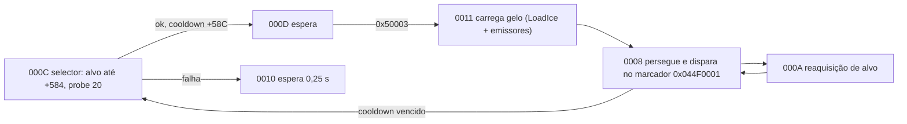

# Família NPC IceWind — Rakion v258

## Escopo e veredito

Este documento fecha o passe estático de `NpcIceWind`, `NpcIceWind2`, `NpcIceWind3` e
`NpcIceWind4`: classes, voo, carga de gelo, disparo, projétil dedicado, áudio e máquina local.

**Veredito:** as quatro variantes compartilham `CNpcIceWindBase` e 21 estados locais. IceWind é a
segunda família aérea (mesmo override de correção vertical do Dragon), mas com um perfil
exclusivamente de alcance: não existe cadeia de ataque próximo — o selector exige alvo dentro do
alcance distante, carrega o gelo com som/emissores dedicados e dispara um **projétil próprio**
(`CIceWind`, classe carregável `EFNMClasses\IceWind.ecl`) que conhece lançador e alvo. O Dragon usa
projectile genérico; IceWind é a única família com classe de projétil tipada até aqui.

## Golden source e reprodução

- `Bin/entitiesmp.dll`, SHA-256
  `3235f03638a87779afeec43fd975d0f9bf49825551a32acb48795fa15372d621`;
- imagem runtime Ghidra `entmemoryfast/entitiesmp_dump.bin`;
- `tools/ghidra/DecompileClientNpcIceWind.py`;
- extrator compartilhado `tools/ghidra/NpcFamilyExtractor.py`.

O extrator lê descritores, tabela `0x3538B618`, default `0x3538B768`, handlers comuns
substituídos, propriedades, componentes, assets e as tabelas do projétil `CIceWind`.

## Classes

| Classe | ID compilado | Descritor | Factory | Pai |
|---|---:|---:|---:|---:|
| `NpcIceWind` / `CNpcIceWind1` | `0x0496` | `0x3538B4C8` | `0x3510A8B0` | `CNpcIceWindBase` `0x3538B778` |
| `NpcIceWind2` / `CNpcIceWind2` | `0x0497` | `0x3538B528` | `0x3510ACC0` | igual |
| `NpcIceWind3` / `CNpcIceWind3` | `0x0498` | `0x3538B588` | `0x3510B050` | igual |
| `NpcIceWind4` / `CNpcIceWind4` | `0x0499` | `0x3538B5E8` | `0x3510B3E0` | igual |
| `CNpcIceWindBase` | `0x0495` | `0x3538B798` | `0x3510E190` | `CNpcBase` |
| `CIceWind` (projétil) | `0x049A` | `0x35387F58` | `0x350AF960` | classe da engine `0x36299810` |

Todas as factories alocam `0x39B0` bytes, chamam o construtor comum `0x3510E0E0` e instalam a
vtable da variante (`0x352D46A8/0x352D4908/0x352D4B68/0x352D4DC8`). O construtor comum reusa
`0x350F0C80` — o mesmo init de NPC voador do Dragon —, registra o objeto de som auxiliar e zera os
quatro slots de emissor `+0x399C..+0x39A8`. Modelo e curva de atributos continuam dados externos;
não há quatro cópias da máquina de comportamento.

O alias de conteúdo `blackicewind` (item `8036`, `NpcIceWind2`) possui `.ecl` apenas nos assets
inativos dos stages `49..55`; nesta build não há item ativo nem classe `NpcBlackIceWind`.

## Propriedades e carga de gelo

A tabela de propriedades `0x353A62C0` define cinco campos próprios da família:

| Offset | Tipo | Uso |
|---:|---|---|
| `+0x38E0` | float | resposta vertical corrente do voo |
| `+0x38E4` | float | piso da banda de altitude |
| `+0x38E8` | float | teto da banda de altitude |
| `+0x38EC` | bool | flag "carregando gelo" (liga na carga, desliga no disparo) |
| `+0x38F0` | sound object | canal do `LoadIce.wav` |

O estado `0000 @ 0x3510D290` (override do `0x044D0045`) mede a altura, mira o centro da banda
(`(+0x38E8 − +0x38E4) × 0,5 + +0x38E4`) e escolhe a resposta vertical: `1,5` por padrão, `−1,5`
no regime inferior, ou proporcional dentro da banda. Fora da banda ele normaliza a direção,
atualiza a velocidade virtual e segue para `0001`; dentro dela converge por `0003`. As constantes
descrevem a correção compilada; a unidade física depende da engine e não deve ser documentada
como metros sem captura dinâmica.

Os campos de seleção herdados (`+0x57C/+0x580/+0x584/+0x588/+0x58C`) continuam vindo do record do
NPC, como nas demais famílias.

## Seleção e ciclo de ataque

`000C @ 0x3510C7C0` é o selector (override do `0x044D0039`) e só tem um ramo de ataque:

1. sem alvo em `+0x368`, devolve o controle à base;
2. mede a distância e compara com `+0x584` (alcance distante);
3. executa probe de linha de tiro com literal `20.0` (a base usa `30.0`);
4. sucesso agenda `+0x5BC = agora + +0x58C` e segue `000D`;
5. falha vai a `0010`, que espera `0,25 s` e reconverge por `000F`.

`0011 @ 0x3510C910` (override do `0x044D0044`) abre a carga: toca o som compartilhado
`0x352B9280`, instala `LoadIce.wav` em `+0x38F0` (volume `5,0`), liga `+0x38EC` e os quatro
emissores, anima o canal `8` e espera a duração retornada (`0012 → 0013`).

O ciclo de perseguição/fogo corre em `0007/0008/000A`:

- `0007 @ 0x3510C220` (override do `0x044D0034`, perda de alvo) grava a posição corrente e o
  sentinela `1e9`, e redireciona para `000A` em vez do fluxo comum `0x044D0037`;
- `000A @ 0x3510DF70` reaquisita: valida o alvo (inclusive se ainda é `CNpcBase` `0x3538A618` e
  se segue vivo), mede distância, calcula a velocidade de aproximação e volta a `0008`; falhas
  devolvem o controle com códigos próprios;
- `0008 @ 0x3510D500` executa: no tick `0x50003`, dentro do cooldown persegue e se alinha; com o
  cooldown vencido volta ao selector `000C`; o disparo em si acontece no marcador de animação
  `0x044F0001`, que valida o slot de arma e emite o projétil; `0x50002/0x50004` encerram por
  `0009 → 000A`.



`0004 @ 0x3510BFC0` (override do `0x044D0046`) fecha o disparo: zera `+0x38EC`, desliga os quatro
emissores, anima o canal `8` e segue `0005 → 0006`. `0014` limpa a apresentação, publica o efeito
compilado `0x20000205` e retorna ao loop comum `0x044D0064`. O default encaminha eventos não
locais para a base.

## Projétil `CIceWind`

`CIceWind` aloca `0x4A8` bytes (ctor `0x350AFB80`) e é criado com o evento `EIceWind`
(`0x049A0000`, `0x88` bytes, ctor `0x350AF100`), que carrega lançador e alvo. Propriedades
(`0x3539F100`):

| Offset | Tipo | Uso |
|---:|---|---|
| `+0x364` | entity ptr | lançador (ignorado na colisão) |
| `+0x368` | entity ptr | alvo |
| `+0x36C` | float | instante do lançamento |
| `+0x370` | float | escalar de trajetória |
| `+0x374`/`+0x380` | float3d | vetores de direção/posição |
| `+0x390` | sound object | canal do projétil |

Máquina local (tabela `0x35387F04`):

- init (`0x350AF010`): instala modelo/textura compilados do `icebullet.SMC`, liga colisão
  (`flags | 0x40`), orienta ao alvo, grava `+0x36C = agora` e entra em voo;
- voo (`0x049A0001 @ 0x350AF6D0`): colisão com o mundo (`0x50005`), timer de vida (`0x50004`) ou
  toque em entidade (`0x50006`) explodem; o toque ignora o próprio lançador e classes filtradas,
  e aplica o dano antes de explodir;
- morte (`0x049A0002 @ 0x350AEBC0`): esconde o modelo e encerra.

A explosão usa o efeito "Explosion IceWind projectile" e `IceBallExp.wav`. Um descritor de enum
com rótulos `none`/`direction type` (Tracer Type) acompanha as propriedades do projétil.
Velocidade, gravidade, lifetime e splash não aparecem como literais completos na tabela — esses
parâmetros continuam dependentes de observação runtime.

## Máquina local `0x0495`

A tabela possui `0000..0014` e default. Cinco entradas substituem estados comuns:

| Evento IceWind | Evento base | Handler | Responsabilidade |
|---:|---:|---:|---|
| `0x04950000` | `0x044D0045` | `0x3510D290` | banda de altitude e avanço aéreo |
| `0x04950004` | `0x044D0046` | `0x3510BFC0` | fim do disparo: flag/emissores off, anim canal 8 |
| `0x04950007` | `0x044D0034` | `0x3510C220` | perda de alvo → reaquisição `000A` |
| `0x0495000C` | `0x044D0039` | `0x3510C7C0` | selector distante, probe 20 e cooldown `+0x58C` |
| `0x04950011` | `0x044D0044` | `0x3510C910` | carga do gelo: LoadIce + quatro emissores |

`0001..0003` fecham a transição de voo. `0005/0006` encerram o disparo; `0009/000A` reaquisitam;
`000B` é vazio; `000D..0010` temporizam o selector; `0012/0013` aguardam a carga; `0014` converge
ao loop comum.

## Assets e apresentação

| Uso | Recurso |
|---|---|
| modelo | `ModelsSV\NPC\IceWind\IceWind.SMC` (+ variante `EFNMModelsSV`) |
| classes carregáveis | `EFNMClasses\NpcIceWind*.ecl`, `NpcIceWindBase.ecl` |
| projétil | `EFNMClasses\IceWind.ecl`, modelo `Icewind_bullet\icebullet.SMC` |
| maldição | `curst_icewind.mdl` |
| carga | `SoundsSV\Npcs\NpcIceWind\LoadIce.wav` |
| disparo | `SoundsSV\Npcs\NpcIceWind\FireIce.wav` |
| explosão | `SoundsSV\Npcs\NpcIceWind\IceBallExp.wav` |
| ciclo | `Summon.wav`, `Die.wav`, `Fly00.wav` |

## Contrato de implementação

```text
IceWindDefinition { npcType, level, farRange, fireDelay, altitudeBand, statCurve }
IceWindState { entityId, targetId, localEventId, attackDeadline, loadingIce, altitudeResponse }
IceWindProjectile { launcherId, targetId, origin, launchedAt }
```

Targeting, voo, carga, disparo, trajetória do projétil, colisão e dano pertencem ao backend
autoritativo quando esse modo for habilitado. Modelo, animação, emissores, som e o rastro visual
permanecem no cliente. A fidelidade host-authoritative original não exige duplicar a simulação no
World.

## Limite de validação

Fechado estaticamente:

- seis classes (quatro variantes, base e projétil), IDs, factories e herança;
- 21 estados, default e cinco overrides;
- banda de altitude com interpolação `0,5` e resposta `±1,5`;
- selector exclusivamente distante com probe `20` e retry de `0,25 s`;
- carga de gelo com flag `+0x38EC`, som dedicado e quatro emissores;
- projétil `CIceWind` com dono/alvo, filtro de lançador e explosão própria;
- modelo, projétil, maldição e seis sons;
- ausência de item ativo/classe `NpcBlackIceWind` nos XFS v258.

Ainda dinâmico:

- unidades e curva visual exata do controle de altitude;
- frame de emissão do disparo e cadência efetiva;
- velocidade, gravidade, lifetime, dano e splash do projétil de gelo;
- skin/aparência das variantes 2/3/4;
- sincronização, morte e efeitos em duas sessões.

Esses pontos exigem captura real e não devem ser inferidos apenas dos nomes dos assets.
