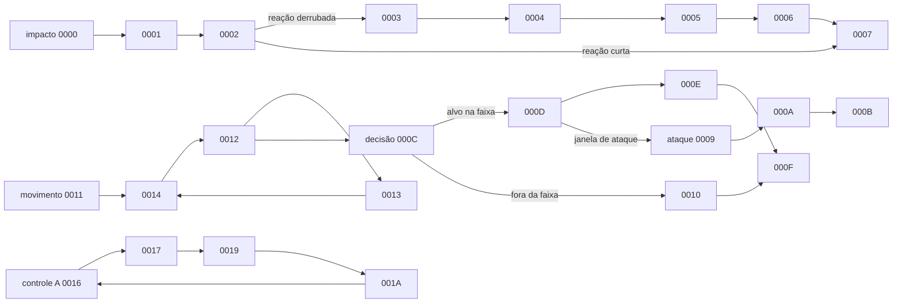

# Família NPC Nak — Rakion v258

## Escopo e veredito

Este documento fecha o passe estático específico de `NpcNak`, `NpcNak2`, `NpcNak3` e
`NpcNak4` no `entitiesmp.dll` entregue. Ele cobre herança, IDs de classe, assets, tabela de
eventos, máquina de estados, ataque, movimento, reação a impacto, morte e campos próprios
consumidos.

**Veredito:** as quatro variantes são apenas classes concretas distintas para catálogo/factory.
Elas herdam a mesma `CNpcNakBase`, usam a mesma máquina de 29 eventos locais e seus quatro
`SetDefaultProperties` saltam para a mesma implementação `0x35118AD0`. A diferença de força,
energia, velocidade, custo e recompensa vem das curvas de `creatures.dat`, não de quatro IAs
compiladas diferentes.

O ataque próprio carrega a animação `Shoot_Poison`, usa o som `FirePoison.wav`, mantém o alvo
herdado de `CNpcBase` e avança por eventos de animação. O binário não contém um intervalo fixo em
milissegundos para esse disparo: duração e janela são obtidas do recurso de animação e do relógio
da engine. A aplicação visual do projétil/veneno ainda requer observação runtime; não deve ser
inventada no World a partir do nome do asset.

## Golden source

- cliente: `Bin/entitiesmp.dll`, SHA-256
  `3235f03638a87779afeec43fd975d0f9bf49825551a32acb48795fa15372d621`;
- imagem runtime analisada: projeto Ghidra `entmemoryfast/entitiesmp_dump.bin`;
- extrator reproduzível: `tools/ghidra/DecompileClientNpcNak.py`;
- curvas e tipos: [`npc-stat-curves.md`](npc-stat-curves.md);
- targeting, owner e dano comum: [`cells-creatures-npc.md`](cells-creatures-npc.md).

O extrator lê os descritores e tabelas diretamente da imagem, decompila todos os handlers Nak e
os sete handlers `CNpcBase` substituídos. Nomes funcionais abaixo são semântica derivada do corpo;
os IDs e endereços são valores literais do binário.

## Classes e herança

| Classe do manifest | ID compilado | Descritor | Factory | Pai |
|---|---:|---:|---:|---:|
| `NpcNak` / `CNpcNak1` | `0x0466` | `0x3538BF98` | `0x35117F40` | `CNpcNakBase` `0x3538C2C8` |
| `NpcNak2` / `CNpcNak2` | `0x0471` | `0x3538BFF8` | `0x35118350` | igual |
| `NpcNak3` / `CNpcNak3` | `0x0472` | `0x3538C058` | `0x35118680` | igual |
| `NpcNak4` / `CNpcNak4` | `0x0473` | `0x3538C0B8` | `0x351189B0` | igual |

Entradas de `SetDefaultProperties`:

```text
CNpcNak1  0x35117D30 -> JMP 0x35118AD0
CNpcNak2  0x35118140 -> JMP 0x35118AD0
CNpcNak3  0x35118470 -> JMP 0x35118AD0
CNpcNak4  0x351187A0 -> JMP 0x35118AD0
```

Isso rejeita uma implementação com quatro árvores de comportamento. Uma porta fiel deve ter um
comportamento Nak e receber tipo/nível/curvas por contrato.

## Assets próprios

| Uso | Recurso literal |
|---|---|
| modelo | `EFNMModelsSV\NPC\Nak\Nak.smc` |
| animação de locomoção | `Move_Fast` |
| animação de ataque | `Shoot_Poison` |
| summon | `SoundsSV\Npcs\NpcMage\Summon.wav` |
| morte | `SoundsSV\Npcs\NpcNak\Die.wav` |
| impacto recebido | `SoundsSV\Npcs\NpcNak\Attacked.wav` |
| disparo | `SoundsSV\Npcs\NpcNak\FirePoison.wav` |

O seletor de reação em `0x35118B90` escolhe animações `Struck_*` conforme direção e tipo do
impacto. As opções observadas incluem `Struck_BackDown`, `Struck_FrontDown`, `Struck_UpSlide`,
`Struck_DownSlide`, `Struck_Right` e `Struck_Left`. Reações derrubadas gravam modo `2` em
`CNpcBase+0x7D8`; as demais, modo `1`.

## Tabela de eventos substituídos

A tabela começa em `0x3538C0E8`, possui 29 registros de 16 bytes e um handler default. Cada
registro é:

```text
u32 localEventId
u32 baseEventId | 0xFFFFFFFF
u32 handler
u32 binder = 0x352B42D5
```

Os sete pontos em que Nak substitui uma transição de `CNpcBase` são:

| Evento Nak | Evento base | Handler Nak | Handler base | Função confirmada pelo corpo |
|---:|---:|---:|---:|---|
| `0x048C0000` | `0x044D0046` | `0x35119260` | `0x350EDFD0` | entrada da reação a impacto |
| `0x048C0008` | `0x044D0055` | `0x3511AC30` | `0x350EE230` | morte normal; limpa relações e delega |
| `0x048C0009` | `0x044D0044` | `0x35119F10` | `0x350DE880` | entrada do ataque venenoso |
| `0x048C000C` | `0x044D0039` | `0x3511A040` | `0x350EDD00` | decisão por alvo/distância |
| `0x048C0011` | `0x044D0034` | `0x35119AA0` | `0x350DE2D0` | entrada de deslocamento/perseguição |
| `0x048C0016` | `0x044D0058` | `0x35119BC0` | `0x350DEF40` | loop de controle A |
| `0x048C0019` | `0x044D005B` | `0x3511A2B0` | `0x350EE700` | loop de controle B |

`0x048C0015`, `0x048C0018` e `0x048C001B` retornam sucesso sem efeito próprio. O evento local
`0x048C001C` inicializa o bloco Nak e encaminha para `0x044D0064`. O handler default do evento
genérico `1` repassa o controle à máquina herdada.

## Máquina de estados

Os IDs internos não são opcodes World/P2P. São eventos locais da entidade e só entram na rede
quando encapsulados pela serialização polimórfica já descrita no documento geral de NPCs.



### Reação a impacto `0000..0007`

`0x35119260` interrompe a ação atual, lê a duração da animação em `+0x63C` e agenda a sequência.
O estado `0002` consulta `+0x7D8`: modo `2` executa a cadeia longa com recuperação/levantada;
modo `1` termina em `0007`. Os estados de espera aceitam os eventos internos `0x50003`,
`0x50004`, `0x16` e `0x044F0001`, em vez de comparar um timeout Nak fixo.

### Ataque venenoso `0009..000B`

`0x35119F10` exige alvo em `CNpcBase+0x368`. Sem alvo, termina a ação. Com alvo:

1. zera `+0x7C0` e `+0x7CC`;
2. carrega a animação literal `Shoot_Poison`;
3. registra a duração obtida do recurso;
4. transita `0009 -> 000A -> 000B` por eventos de animação.

O asset `FirePoison.wav` e o nome `Shoot_Poison` confirmam a apresentação venenosa. O dano base
continua vindo de `NpcSetup[level]+0x14` (`Attack`) e passa por
`CNpcBase::FillDamageInfoParam`; não existe um segundo ataque hardcoded nas quatro subclasses.
O tipo exato do projétil, multiplicador e duração do status não foram materializados nesses
handlers. Devem ser capturados no evento de animação antes de qualquer porta server-authoritative.

### Decisão e perseguição `000C..0014`

O estado `000C` rejeita alvo nulo e mede distância por `CNpcBase+0x368`. A faixa própria
inicializada em `CNpcNakBase+0x3994` vale `3.0f` em unidades da engine. Quando o alvo satisfaz a
faixa e o teste de alcance/visada herdado, o handler calcula a próxima janela em `+0x5BC` e pode
entrar no ataque `0009`. Fora da faixa, segue por `0010/000F`.

`0011` captura a posição atual em `+0x590..+0x598`; `0014` valida target/locomoção e inicia
`0012`. O handler `0012` é o update contínuo: recalcula vetor para o alvo, consulta velocidade e
distância herdadas, testa colisão/solo e ajusta flags de movimento. Ele também responde a
`ESetTargetforGroup 0x044D0006`, `EReportTargetforLeader 0x044D0007`,
`ETouchSendedByRemote 0x044D0011` e aos marcadores `0x50002..0x50004`.

### Morte e loops de controle

`0008` é a substituição direta da morte normal `CNpcBase @ 0x350EE230`. Antes de delegar, percorre
relações/seguidores e restaura a referência Nak usada pelo grupo. A rotina base executa a
liberação do slot da cell, recompensa de CP, estado morto e efeitos já documentados no fluxo
comum.

Os pares `0016/0017` e `0019/001A` são loops de controle orientados a eventos. Eles tratam perda e
troca de alvo, reconsideração `0x044D0009`, eventos de grupo, touch remoto e os marcadores de
animação. Não há polling de rede ou IA separada por variante. Como o binário não expõe nomes para
esses quatro estados, o documento preserva rótulos funcionais e IDs exatos em vez de inventar
nomes oficiais.

## Campos próprios consumidos

| Offset em `CNpcNakBase` | Tipo/valor inicial | Consumo confirmado |
|---:|---|---|
| `+0x3980` | `u32 = 1` | flag de formação/grupo consultada pelos handlers |
| `+0x3994` | `float = 3.0` | faixa da decisão Nak antes do ataque |
| `+0x3998` | `u8 = 0` | estado auxiliar de movimento |
| `+0x399C` | `u32 = 0` | estado auxiliar |
| `+0x39A0` | `u32 = 0` | estado auxiliar |
| `+0x39A4` | ponteiro = `this` | referência usada para coordenação de grupo |

Campos herdados relevantes: target `+0x368`, posição capturada `+0x590..+0x598`, deadline
`+0x5BC`, animação `+0x63C`, modo/duração de impacto `+0x7D8/+0x7DC`, flag `+0x7E4` e opções de
target `+0x804/+0x808`.

## Contrato para uma futura simulação

Uma implementação fiel deve manter a regra de negócio no backend e representar a borda por DTOs,
mas não deve ser ativada como substituta da autoridade original sem golden runtime. O recorte
mínimo é:

```text
NakDefinition { npcType, level, attackRange = 3.0, statCurve }
NakState { entityId, ownerId, targetId, localEventId, animationDeadline }
NakIntent { acquireTarget, move, startPoisonShot, die, disappear }
```

As quatro variantes selecionam `npcType`/curva; não selecionam outra classe de domínio. Timings
devem vir do catálogo de animações ou de captura, nunca de constantes arbitrárias. Dano, poison e
spawn de projétil precisam ser autoritativos no mesmo lado para não duplicar hits entre host e
World.

## Limite de validação

Fechado estaticamente:

- classes, IDs, pai, factories e compartilhamento de defaults;
- 29 eventos locais, default, sete overrides e handlers;
- grafo de reação, ataque, decisão, perseguição, morte e controle;
- assets, faixa `3.0f` e campos próprios consumidos;
- fonte do Attack e ausência de multiplicador por variante nesses handlers.

Ainda dinâmico:

- frame exato em que o projétil é criado;
- tipo/multiplicador do projétil e duração/stack do poison;
- duração real das animações carregadas pelo asset;
- resultado visual de hit, morte, desaparecimento e sincronização em dois clientes.

Essas quatro pendências exigem instrumentação/captura do cliente gráfico. Elas não justificam
criar valores especulativos no servidor.
