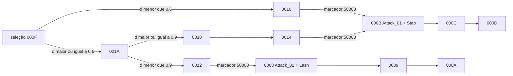

# Família NPC Panzer — Rakion v258

## Escopo e veredito

Este documento fecha o passe estático de `NpcPanzer`, `NpcPanzer2`, `NpcPanzer3` e
`NpcPanzer4`. O recorte cobre classes, assets, reação a impacto, seleção entre ataques, janelas
por distância, fluxo de hit e integração com a máquina comum de `CNpcBase`.

**Veredito:** as quatro variantes compartilham integralmente `CNpcPanzerBase`. Seus
`SetDefaultProperties` saltam para `0x3511C610`, que salta para o default comum de `CNpcBase` em
`0x350E34D0`. O comportamento possui 34 eventos locais mais o default, dois ataques corpo a corpo
reais (`Attack_01`/stab e `Attack_02`/lash) e seleção determinística pelas distâncias `0.6f` e
`0.9f`. Tipo, nível e curvas diferenciam as variantes; não há quatro IAs.

## Golden source e reprodução

- `Bin/entitiesmp.dll`, SHA-256
  `3235f03638a87779afeec43fd975d0f9bf49825551a32acb48795fa15372d621`;
- imagem runtime Ghidra `entmemoryfast/entitiesmp_dump.bin`;
- `tools/ghidra/DecompileClientNpcPanzer.py`;
- infraestrutura comum sem duplicação em `tools/ghidra/NpcFamilyExtractor.py`.

O extrator lê os quatro descritores, a tabela `0x3538C498`, todos os handlers locais, os handlers
base substituídos, strings e escalares diretamente da imagem.

## Classes

| Classe | ID compilado | Descritor | Factory | Pai |
|---|---:|---:|---:|---:|
| `NpcPanzer` / `CNpcPanzer1` | `0x0467` | `0x3538C348` | `0x3511BAD0` | `CNpcPanzerBase` `0x3538C6C8` |
| `NpcPanzer2` / `CNpcPanzer2` | `0x049B` | `0x3538C3A8` | `0x3511BE30` | igual |
| `NpcPanzer3` / `CNpcPanzer3` | `0x0475` | `0x3538C408` | `0x3511C190` | igual |
| `NpcPanzer4` / `CNpcPanzer4` | `0x0476` | `0x3538C468` | `0x3511C4F0` | igual |

```text
CNpcPanzer1  0x3511B890 -> JMP 0x3511C610
CNpcPanzer2  0x3511BBF0 -> JMP 0x3511C610
CNpcPanzer3  0x3511BF50 -> JMP 0x3511C610
CNpcPanzer4  0x3511C2B0 -> JMP 0x3511C610
CNpcPanzerBase 0x3511C610 -> JMP 0x350E34D0
```

`NpcPanzer2` usa o modelo literal `BlackPanzer\Panzer.SMC`; `NpcPanzer` usa
`Panzer\Panzer.SMC`. As variantes 3/4 não possuem outro caminho de modelo literal junto ao bloco
da família, portanto não se deve inferir um terceiro asset sem observar o manifest/runtime.

## Assets

| Uso | Recurso |
|---|---|
| ataque curto/stab | `Attack_01`, `SoundsSV\Npcs\NpcPanzer\StabAttack.wav` |
| ataque lash | `Attack_02`, `SoundsSV\Npcs\NpcPanzer\LashAttack.wav` |
| summon | `SoundsSV\Npcs\NpcPanzer\Summon.wav` |
| morte | `SoundsSV\Npcs\NpcPanzer\Die.wav` |
| corrida | `SoundsSV\Npcs\NpcPanzer\Run.wav` |
| reação adicional | `Struck_SpinLeftDown`, `Struck_SpinRightDown` |

Cada ataque cria uma fonte de som no bloco herdado `+0x4C0`, com parâmetros literais
`30.0f`, `6.0f`, `1.0f`, `1.0f`, `0.0f`, e liga a duração ao recurso de animação. O `6` passado
ao registrador do som é canal/slot do efeito, não seis segundos.

## Eventos substituídos

A família local `0x048D` contém `0x0000..0x0021` e um handler default. Os quatro pontos ligados
à máquina base são:

| Evento Panzer | Evento base | Handler | Semântica |
|---:|---:|---:|---|
| `0x048D0000` | `0x044D0046` | `0x3511CD50` | entrada de impacto/struck |
| `0x048D000E` | `0x044D0044` | `0x3511D6D0` | encerramento do ataque próprio |
| `0x048D000F` | `0x044D0043` | `0x3511E0A0` | seleção da variante de ataque |
| `0x048D001B` | `0x044D0039` | `0x3511E1C0` | decisão de alcance/FireOrHit |

Morte, active/inactive e loop principal não são substituídos: Panzer herda esses fluxos de
`CNpcBase`. Isso difere da Nak, que intercepta também morte e loops de controle.

## Máquina de ataque

`0x3511E0A0` exige target em `CNpcBase+0x368`, mede a distância e a salva em `+0x658`. A seleção
usa dois floats globais literais:

| Distância em unidades da engine | Caminho inicial | Ataque disparado no marcador `0x50003` |
|---:|---|---|
| `< 0.6` | `000F -> 0010` | `000B`, `Attack_01`/stab |
| `0.6 <= d < 0.9` | `000F -> 001A -> 0012` | `0008`, `Attack_02`/lash |
| `>= 0.9` | `000F -> 001A -> 0018 -> 0014` | `000B`, `Attack_01`/stab |



Os estados preparatórios respondem a `0x50002` avançando suas cadeias e a `0x50003` entrando na
animação escolhida. `0x16`, `0x50004` e `0x044F0001` encerram/avançam as animações da mesma forma
que na máquina comum. Não existe cooldown Panzer em milissegundos; o prazo usa relógio da engine,
duração do recurso e os campos herdados `+0x588/+0x58C`.

## Impacto e FireOrHit

`0000..0007` reproduz a cadeia curta/derrubada já vista na Nak, incluindo
`Rise_Front`. Panzer acrescenta `Struck_SpinLeftDown` e `Struck_SpinRightDown` ao seletor virtual
de reação. O modo herdado `+0x7D8` decide entre recuperação longa e saída curta, e `+0x7DC`
fornece a duração.

`001B` substitui a entrada base de FireOrHit. Ele:

1. encerra se o target for nulo;
2. compara distância com `+0x580 = 10.0f`;
3. exige o teste herdado de alcance/visada com argumento `20.0f`;
4. compara novamente com `+0x57C = 2.0f`;
5. agenda `+0x5BC` com o relógio e os delays `+0x588/+0x58C`;
6. escolhe `001C`, `001E` ou `0020`, convergindo em `001F`.

Esse ramo controla aproximação, janela de hit e retorno após o golpe. Ele não grava dano próprio:
o valor continua vindo de `NpcSetup[level]+0x14` (`Attack`) e do preenchimento comum de
`DamageInfoParam`.

## Reação e demais estados

| Faixa | Responsabilidade |
|---|---|
| `0000..0007` | struck, queda e recuperação |
| `0008..000A` | animação/som `Attack_02` |
| `000B..000D` | animação/som `Attack_01` |
| `000E` | saída do ataque |
| `000F..001A` | escolha por distância e preparação |
| `001B..0020` | alcance, aproximação, FireOrHit e retorno |
| `0021` | inicialização e encaminhamento ao main loop `0x044D0064` |

O evento default `1` delega à máquina base. Os eventos locais são estados internos; não são
opcodes World nem devem ser enviados isoladamente pelo servidor.

## Contrato de implementação

Uma porta server-authoritative futura deve ter um único comportamento Panzer:

```text
PanzerDefinition { npcType, level, closeSplit = 0.6, variantSplit = 0.9, statCurve }
PanzerState { entityId, targetId, distance, localEventId, animationDeadline }
PanzerAttack { Stab, Lash }
```

As variantes só escolhem tipo/curva/modelo disponível. A regra de seleção de ataque pertence ao
backend; o cliente recebe contratos de ação, não entidades de persistência. Para evitar hit
duplicado, não se deve manter FireOrHit simultaneamente autoritativo no host original e no World.

## Limite de validação

Fechado estaticamente:

- quatro classes, IDs, factories, pai e defaults compartilhados;
- 34 eventos locais, default e quatro overrides;
- dois ataques, animações, sons e seleção `0.6/0.9`;
- cadeia de impacto, FireOrHit, distâncias e deadlines herdados;
- fonte de dano comum e ausência de multiplicador por variante nesses handlers.

Ainda dinâmico:

- frame/volume exatos dos hitboxes de stab e lash;
- multiplicadores de cada golpe, se aplicados por marcador/asset;
- duração real das animações;
- resultado visual e sincronização dos dois ataques em dois clientes.

Esses valores precisam de captura do cliente; não devem ser sintetizados no World.
