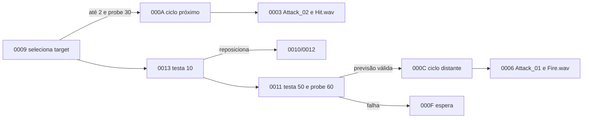

# Família NPC SoulCannon — Rakion v258

## Escopo e veredito

Este documento fecha o passe estático de `NpcSoulCannon`, `NpcSoulCannon2`,
`NpcSoulCannon3` e `NpcSoulCannon4`: classes, defaults, targeting, ataques, previsão do alvo,
efeitos permanentes e máquina local.

**Veredito:** as quatro variantes compartilham `CNpcSoulCannonBase` e 29 eventos locais. O ramo
próximo usa `Attack_02`/`Hit.wav`; o distante usa `Attack_01`/`Fire.wav` e calcula um ponto futuro
do alvo antes do disparo. A seleção usa distâncias `2/10/50`, delays `2/3` e probes `30/60`.
Modelo/curva distinguem as variantes; a IA não é duplicada quatro vezes.

## Golden source e reprodução

- `Bin/entitiesmp.dll`, SHA-256
  `3235f03638a87779afeec43fd975d0f9bf49825551a32acb48795fa15372d621`;
- imagem runtime Ghidra `entmemoryfast/entitiesmp_dump.bin`;
- `tools/ghidra/DecompileClientNpcSoulCannon.py`;
- extrator compartilhado `tools/ghidra/NpcFamilyExtractor.py`.

O extrator lê descritores, tabela `0x3538C9D0`, 29 handlers, default, propriedades, assets e os
helpers de previsão/recuperação.

## Classes

| Classe | ID compilado | Descritor | Factory | Pai |
|---|---:|---:|---:|---:|
| `NpcSoulCannon` / `CNpcSoulCannon1` | `0x046D` | `0x3538C880` | `0x35120B80` | `CNpcSoulCannonBase` `0x3538CBB0` |
| `NpcSoulCannon2` / `CNpcSoulCannon2` | `0x0480` | `0x3538C8E0` | `0x35121320` | igual |
| `NpcSoulCannon3` / `CNpcSoulCannon3` | `0x0481` | `0x3538C940` | `0x35121810` | igual |
| `NpcSoulCannon4` / `CNpcSoulCannon4` | `0x0482` | `0x3538C9A0` | `0x35121D00` | igual |
| `CNpcSoulCannonBase` | `0x0491` | `0x3538CBD0` | `0x35124300` | `CNpcBase` |

Os `SetDefaultProperties` das quatro variantes saltam para `0x35123AF0`, o default único da
base. Atributos por nível continuam vindo de `creatures.dat`.

## Defaults e seleção

| Campo runtime | Valor | Uso comprovado |
|---:|---:|---|
| `+0x57C` | `2.0f` | alcance do ataque próximo |
| `+0x580` | `10.0f` | limiar intermediário/reposicionamento |
| `+0x584` | `50.0f` | alcance do disparo |
| `+0x588` | `2.0f` | delay curto |
| `+0x58C` | `3.0f` | delay longo |
| probe curto/intermediário | `30.0f` | visada dos selectors `0009/0013` |
| probe longo | `60.0f` | visada e preparação do selector `0011` |

`0009` escolhe o ramo próximo até `2`. Se não puder atacar, `0013` testa `10` e decide entre
aproximar ou seguir para `0011`. O ramo longo aceita até `50`; além de visada, o helper
`0x35124710` recebe a posição do target e produz a solução guardada em
`+0x38EC..+0x3900`. Falha de solução retorna ao ciclo sem inventar um disparo.



## Máquina local `0x0491`

A tabela contém `0000..001C` mais default. Cinco entradas substituem eventos comuns:

| Evento SoulCannon | Evento base | Handler | Responsabilidade |
|---:|---:|---:|---|
| `0x04910000` | `0x044D0061` | `0x35123670` | limpa target anterior e abre o ciclo local |
| `0x04910003` | `0x044D0043` | `0x351225C0` | inicia `Attack_02` e `Hit.wav` |
| `0x04910006` | `0x044D0044` | `0x35122810` | inicia `Attack_01` e `Fire.wav` |
| `0x04910009` | `0x044D0039` | `0x35123700` | entrada de targeting próximo |
| `0x04910014` | `0x044D004F` | `0x35122EC0` | reação temporizada e recuperação |

`0004/0005` finalizam o ataque próximo; `0007/0008`, o disparo. `000A..0013` implementam
seleção, sinais `0x50002/03/04`, cooldown, aproximação e previsão. `0014 -> 0015 -> 0016`
mantém uma reação de três segundos, atualiza estado interno e escolhe `0019` ou `001B`; os ramos
`0017..001B` finalizam animação/recuperação. `001C` retorna ao loop comum `0x044D0064`.

O handler local `0001` também absorve eventos globais `0x50002..13` e
`0x044D0005/0A/0B/0C/0D/0F/10/12/13`, incluindo dano, morte e mudança de estado. Isso não cria
uma segunda regra de HP: o preenchimento de dano continua no caminho comum de `CNpcBase`.

## Assets e apresentação

| Uso | Recurso |
|---|---|
| modelo | `EFNMModelsSV\NPC\SoulCannon\SoulCannon.smc` |
| classe de efeito | `EFNMClasses\SoulCannon.ecl` |
| ataque próximo | `Attack_02`, `SoundsSV\Npcs\NpcSoulCannon\Hit.wav` |
| disparo | `Attack_01`, `SoundsSV\Npcs\NpcSoulCannon\Fire.wav` |
| projétil/apresentação | `SoulCannon\shell\shell.SMC`, `SoulCharge` |
| explosão | `explosion.wav`, `mainboom.tex`, `Spark.tex`, `Wing.tex` |
| ciclo | `Summon.wav`, `Die.wav`, `Walk.wav` |
| emissores | `STEAM_Point00`, `STEAM_Point01`, `STEAM_Flag` |

Os dois ataques montam parâmetros de som/efeito com literais `50`, `5`, `1`, `1` e slot `6`.
Eles não devem ser reinterpretados como dano, velocidade ou lifetime. A base também inicializa o
efeito de vapor em `+0x38E8`; partículas e áudio permanecem apresentação client-side.

## Contrato de implementação

```text
SoulCannonDefinition { npcType, level, nearRange = 2, midRange = 10, fireRange = 50, statCurve }
SoulCannonState { entityId, targetId, localEventId, attackDeadline, predictedAim }
SoulCannonShot { ownerId, origin, aimPoint, spawnedAt }
```

Targeting, previsão, decisão de disparo, spawn e dano pertencem ao backend em uma porta
server-authoritative. Modelo, vapor, áudio e explosão visual ficam no cliente. Não se deve manter
o mesmo hit autoritativo simultaneamente no host original e no World.

## Limite de validação

Fechado estaticamente:

- cinco classes, IDs, factories, herança e defaults;
- 29 eventos locais, default e cinco overrides;
- `Attack_02` próximo, `Attack_01` distante e seus sons;
- distâncias `2/10/50`, delays `2/3` e probes `30/60`;
- cálculo/armazenamento do ponto previsto do alvo;
- modelo, shell, explosão, SoulCharge e emissores de vapor.

Ainda dinâmico:

- frame de materialização e trajetória do disparo;
- velocidade, lifetime, raio, homing e colisão;
- volume de hit, multiplicador de dano e splash;
- significado visual exato da sequência `0014..001B`;
- aparência das variantes 2/3/4 e sincronização em duas sessões.

Esses dados precisam de captura do cliente e não devem ser sintetizados no World.
