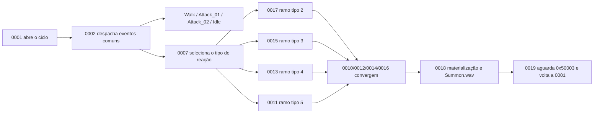

# Família NPC Taurus — Rakion v258

## Escopo e veredito

Este documento fecha o passe estático de `NpcTaurus`, `NpcTaurus2`, `NpcTaurus3` e
`NpcTaurus4`: classes, defaults, locomoção, ataques, reações, summon e máquina local.

**Veredito:** as quatro variantes compartilham `CNpcTaurusBase`. O comportamento combina caminhada
proporcional à distância, ataque próximo `Attack_01`, investida `Attack_02`, duas idles, reação
selecionada por tipo e uma sequência própria de materialização. Modelo e curva de atributos
distinguem variantes; não existem quatro máquinas de IA.

## Golden source e reprodução

- `Bin/entitiesmp.dll`, SHA-256
  `3235f03638a87779afeec43fd975d0f9bf49825551a32acb48795fa15372d621`;
- imagem runtime Ghidra `entmemoryfast/entitiesmp_dump.bin`;
- `tools/ghidra/DecompileClientNpcTaurus.py`;
- extrator compartilhado `tools/ghidra/NpcFamilyExtractor.py`.

O extrator lê descritores, tabela `0x3538CD90`, default `0x3538CF30`, propriedades, assets,
handlers e o registro tipado de `TaurusEvent` em `0x3538CD80`.

## Classes

| Classe | ID compilado | Descritor | Factory | Pai |
|---|---:|---:|---:|---:|
| `NpcTaurus` / `CNpcTaurus1` | `0x046A` | `0x3538CC30` | `0x351262F0` | `CNpcTaurusBase` `0x3538CF40` |
| `NpcTaurus2` / `CNpcTaurus2` | `0x0486` | `0x3538CC90` | `0x35126700` | igual |
| `NpcTaurus3` / `CNpcTaurus3` | `0x0487` | `0x3538CCF0` | `0x351271C0` | igual |
| `NpcTaurus4` / `CNpcTaurus4` | `0x0488` | `0x3538CD50` | `0x351274F0` | igual |
| `CNpcTaurusBase` | `0x0493` | `0x3538CF60` | `0x35128A30` | `CNpcBase` |

Os quatro `SetDefaultProperties` saltam para `0x35127670`. A curva de HP, AP, ataque e CP por
nível continua em `creatures.dat` e está consolidada em
[`npc-stat-curves.md`](npc-stat-curves.md).

## Defaults comprovados

| Campo runtime | Valor | Uso no Taurus |
|---:|---:|---|
| `+0x57C` | `2.0f` | limiar próximo herdável |
| `+0x580` | `10.0f` | distância usada para escalar a caminhada |
| `+0x584` | `50.0f` | alcance distante herdável |
| `+0x588` | `2.0f` | delay curto |
| `+0x58C` | `3.0f` | delay longo |
| `+0x56C` | `3.0f` | escalar base do estado de caminhada |
| `+0x570` | `4.0f` | escalar aplicado ao estado de investida |
| `+0x574` | `250.0f` | limite copiado durante caminhada |
| `+0x578` | `220.0f` | limite copiado durante investida |

O helper de caminhada `0x35128C50` seleciona `Walk`, mede a distância ao target e, quando a
sondagem permite, calcula `distância / 10 × 3`; no fallback usa `3`. O segundo campo de movimento
recebe `250`. A investida copia `4` e `220`, além de registrar o instante corrente.

## Ataques, idle e reação

O dispatcher local `0x35128F30`, associado ao estado `0002`, traduz eventos comuns para as ações
Taurus:

| Evento recebido | Ação comprovada |
|---:|---|
| `0x044D0001` | caminhada `Walk` com velocidade proporcional à distância |
| `0x044D0002` | inicia `Attack_01`, toca `CloseAttack.wav` e marca estado interno `3` |
| `0x044D0003` | inicia `Attack_02`, marca estado `4` e aplica os escalares da investida |
| `0x044D0004` | escolhe aleatoriamente `Idle01` ou `Idle02` e marca estado `6` |
| `0x04930000` | chama o slot virtual `+0x254` da instância Taurus |

O ataque próximo também prepara o emissor de áudio com alcance `30`, parâmetro `6`, ganho `1` e
posição da entidade. Esses valores pertencem à apresentação do som; não são dano ou hitbox.

O estado `0007` escolhe um tipo em `+0x80C` e prepara a transição. Os tipos `2`, `3` e `4` usam,
respectivamente, esperas de `1,5 s`, `1,2 s` e `0,75 s`; o tipo `5` limpa `+0x5B8`. Os ramos
convergem em `0010/0012/0014/0016` antes da sequência `0018 -> 0019`. O valor exato de cada tipo
visual deve ser confirmado em runtime; o binário prova a seleção e os tempos, não nomes de
animação para todos os ramos.

## Máquina local `0x0493`

A tabela contém 26 estados `0001..001A` e um default. `0000` não é uma 27ª linha dessa tabela:
é uma classe de evento separada.



`0004..0006` e `0008..000F` formam cadeias temporizadas que avançam nos sinais `0x50003/04`.
`001A` aceita o evento sem efeito adicional. O default encaminha eventos não tratados para o
comportamento comum, incluindo dano, morte e mudanças globais de estado.

### O registro `TaurusEvent`

Os quatro DWORDs em `0x3538CD80` são:

```text
04930000 351289D0 3538CD80 00000000
```

`0x351289D0` aloca oito bytes e chama o construtor `0x35127640`, que registra o tipo
`0x04930000`. Portanto, o bloco é descritor/factory de evento. Ele fica fisicamente após o
descritor de `NpcTaurus4`, mas não prova uma tabela exclusiva nem comportamento especial de
Taurus4.

## Materialização e assets

O handler `0018 @ 0x35129E30` toca `SoundsSV\Npcs\NpcTaurus\Summon.wav`, monta a apresentação de
materialização, normaliza um vetor de direção e converge para `0019`. A lista de recursos
comprovada é:

| Uso | Recurso |
|---|---|
| modelo Taurus | `EFNMModelsSV\NPC\Taurus\Taurus.smc` |
| modelo Black Taurus | `EFNMModelsSV\NPC\blacktaurus\Taurus.smc` |
| locomoção | `Walk`, `Walk.wav`, `Run.wav` |
| idle | `Idle01`, `Idle02`, `Stand` |
| ataque próximo | `Attack_01`, `SoundsSV\Npcs\NpcTaurus\CloseAttack.wav` |
| investida | `Attack_02` |
| reação | `BeAttackedFront.wav`, `BeAttackedBack.wav` |
| ciclo | `Die.wav`, `Summon.wav` |

Os modelos disponíveis estão provados; a associação visual exata das variantes 3/4 deve ser
capturada no cliente, sem inferência a partir da proximidade das strings no binário.

## Contrato de implementação

```text
TaurusDefinition { npcType, level, nearRange = 2, midRange = 10, farRange = 50, statCurve }
TaurusState { entityId, targetId, localEventId, reactionType, deadline, movementState }
TaurusAction { kind: Walk | CloseAttack | Charge | Idle | Reaction | Summon, startedAt }
```

Seleção de target, movimento, decisão de ataque, colisão e dano pertencem ao backend
autoritativo. Modelo, animação, áudio e materialização ficam no cliente. Uma implementação nova
deve conservar a cadeia de estados e emitir contratos explícitos, sem duplicar a regra de dano no
host original e no World.

## Limite de validação

Fechado estaticamente:

- cinco classes, IDs, factories, herança e defaults;
- 26 estados locais, default e evento tipado `0x04930000`;
- caminhada proporcional, `Attack_01`, `Attack_02`, idle e escalares de movimento;
- tipos de reação e delays `1,5/1,2/0,75`;
- sequência de materialização e retorno ao ciclo;
- modelos, animações nomeadas e sons da família.

Ainda dinâmico:

- volume e frame de hit de `Attack_01`;
- trajetória, duração e colisão da investida `Attack_02`;
- nomes visuais exatos dos tipos `2..5`;
- multiplicadores de dano e knockback;
- associação final de modelo das variantes 3/4;
- sincronização, morte e materialização em duas sessões.

Esses pontos exigem captura real e não devem ser inventados no World.
