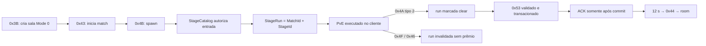

# Engenharia reversa de stages PvE e progressão — Rakion v258

## Escopo e estado atual

Este documento cobre catálogo, elegibilidade, sala solo, início, clear/morte, resultado `0x53`,
rank, EXP/gold, persistência, reset de rank e liberação temporária de nível. Criaturas, Cells e
scripts internos ficam em [`cells-creatures-npc.md`](cells-creatures-npc.md).

**Veredito:** o fluxo Stage/PvE está implementado e validado headless de ponta a ponta. O World
combina os 48 registros SQL com o catálogo versionado da build v258, autoriza a entrada, impõe a
duração e valida a recompensa exata por melhoria de rank. Combate, objetivo e cálculo do rank
ainda ocorrem no cliente. A EXP dos três Cells é validada e persistida no mesmo commit da
progressão principal. Os 48 stages não foram validados visualmente um a um.

## Evidência e fontes

- SQL ativo: `stageinfo`, `userstageinfo`, `characterinfo`, `usergameinfo` e `classlevelinfo`;
- cliente: export `SendFieldGameStagePoint` e dispatcher do retorno `0x53`;
- World original: limites de GamePoint por modo e fluxo de reset/unlimit `0x70/0x71`;
- reconstrução: `StageCatalog`, estado `StageRun`, `WorldServer.Stages` e
  `WorldDatabase.StageSettlement`;
- provas: `StageCatalogTests`, `StageSettlementDatabaseSmokeTests` e
  `tools/world_stage_probe.py`.

## Catálogo legado

`stageinfo` contém exatamente 48 linhas ativas, IDs `1..48`:

```text
id, maxcharacters, minlevel, maxlevel
```

- `maxcharacters`: `1..4`;
- nível mínimo: de `1` a `24`;
- nível máximo: de `10` a `35`;
- não contém duração, mapa físico, waves, criaturas, pré-requisitos, fórmula de rank ou prêmio.

Esses dados foram localizados diretamente no `DataSetup.xfs`, em `LevelData/stage_*.txt`. A build
possui 55 arquivos, mas somente `1..48` aparecem no SQL ativo; `49..55` são conteúdo adicional
não habilitado pelo backend legado. Cada arquivo traz `time_limit`, goal, cinco `rankvar` com
threshold/EXP/gold/multiplicador, limites de players/nível e a gramática de spawns. Exemplo:

```text
Stage 3: time_limit=288, goal=time attack
S value=96  exp=64 gold=132 multi=4.0
A value=128 exp=40 gold=83  multi=2.5
B value=160 exp=32 gold=66  multi=2.0
C value=224 exp=24 gold=50  multi=1.5
D value=288 exp=16 gold=33  multi=1.0
```

`tools/extract_stage_catalog.py` lê a golden source XFS diretamente, remove comentários antes dos
blocos — necessário porque Stages 27 e 40 mantêm tabelas antigas comentadas — e emite JSON ou
resumo reproduzível com hash SHA-256 por arquivo.

Uma premissa anterior tratava a EXP como `72/54/36/27/18`, derivada da curva de nível. A
reverificação do loader rejeitou essa transformação: `GetLevelInfo @ 0x3522B880` obtém o registro
e `CLevelScriptor::GetLevelInfo @ 0x3522C190` devolve `objeto + 0x12C`. Logo, os reads do produtor
em `_s_stage+0x4C/+0x50` apontam diretamente para `objeto+0x178/+0x17C`, os campos gold/EXP do
`rankvar`. `CLevelScriptor::SetStageParameter @ 0x352313D0` percorre a primeira linha a partir de
`objeto+0x17C`, em passos de `0x28`, e apenas encaminha seus valores; a varredura das instruções
não encontrou escrita de normalização nesses campos. O runtime usa, portanto, a EXP literal do
`DataSetup.xfs`; `multi` é preservado como metadado do asset, não aplicado ao prêmio por esse
produtor.

No boot, `LoadStageCatalogAsync` lê todos os registros e `StageCatalog` falha para IDs duplicados,
limites inválidos, zero players ou `minlevel > maxlevel`. O World registra warning se a quantidade
carregada for diferente de 48. O runtime também embute `Data/stage-content-v258.json`, exige
correspondência exata com essas linhas e usa duração/ranks/rewards como golden source. Os
thresholds anômalos dos stages `28` e `38` permanecem marcados e não são corrigidos
por suposição.

### Grafo de execução dos scripts

O extrator agora interpreta `Switch`, `Trigger`, `NpcSpawn`, `PopupMessage`, `WarpSpawn` e
`BoxItem`, resolve `linkswitch`, `linktrigger` e targets de `spawn npc/item`, e percorre o grafo a
partir de todo `Switch condition=start`. A evidência reproduzível completa está em
[`../../audits/evidence/stage-flow-v258.json`](../../audits/evidence/stage-flow-v258.json).

Nos 48 stages ativos foram encontrados:

- 5.826 nós declarados e 4.482 alcançáveis por links explícitos;
- 48 triggers com `execution=win`, 47 deles explicitamente alcançáveis;
- Stage 29 (`guard`) declara `win`, mas não o liga à raiz; o término depende do goal implícito;
- 29 referências sem definição em 14 stages: `8,15,17,20,23,25,26,35,36,40,41,42,45,46`;
- 31 nomes repetidos dentro do mesmo tipo em 10 stages:
  `7,8,11,14,16,17,19,20,22,29`;
- 21 stages têm ao menos uma dessas duas anomalias; o boot registra contagens separadas para
  referências ausentes e duplicatas.

Esses achados descrevem o asset v258; não são automaticamente bugs de gameplay. Alguns caminhos
são resíduos não ligados e algumas ações podem ser disparadas implicitamente pelo goal.

O loader foi fechado no `entitiesmp.dll`: `CLevelScriptor::SetStageParameter @ 0x352313D0`
instancia triggers e switches na ordem declarada e chama `InitQuestTrigger @ 0x352301B0` e
`InitQuestSwitch @ 0x3522F2B0`. Os resolvedores de nomes percorrem as listas do índice zero em
diante — por exemplo, triggers em `0x3522E500` — e retornam na primeira igualdade. Assim, nomes
duplicados usam **first declared wins**; as declarações posteriores continuam instanciadas, mas
links pelo nome apontam para a primeira. Quando uma referência não existe, os inicializadores
retornam sem completar aquele bloco; `SetStageParameter` continua com os demais objetos e ainda
pode concluir o load. A auditoria preserva os dois casos separadamente: `flowNamesUnique=false`
para shadowing por duplicata e `flowReferencesConsistent=false` somente para destino ausente.

## Jornada implementada



### Entrada e identidade da execução

No primeiro `0x4B`, `BeginStageRun` exige:

- field em modo `0`;
- `MatchId` não vazio;
- stage existente no catálogo;
- nível em `minlevel..maxlevel`, salvo `stagelevelfree` vigente;
- quantidade atual de jogadores entre `1` e `maxcharacters`.

A autorização bem-sucedida grava na sessão o `StageRunId` igual ao `Field.MatchId`, o `StageId` e
o estado `cleared=false`. Resultado posterior precisa corresponder ao mesmo field, match e stage.
A elegibilidade não é recalculada no retry do resultado: ela foi autorizada no início e um
level-up do primeiro commit não pode quebrar a idempotência do replay.

Depois dessa inicialização local, o mesmo primeiro `0x4B` continua no handler canônico
`FUN_004247B0→FUN_00405C00`. Mesmo com `len=0`, ele é publicado aos outros records em `state=4`;
o World não responde com `0x31` nem repinta poções durante a entrada no stage.

O marcador de level-free usa o mesmo epoch em minutos do MySQL e permanece ativo até
`marcador + 1440`, inclusive.

### Duração e execução

O create aceita rounds `1..21`, mas em Mode 0 a duração enviada pelo cliente não é autoritativa.
O World a substitui pela duração do catálogo antes do início; Stage 3 usa exatamente 288 s.

Mode zero não recebe o tick UDP global dos modos Battle. Countdown, entidades, dano, objetivos e
clear são executados pelo cliente. O servidor mantém a identidade da execução, fecha o protocolo
e protege a persistência; ele não comprova waves, criaturas mortas ou objetivo concluído.

### Clear, morte e abandono

- clear: C→S `0x4A [02]`; somente o master pode concluir. Todas as runs compatíveis dos players
  ativos são marcadas e cada participante recebe S→C `0x4A` com o rank;
- morte: C→S `0x4F`; a vítima é marcada morta e o evento é publicado para a party. O resumo tipo
  `1` e a invalidação das runs só ocorrem quando não resta nenhum player vivo nos slots `0..9`;
- give up: `0x46` invalida a run;
- retorno: após 12 s, `0x44 reason=2` devolve o jogador à room.

Sem clear autorizado, `0x53` não recebe ACK nem altera o banco.

Essa política vem do World original: `FUN_004246E0` exige que o sender seja `field+0x121`
(master) antes de chamar `FUN_00405A90`; o clear percorre os 20 records e publica para cada
`state==4`. Em `FUN_004087D0`, modo `0`, a morte chama `FUN_004063A0`, que só entra em round-end
quando não encontra nenhum slot vivo entre `0..9`. O World .NET agora reproduz essas regras no
domínio `Field`, incluindo party de dois a quatro jogadores; a prova atual é headless, não visual.

## Resultado `0x53`

Shape confirmado do request:

```text
u8  stage
u8  rank                  # 0..5
u8  count                 # 0..4
u16 mapSlots[count]
u32 reportedExp
u32 reportedGold
u32 cellExpSlot1
u32 cellExpSlot2
u32 cellExpSlot3
```

Os três últimos campos são a EXP dos Cells equipados nos slots `10`, `11` e `12`.
O servidor rejeita header truncado, ranges inválidos e qualquer comprimento diferente de
`23 + count*2` lógico ou do tamanho canônico após padding da cifra em blocos de 12 bytes. Também
rejeita map slot fora da capacidade do World, stage divergente, resultado antes do clear e
recompensa acima do teto original de Mode 0: `1500 EXP / 500 gold`.

Há uma única rota ativa: `ClientSession.DispatchOpcode` entrega primeiro ao intercept de lobby,
que chama `OnStageResultAsync`, faz o parse estrito e delega a
`WorldServer.ApplyStageResultAsync`. Os antigos handlers paralelos de `WorldHandlers` foram
removidos; a entrada `0x53` da tabela chama diretamente o handler canônico do settlement. Isso
impede crédito direto em memória, persistência fire-and-forget e ACK antes do commit.

Validações de autorização:

- field existe, está em Mode 0 e em `RoundEnd`;
- run existe, foi marcada clear e conserva o mesmo `MatchId`;
- stage reportado coincide com run e field;
- rank `0..5`, no máximo quatro map slots;
- round/recompensa respeitam `GamePointRules`.

Resposta de sucesso:

```text
[u16 0x53][u8 status=0][stage][rank][count][u16 mapSlots...]
```

O ACK sai apenas após o commit. Um replay byte-semanticamente idêntico recebe o mesmo ACK; um
replay com rank, EXP, gold ou bônus divergente é rejeitado.

## Recompensa e progressão

O backend calcula o prêmio esperado do catálogo. No primeiro clear usa o valor integral do rank;
ao melhorar, credita apenas `reward(rank atual) - reward(melhor rank anterior)`; ao repetir ou
piorar, exige zero. Power User acrescenta 50% apenas à EXP. O resultado calculado inclui:

- EXP acumulada;
- nível e pontos após todos os level-ups;
- gold após bônus;
- maior rank entre o persistido e o reportado.

O produtor `entitiesmp.dll:0x3515C760` indexa o `rankvar`, subtrai a recompensa do melhor rank
anterior e envia gold/EXP. Para cada Cell equipado envia `EXP/3`; Power User transforma essa
parcela em `x+x/2`. `rakion.bin:0x00478BF0` aplica os valores e os encaminha em
`SendFieldGameStagePoint`. O World reproduz e valida essa fórmula.

`FUN_351933D0` e `FUN_35192F40` fecham o cálculo de rank. As cinco linhas são percorridas na
ordem S→D:

- `time attack`: tempo decorrido convertido para inteiro; primeiro `threshold >= tempo`;
- `butchery`: contador `_s_stage+0x36C`; primeiro `threshold <= kills`;
- `survival`: `trunc(sum(GetHP jogadores) / HP inicial * 100)`;
- `guard`: `trunc(sum(GetHP protegidos) / sum(GetMaxHP protegidos) * 100)`.

Os slots virtuais `+0x154/+0x158` foram resolvidos pelos exports como `GetMaxHP/GetHP`, e a
constante em `entitiesmp+0x2B4C30` é `100.0f`. `StageRankPolicy` porta a seleção dos thresholds.
O World ainda não usa essa política para substituir o rank recebido porque não possui a métrica
PvE autoritativa: o combate/NPC continua no cliente e o pacote `0x53` não transporta tempo,
kills ou HP. Aceitar o rank como autoritativo aqui exigiria antes portar essa simulação.

Ranks usados pelo overlay:

```text
0 = nenhum, 1 = D, 2 = C, 3 = B, 4 = A, 5 = S
```

`GREATEST` impede regressão do melhor rank. `LoadStageRanksAsync` indexa por Stage ID e o writer
do `0x0C` copia a partir do índice 1; goldens protegem contra o antigo deslocamento de um stage.

## Transação e idempotência

No boot, a migração:

1. remove duplicatas de `(characterid,stage)`, preservando o maior rank e o menor ID no empate;
2. converte `userstageinfo` para InnoDB;
3. cria unique index `(characterid,stage)`;
4. cria `stage_result_settlement_ledger` e `stage_result_cell_settlement_ledger` em InnoDB.

A chave do ledger principal é `(run_id, character_id)`; o ledger de Cell acrescenta
`cell_index`. Na mesma transação, o settlement:

1. bloqueia o rank existente;
2. tenta inserir a identidade e todo o conteúdo econômico do resultado;
3. em replay, confere se o conteúdo é exatamente o já comprometido;
4. bloqueia e compara progressão e wallet com o snapshot esperado;
5. bloqueia e confere os três itens equipados;
6. atualiza EXP/nível/pontos, gold, melhor rank e EXP/nível dos Cells;
7. confirma o commit;
8. só então atualiza a sessão e envia level-up/ACK.

Falha ou estado concorrente divergente reverte tudo. O smoke MariaDB parte deliberadamente de
`userstageinfo` MyISAM e comprova conversão, primeiro crédito, replay, replay divergente,
concorrência, preservação do melhor rank e rollback por progressão stale.

## Reset de rank e level-free

| Opcode | Operação | Estado |
|---:|---|---|
| `0x70` | Stage Rank Clear | transacional e validado por protocolo/banco |
| `0x71` | Stage Level Free | transacional e validado por protocolo/banco |

`0x70` escolhe produtos `10011..10013` por nível, apaga os ranks e debita Cash no mesmo commit.
`0x71` compra `10014` por 16.500 Cash, grava o minuto em `stagelevelfree` e bloqueia recompra por
1440 minutos. O catálogo de entrada consome esse marcador para liberar apenas o gate de nível;
stage inexistente e limite de party continuam obrigatórios.

## Ativação e operação

Não existe flag `[Stage]` nesta implementação. O fluxo é ativado ao iniciar o World e falha no
boot se o catálogo ou a migração não puderem ser carregados.

1. Garanta `stageinfo` com IDs únicos e valores válidos; a base oficial possui 48 registros.
2. Faça backup de `userstageinfo`, pois o primeiro boot converte engine e deduplica linhas.
3. Use uma conta de banco com `SELECT`, `CREATE TABLE`, `ALTER`, `DELETE`, `INSERT` e `UPDATE`.
4. Inicie o World normalmente com `deploy/worldserver.ini`.
5. Confirme no log o catálogo carregado e ausência de warning de contagem.
6. Rode o smoke MariaDB e `python tools/world_stage_probe.py 40708` com a fixture `test`/char `1`.

O probe concede `40 EXP`, `83 gold` e rank A no Stage 3. Em uma base de desenvolvimento, faça
snapshot/restauração da fixture ou use uma conta descartável.

## Validação executada em 2026-07-16

- 768/768 testes do projeto World;
- smoke MariaDB transacional aprovado;
- build World Release com zero warnings e zero erros;
- probe runtime: create → start → spawn → clear → settlement;
- resultado antes do clear: sem ACK e sem mutação;
- stage divergente: sem ACK e sem mutação;
- resultado válido: `53 00 00 03 04 00`;
- replay idêntico: mesmo ACK e uma única linha/crédito;
- replay divergente: sem ACK;
- a execução atualizada reportou `+40 EXP/+83 gold`, aplicou `+60 EXP/+83 gold` com Power User
  ativo e restaurou a fixture após verificar ledger, progressão e rank `4`;
- fórmula de primeiro rank, melhoria, repetição e EXP de Cell com/sem Power User coberta em teste.

## Validação E2E executada em 2026-07-18

`SoloStageSettlementE2ETests` sobe o `WorldServer` real e fecha pelo socket:

- login, seleção, sala do stage 1, start e spawn `0x4B`;
- clear `0x4A` e abertura da janela válida de settlement;
- reward diferencial do rank 5, Cell EXP e bônus Power User enviados por `0x53`;
- ACK `53 00 00 01 05 00` e persistência de EXP, gold, rank e ledger no MySQL;
- replay byte a byte idêntico com novo ACK, um único ledger e nenhum segundo crédito.

## Cobertura e lacunas restantes

| Área | Estado |
|---|---|
| catálogo 48 stages | carregado e validado estruturalmente |
| nível/max players | autorizado no início da run |
| vínculo start/clear/result | implementado e provado runtime |
| morte/give up sem prêmio | implementado; cobertura visual pendente |
| rank/EXP/gold atômicos | implementado e smoke-testado |
| idempotência/replay | implementada e provada em banco + wire |
| overlay após relog | golden-testado; visual pendente |
| reset/unlimit | implementados e validados |
| duração | autoritativa pelo catálogo v258 embutido |
| EXP/gold por rank | autoritativos, inclusive delta por melhoria |
| EXP dos três Cells | validada e persistida atomicamente com ledger por slot |
| fórmula de rank por goal | RE fechado e política portada; input ainda client-authoritative |
| PvE e objetivos | client-authoritative |
| pré-requisito/allowlist por stage | ausente do catálogo legado |
| party 2..4 | clear do master e derrota por todos mortos cobertos headless; visual pendente |
| matriz dos 48 stages | sem validação runtime/visual completa |

## Próximos passos para RE completo

1. Portar/autorizar as métricas PvE antes de impor `StageRankPolicy` no settlement.
2. Testar visualmente clear, morte, give up e relog em cada um dos 48 stages.
3. Validar visualmente party real nos stages cujo `maxcharacters` é `2..4`.

O sistema só pode ser chamado de PvE totalmente server-authoritative após rank/recompensa e prova
de objetivo deixarem de depender do cliente. A persistência e a correlação do protocolo já estão
fechadas; conteúdo, autoridade de combate e matriz visual ainda não.
